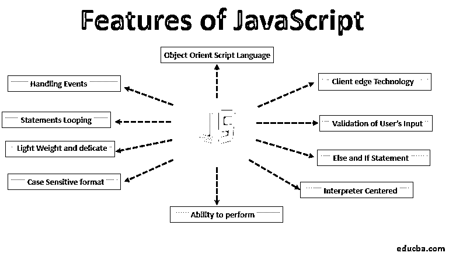

# JavaScript 的特性

> 原文：<https://www.educba.com/features-of-javascript/>




## JavaScript 特性概述

下面的文章提供了 JavaScript 特性的详细概述。Java Script 是由 Brendan Eich 于 1995 年在 Netscape 中开发的，用于在网页中编码，允许对客户端边缘进行逻辑操作。JavaScript 主要是一种客户端边缘脚本语言。这种以对象为中心的脚本语言最常用于设计网页，是 Netscape 开发的一种独立语言。它给用户提供了对浏览器的额外控制，并有可能在脚本中创建新功能。这种脚本语言的特点是输入区分大小写，可以检测用户的浏览器和操作系统。JavaScript 主要用于客户端边缘技术中的验证。

以下是 JavaScript 的更多特征:

<small>网页开发、编程语言、软件测试&其他</small>

1.  以对象为中心的脚本语言
2.  客户端边缘技术
3.  用户输入的验证
4.  Else 和 If 语句
5.  翻译中心
6.  执行内置功能的能力
7.  区分大小写的格式
8.  重量轻，精致
9.  语句循环
10.  处理事件

*   Java 脚本的语句控制语法系统与 C 语言中使用的语句控制语法非常相似。由于 HTML 只能设计网站，而不能执行逻辑操作，如条件检查、语句循环(while & for)、在客户端边缘进行语句决策(else 和 if)以及两个数相加，因此 Java Script 允许执行更多功能。
*   JavaScript 无法执行这些功能，这导致我们需要 JavaScript 在客户端边缘执行这些操作。这种脚本语言可以帮助建立更多的交互式网站，开发内置时钟，轻型客户端程序，建立带有不同对话框的窗口弹出，如警告对话框，确认对话框和提示对话框选项。
*   现在许多网络巨头都在使用 Java 脚本技术，如脸书、YouTube、Twitter、Gmail 和谷歌地图等。Java 脚本具有企业级弹出菜单、新窗口的打开和关闭、HTML 层的操作、HTML 的界面增强、在页面内添加动画要素、在 HTML 的文档中添加动态外观以及修复与浏览器相关的问题。
*   发送到服务器的 HTML 表单数据中的数据输入的验证可以使用 JavaScript 来完成。用户还可以对 HTML 层的数据进行操作，如移动功能、隐藏、更改 HTML 代码的接口以及单独编写代码是 Java Script 的一些重要特性。

### JavaScript 特性

现在让我们详细看看 JavaScript 的特性:

#### 1.以对象为中心的脚本语言

以对象为中心的语言特性内置在对象中，因为 Java 脚本有一个窗口对象。面向对象语言的一些常见例子有 Java 脚本和 Visual Basic 等。以对象为中心的语言主要用于像多态这样的特性，多态是一种以多种形式获取对象的特性。在[面向对象编程](https://www.educba.com/object-oriented-programming-in-java/)中使用[多态性](https://www.educba.com/what-is-polymorphism/)需要每当我们使用来表示父类对一个子类对象的引用。

#### 2.客户端边缘技术

客户端基本上是一个术语，用于各个用户的 Web 浏览器。服务器上的数据由客户端上传，然后由用户以呈现的形式使用。用户通过网络浏览器访问客户端，通过网站进行冲浪和交互。Java Script 中的客户端边缘技术允许客户端完全控制服务器中正在更新的内容。

#### 3.用户输入的验证

用户输入的验证通常被称为表单验证，它允许用户通过网页填写表单与客户端进行交互。表单中的详细信息需要正确填写，表单验证可以帮助客户验证用户输入的详细信息。

#### 4.Else 和 IF 语句

IF 和 Else 语句用于执行逻辑运算。

#### 5.翻译中心

Java 脚本是以解释器为中心构建的，它允许用户在不使用编译器的情况下获得输出。这意味着用户执行的输入可以直接呈现，而无需编译代码。

#### 6.执行内置功能的能力

Java 脚本有许多内置函数，如 isNAN()、Number()、parseFloat()和 parseInt()等。 [isNAN()函数](https://www.educba.com/isnan-javascript/)用于识别输入对象是否为正确的数字格式。parseFloat()函数用于将对象转换成数字。parseInt()函数用于分析字符串。

#### 7.区分大小写的格式

用 Java 脚本编写的代码是区分大小写的，这解释了无论代码是用大写还是小写格式编写，输出都不会有什么不同。

#### 8.重量轻，精致

Java Script 的特点是轻量级和精致，用 JavaScript 写的代码不包含变量，只使用对象来执行操作。

#### 9.语句循环

语句循环用于重复执行相同的操作。在这种操作中，同一组代码以重复的方式运行一段特定的或不特定的时间。

#### 10.处理事件

Java 脚本能够控制服务器上更新的操作。这基本上是控制网站上的响应，当用户试图执行由客户端处理的任何操作时，如点击链接和选项，网站上的交互响应等。

### Java 脚本注释

这些有助于理解代码的用途，注释不会显示在 JavaScript 呈现的输出中。

有两种类型的 Java 脚本注释:

*   注释写在单行下面
*   注释写在多行下面

#### 单行书写的注释

这些注释可以用双正斜杠来标识。

单行注释的示例如下:

```
<script>
//  This is how we write comments is single line
document.write ( "HTML and JavaScript" );
<script/>
```

**结果**

HTML 和 JavaScript

#### 在多行下写的注释

这些注释可以用以正斜杠和星号开始并以星号和正斜杠结束的结构来标识。

在多行下书写的注释示例:

```
<script>
/* This is how we write comments in Multi-Line /*
document.write ( "Features of JavaScript" );
<script/>
```

**结果:**

Java 脚本的特性

**Java 脚本的局限性**

*   客户端边缘的读写功能在 Java 脚本中不可用。
*   在 Java Script 中无法使用网络程序执行功能。

### 推荐文章

这是 JavaScript 特性的指南。在这里，我们讨论 JavaScript 的不同特性和限制，以及在多行下编写的注释的例子。您也可以浏览我们推荐的其他文章，了解更多信息——

1.  [JavaScript 中的构造函数](https://www.educba.com/constructor-in-javascript/)
2.  [JavaScript 中的数组](https://www.educba.com/arrays-in-javascript/)
3.  [JavaScript 工具](https://www.educba.com/javascript-tools/)
4.  【Javascript 能做什么？


