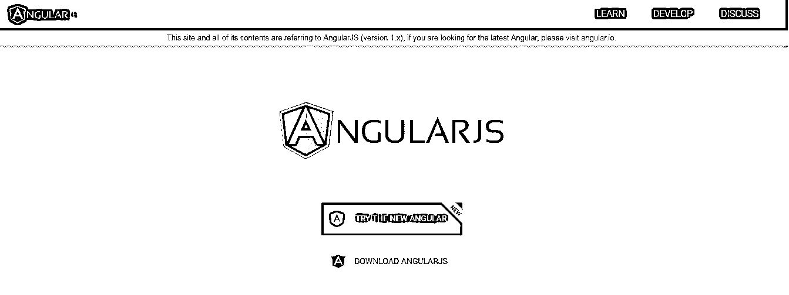
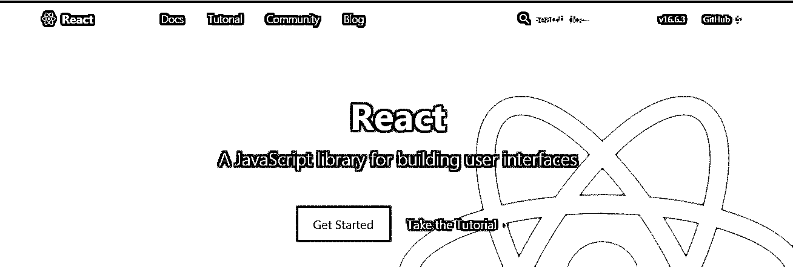
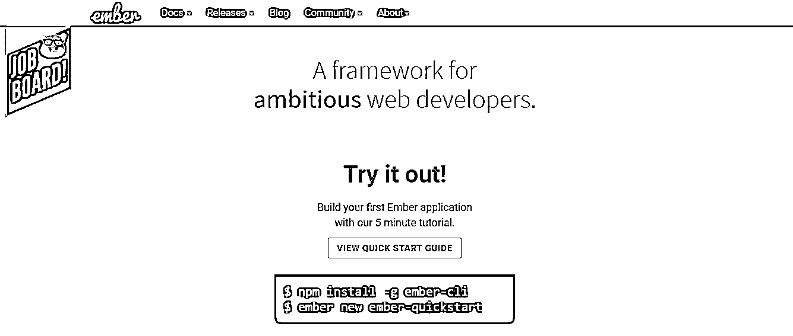
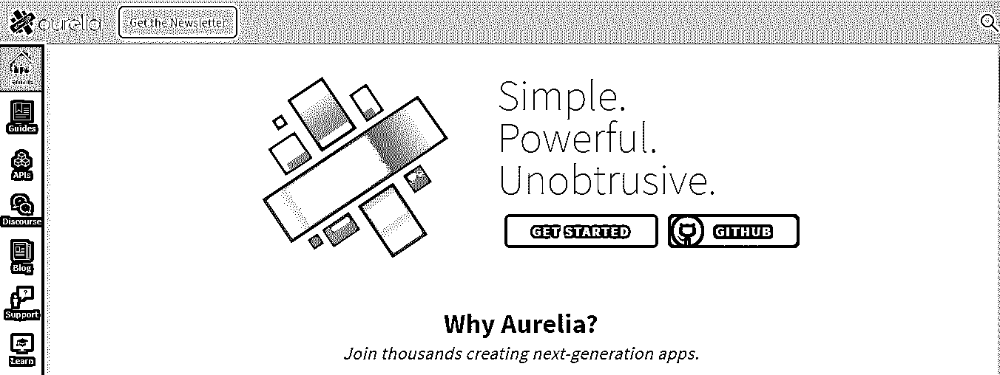

# 最佳 Javascript 框架

> 原文：<https://www.educba.com/best-javascript-frameworks/>

## 最佳 Javascript 框架介绍

Javascript 是一种弱类型的、动态的、基于原型的、解释的高级编程语言，是除了 T2 HTML 和 CSS 之外的万维网的关键技术之一。Javascript 框架非常流行的一个主要原因是它的交互式网页，这是 web 应用程序的一个重要组成部分。大多数网站都有 Javascript 框架，今天所有的网络浏览器基本上都有一个专用的 [JavaScript 引擎](https://www.educba.com/how-javascript-works/)。

然而，当涉及到为你的项目选择正确的 Javascript 框架时，这个过程可能会令人疲惫和困惑。随着每天新技术的出现，新的框架以非常快的速度被引入，我们并不总是能够安全地假设最近的框架会比以前的框架更适合。这完全取决于您的需求、资源类型以及您想要利用的特性。正确的平台是构建应用程序的必要条件，我们不仅保证最受欢迎的选择，也保证最受欢迎的选择，这些选择可能会为您提供适合您项目的基本概念。

<small>网页开发、编程语言、软件测试&其他</small>

### 最佳的 5 个 Javascript 框架

下面给出了前 5 个最佳框架:

#### 1.Angular JS 2

[https://angular . org/](https://angularjs.org/)

这是我个人最喜欢的 Javascript 框架，它的早期版本已经在市场上存在很长时间了。它有一个坚实的开发过程，一个庞大的谷歌团队负责它的创建。这一事实使其与众不同，比任何竞争对手都更稳定。

**思考要点:**

*   Angular 用的是 Typescript，据说是 Javascript 的上标，可以轻松向下编译成 VanillaJS。这一事实给了它额外的优势，绝对是一个独特的卖点。
*   内容的预渲染有助于更好的 SEO 管理和更快的浏览速度。
*   经过长时间的巨大发展，框架变得更加稳定。
*   由于 Google 的存在，程序员在采用这个框架时感到更加自信。

**我的话:**

如果你需要一个稳定的、功能丰富的平台，这就是你选择的 Javascript 框架，因为它提供了大量有用的内容。

#### 2.React.js

[https://reactjs.org/](https://reactjs.org/)

这是脸书创造的另一个坚固的框架。它是那些写得非常好的初始框架之一。

**思考要点:**

*   持续的增长和高采用率表明，寻找有能力和高效的 React 开发人员将是一件容易的事情。
*   JSX 的采用允许组件重构，当我们谈到在服务器上运行时，这最终会编译成 React JS。这将有助于创建一组更动态、更有吸引力的 HTML 页面，这一点至关重要。
*   [React Native 提供了](https://www.educba.com/button-in-react-native/)无缝的移动体验，可以与 React 应用程序配对。

**我的话:**

React 是一个伟大的工具，一个强大的 Javascript 框架，是任何综合项目的完美匹配。许多开发人员在采用这个框架时的一个顾虑是关于它的母公司脸书，它经常停止更新和进一步的增强、支持，并且还改变了许可。

#### 3.Ember.js

-= ytet-伊甸园字幕组=-翻译:粒粒粒粒粒粒粒粒粒粒粒粒粒粒粒粒粒尘紫月皮皮 scenery 校对:粒尘归尘土归土

这个 Javascript 框架旨在快速完成工作，没有太多延迟。当您的需求与其结构完全一致时，这是一个很好的选择，因为修改结构可能会很痛苦。因此，它被认为是一种固执己见的框架，引导开发人员采用平台的最佳实践。

**思考要点:**

*   自以为是的做法使得处理框架变得容易，只有一个条件，遵守它的结构。
*   Ember.js 的命令行[界面打开了一个名为“ember-cli”的包，它为开发人员添加到 Ember 的应用程序开发工具包中提供了大量可能性。](https://www.educba.com/ember-js-vs-angular-js/)
*   当您使用 F12 时，余烬检查器用于轻松检查对象。当您正在开发或[调试](https://www.educba.com/what-is-debugging/)时，这两种情况下都可以使用该功能。

**我的话:**

Ember.js 是一个在最短的时间内看到行动的伟大工具，也是一个很好的解决问题的工具。一组固定的需求和一组定义的开发实践是采用这个框架的正确组合。

#### 4.蛹

[https://aurelia.io/](https://aurelia.io/)

这个框架由组件级模块组成，这使得开发人员可以灵活地选择他们想要处理的部分。它还为他们提供了完整使用框架的便利。

**思考要点:**

*   这是一种现代的应用程序开发框架，通过展示其模块化基础设施来取悦其利益相关者。
*   学习这个框架不需要太多时间。这很容易处理。因此，开发人员有更多的时间来编写一段高效的代码，而不会浪费太多的精力。
*   它利用 MV*架构，确保防止任何不必要的配置。
*   它支持 TypeScript、ES 2015、ES 2016 和 ES5，为其提供了在各种应用中使用的灵活性。

**我的话:**

它是最兼容的 Javascript 框架之一。在不影响服务的情况下，它可能是最实用、最快捷的框架。

#### 5.骨干网. js

[https://backbonejs.org/](https://backbonejs.org/)

这是最古老的框架之一，但是它现在经常在遗留应用程序和新项目中使用。

**思考要点:**

*   它的成熟确保了许多错误已经被修复，并且它是迄今为止最安全和稳定的框架之一。此外，社区支持和提供的资源是坚实的。
*   应用程序结构的方法很简单。这是最轻的框架之一。
*   它不强制任何模板引擎，这完全由开发人员决定。然而，下划线是作为依赖特性提供的，这可能是模板化最容易的选择。

**我的话:**

它不是一个非常受欢迎的 Javascript 框架，因为许多较新的框架是更好的匹配，但对于一组特定的需求，这可能是正确的选择。顾名思义，这是迄今为止最强的框架之一。在这篇文章中，我们读到了最好的 javascript 框架。根据您公司的需求和要求选择框架，并关注我们的博客以获取更多文章。

### 推荐文章

这是最佳 Javascript 框架的指南。这里我们讨论了基本概念，不同的 Javascript 框架如 Angular js 2，React js，Ember js，Backbone js，Aurelia。您也可以阅读以下文章，了解更多信息——

1.  [JavaScript 职业](https://www.educba.com/careers-in-javascript/)
2.  [备忘单 JavaScript](https://www.educba.com/cheat-sheet-javascript/)
3.  [二分搜索法 JavaScript](https://www.educba.com/binary-search-javascript/)
4.  [JavaScript 数学函数](https://www.educba.com/javascript-math-functions/)

