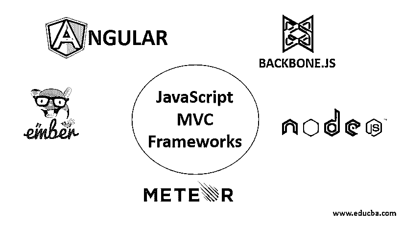

# JavaScript MVC 框架

> 原文：<https://www.educba.com/javascript-mvc-frameworks/>

## JavaScript MVC 框架简介

在 JavaScript MVC 框架中，MVC 的完整形式是模型、视图和控制器。MVC 基本上是一种著名的组织编写代码的方式。可以编写代码来完成不同的任务。下面就从创建网站这方面来说吧。一些代码用于在页面上显示 HTML 元素,而一些代码用于设计元素。不用说，CSS 做到了。一些代码是实时动画或检查错误。这些代码被称为 JavaScript。

1.  **M-Model:** 模型是定义任务或任务列表。这是所有数据存储的地方。它没有关于视图和控制器信息。
2.  V-View: 它定义了网站的外观。它显示了用户将如何与应用程序或网站进行交互。
3.  **C-Controller:** 定义用户如何插入任务或完成任务。我们可以称之为决策者。它可以在自己更新时更新模型和视图。

总的来说，自己从头开始编写所有代码并避免任何已经编写好的代码并不太难。然而，我们总是可以使用像主干一样坚固的东西，避免做出不正确的假设。

<small>网页开发、编程语言、软件测试&其他</small>

### JavaScript MVC 框架是做什么的？

编写的代码可以很容易地由 MVC 来维护，它将视图逻辑和业务逻辑分离开来。作业可以很容易地分配和管理，什么任务由谁负责，谁负责哪个代码。

#### JavaScript 框架

JavaScript 是 web 开发或设计不可或缺的一部分。然而，面对大量的代码和多人的工作，没有合适的 JavaScript 框架来管理代码并不是一件容易的事情。使用框架是因为如果开发 web 应用程序或网站，响应式设计是必须的。让我们继续讨论一些著名的 JavaScript 框架。

### JavaScript MVC 框架

以下是详细解释的 5 个 JavaScript MVC 框架。

#### 1.Angular.js

这是最重要的，因为有两个原因。首先，它由谷歌运营，其次，它是一个开源的 JavaScript 框架。由于是谷歌操作的，它在编码方面出现错误和失误的几率更小。这主要用于开发单页应用程序(SPA)。HTML 在定义和显示静态文档方面很棒，但在开发动态网站或应用程序时，它没有太多的功能。这就是 [AngularJS](https://www.educba.com/what-is-angularjs/) 出现的原因。它改进了应用程序的词汇。

#### 2.Ember.js

虽然它不能被称为很老，因为它是在 2015 年开始的，但它已经成长了很多。不仅如此，由于其应用领域广泛，一直很受欢迎。这个 JavaScript 框架最好的一点是，它支持双向数据绑定。因为它，它总是建立一个可靠的平台，处理最复杂的用户界面。Ember 是麻省理工学院许可的免费开源客户端 JavaScript 框架。早先这个框架的名字是 SproutCore MVC network。Ember 以其可重用性而闻名，它可以很好地维护 JavaScript Web 应用程序。它通过轻松管理 URL 来减少工作量。不仅如此，它还具有在内容改变时改变和更新整个模型的功能。

#### 3.流星

如果你正在考虑[制作一个全栈的](https://www.educba.com/full-stack-web-developer/) JavaScript 平台来制作一个网络应用或移动应用，Meteor 可能适合。它有助于创建实时应用程序，因为它提供了一个完整的生态系统，而不是组合这么多不同的工具。虽然它不能用于非常大和复杂的应用程序，但它为初学者和新程序员提供了很好的支持。最好的利用是制作实时应用程序。它基本上提供了一个平台，可以开发跨平台的 web、Android 和 iOS 应用程序。好消息是相同的代码可以用于所有类型的设备和浏览器。它还提供了大量的扩展包，非常容易安装，以改善框架的功能。

#### 4.节点. js

2009 年，Ryan Dahl 开发了这个服务器端平台。这基本上是建立在 Chrome 的 JavaScript 搜索引擎上。它是最有用的 JavaScript 框架之一，因为它不仅在 MIT 下是免费和开源的，而且是跨平台的。它可以用于开发网络应用程序。Node.js 以其速度著称，这也是它成为最广泛使用的网络框架的原因。它使用单线程模型，这有助于服务器立即平稳响应。这使得它具有高度的可伸缩性，并且在应用中没有缓冲区。

#### 5.骨干网. js

Backbone.js 是一个开源的 JavaScript 框架，你可以利用数百个扩展来改进它的功能。用于制作客户端应用程序，以轻量级著称。模型视图控制器使用事件将数据抽象到模型中。Backbone.js 为您提供了一种管理所有前端开发的更简单的方法。顾名思义，它提供了组装客户端应用程序主干的基本构件。就像大多数框架一样，它也随着模型的变化更新 HTML 元素。

### 结论

还有很多 JavaScript MVC 框架可供使用，它们有很好的特性，但不包括在本文中，例如 Mithril、Polymer、Aurelia、React 等等。JavaScript 基本上是一种事件驱动的编程语言，同时也带有函数式和命令式编程风格。JavaScript 不再是客户端应用程序了。它也被广泛用于服务器端脚本，因此框架的数量也在增加。有了这么多可用的框架，选择或声明最好的一个并不容易，因为每个框架都有自己的专长。然而，在选择任何一个之前，了解项目的需求是很重要的。应根据项目所需的功能进行选择。

### 推荐文章

这是 JavaScript MVC 框架的指南。这里我们讨论 MVC 框架、JavaScript 框架的介绍，以及所有 JavaScript MVC 框架的解释。您也可以浏览我们的其他相关文章，了解更多信息-

1.  [JavaScript 的特性](https://www.educba.com/features-of-javascript/)
2.  [什么是 MVC？](https://www.educba.com/what-is-mvc/)
3.  [Java 中的框架](https://www.educba.com/frameworks-in-java/)
4.  [AngularJS 架构](https://www.educba.com/angularjs-architecture/)

