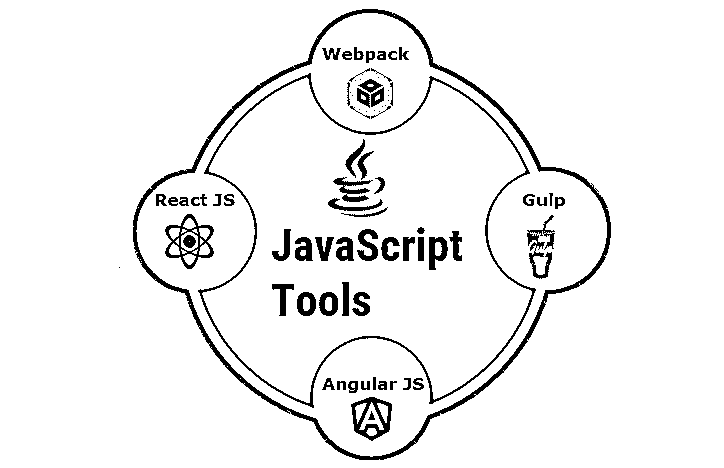

# JavaScript 工具

> 原文：<https://www.educba.com/javascript-tools/>

## JavaScript 工具简介

如今，JavaScript 是最著名和最常用的编程语言之一。这是因为它在不断进步和发展，推出了比以往更多的工具。这些 javascript 工具帮助开发人员使编程变得更加容易和简单，正因为如此，这些工具被每个人广泛使用。

### JavaScript 工具

让我们深入了解可供用户使用的各种著名的 JavaScript 工具，要想在这个领域保持领先地位，您必须了解这些工具。

<small>网页开发、编程语言、软件测试&其他</small>

#### 1.反应 JS

React JS 是一种开源技术，最初由脸书的工程师作为 JS 库引入。它提出了创新的方法来描述网页，具有许多优点，包括高性能和动态用户界面。在 React 中，我们可以重用代码的组件，这有助于我们节省时间和精力，当我们有系统更新时，这个功能尤其方便。[反应组分](https://www.educba.com/react-components-libraries/)是不同的，因此它们互不干扰。

我们有几个特征需要反应。数据绑定是在向下的方向上完成的，以支持稳定的代码。我们有一个虚拟的 DOM 使我们能够提高速度。React JS 社区的持续开发和增强有助于将其推向顶峰。

#### 

2。快递 JS

Express JS 是一个 [web 框架，通过使用技术节点 JS 来帮助](https://www.educba.com/web-development-frameworks/)设计者构建网页和网站。Express JS 为我们提供了强大的工具，可以用于 HTTP 服务器，使其稳定。

Express JS 可用于路由。它包括[巨大的测试覆盖面](https://www.educba.com/test-coverage/)并且具有像缓存和重定向这样的特性，这可以帮助 HTTP 服务器。它通常执行应用程序和网站相当快，并支持许多引擎。

我们使用 Express JS 是因为在 Express 中构建 API 非常简单，可以轻松创建网站和单页应用程序。

#### 3.角度 JS

Angular JS 是一个 JavaScript 框架，帮助我们编写客户端应用程序。Angular JS 支持 HTML，并允许正确构建相互关联的组件。我们不需要为 ui、数据库和链接单独编码，因为框架已经为我们做了。

Angular 是一个跨平台的解决方案，在创建 web 应用程序，尤其是单页面应用程序方面已经变得很流行。它包含在标准和流行的均值堆栈中。它为我们提供了命令行工具，并允许自动分割代码。它还为我们提供了双向数据绑定，这使得我们的数据更加安全。Angular JS 正在不断升级，这有助于它跟上技术变化的步伐。

#### 4.电子

如今，作为一种创建跨平台桌面应用程序的有效工具，Electron 已经获得了极大的关注。Electron 建立在 Node JS 和 Chromium engine 上，扩展支持 HTML、CSS、JS 组成的完整包。像 Docker 和桌面 GitHub 这样的应用程序都是在 Electron 上创建的。

Electron 是一个开源工具，可以免费获得。它与 Windows、Linux 和 Mac 系统兼容。Electron 包含为应用程序预先构建的演示 API，并有帮助调试的 Chromium 工具。Electron 也有能力在其环境中执行单元测试。这个工具的缺点是，由于它与 Chromium 捆绑在一起，更新的大小非常大。

#### 5.吞咽

Gulp 是特定于任务的 JavaScript 工具的一个样本。当程序员编写、编译或执行代码时，以及当他们压缩文件或图像时，他们会做很多更改，并且随着他们做出的每个更改，他们需要从头运行任务。为了帮助克服这些平凡而令人沮丧的任务，我们有专门针对单一任务的工具，比如 Gulp。

Gulp 帮助我们自动将文件加载到构建文件夹中。与其他特定于任务的工具相比，Gulp 更加强大，因为它速度快，对 JavaScript 代码有很好的覆盖，并且有单任务插件。据说大约 40%的开发者使用 Gulp。

#### 6.NPM

像 Gulp 一样，NPM 是一个特定于任务的工具，同时它也是一个 JavaScript 包管理器。在这里，我们可以发现大量可重用的代码包。NPM 非常灵活，也可以用作构建工具。

NPM 可以处理默认任务，例如简单的测试和其他类似的常规问题，也可以处理任意任务，例如我们创建的任务。这个工具比 Gulp 或其他这类特定于任务的工具更受欢迎，因为它提供了更多的包和插件，也因为它具有更少的兼容性和调试问题。NPM 创建了强大的脚本，适用于跨平台项目。

#### 7.网络包

当我们处理几个 JavaScript 文件时，Webpack 非常有用。这个工具是一个模块捆绑器，它以正确的顺序将模块插入到浏览器中。css，。它有一个模块化的插件系统，使我们能够执行任何可能的任务。Webpack 是最常见的工具之一，因为它使我们能够打包 JS 文档，以便在浏览器中使用，也可以作为任务运行程序的辅助工具。

Webpack 有很好的特性，包括能够将代码分成许多部分，这样我们可以减少加载时间。它还通过随时监控正在加载的零件来优化尺寸。它为我们提供了捆绑这些部件的功能，可以单独装载它们，也可以与几个部件一起装载。我们也可以在编译时解决依赖关系。

#### 8.埃斯林特

ESLint 也是一个特定于任务的工具，专门用于检测错误的任务。它监督代码来发现我们的失误，比如遗漏了一个右括号或者在代码末尾增加了额外的括号。检查代码中可能存在的错误的行为被称为“林挺”。

ESLint 可以根据开发者的需求进行配置。它有几个插件，用于它遵循的几个默认规则。EsLint 可以和 NodeJS 一起使用，它支持 Windows、Linux 和 Mac 系统。许多伟大的公司，如微软、Atlassian、网飞和 Domain 都在他们的应用程序中使用 ESLint，这向我们展示了 ESLint 对于一个 JavaScript 工具的重要性。

#### 9.view . js-检视. js

Vue JS 是一个高级 JavaScript 框架，用于开发图形用户界面。它由 Angular JS 创建，是一个轻量级的开源框架。Vue 使用 HTML 语法绑定数据，并提供导航、动画等工具。如今，Vue 越来越受欢迎，因为它简单明了，功能良好，并支持所有主流浏览器。

#### 10.jQuery

由于其正确的语法和较小的尺寸，jQuery 仍然是目前最流行的 JavaScript 工具之一。它用于创建客户端应用程序和网站。它有很好的属性，如动画和事件处理，也可以用来创建插件。像 Google、DailyMotion 和 MSN 这样的公司已经使用 jQuery 来构建他们的网站。

### 结论

在本文中，我们已经看到了几个 JavaScript 工具。开发人员可以根据应用程序的需要来使用每个工具和框架。

### 推荐文章

这是 JavaScript 工具的指南。这里我们详细讨论一下 javascript 的简介和一些著名的工具。您也可以浏览我们推荐的其他文章，了解更多信息——

1.  [如何安装 JavaScript](https://www.educba.com/install-javascript/)
2.  [JavaScript 的使用](https://www.educba.com/uses-of-javascript/)
3.  [JavaScript 职业](https://www.educba.com/careers-in-javascript/)
4.  [JavaScript vs VBScript](https://www.educba.com/javascript-vs-vbscript/)

