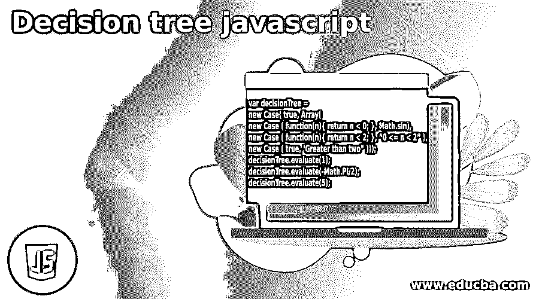
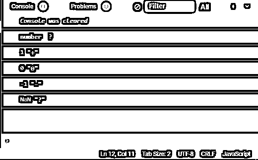

# 决策树 javascript

> 原文：<https://www.educba.com/decision-tree-javascript/>




## 决策树 javascript 简介

决策树 javascript 是一种工具，软件开发人员使用它来构建分析工具，帮助用户或客户可视化决策并了解决策结果的后果。像计算机科学中的其他树一样，决策树也有节点。这些节点被称为决策节点和结果节点，结果节点也被称为结束节点。在某些条件下，决策树也有机会节点，在某些特殊条件下，机会节点有利于一组结果而不是另一组结果。javascript 中的决策树是 javascript 上图表库的一部分。

**决策树的语法:**

<small>网页开发、编程语言、软件测试&其他</small>

```
var decisionTree =
new Case( true, Array(
new Case ( function(n){ return n < 0; }, Math.sin),
new Case ( function(n){ return n < 2; }, “0 <= n < 2” ),
new Case ( true, ‘Greater than two” )));
decisionTree.evaluate(1);
decisionTree.evaluate(-Math.PI/2);
decisionTree.evaluate(5);
```

使用这个实现，您可以任意嵌套您的树:

```
Case.prototype = {
nomatch : { match : false },
match : function (v) { return  { match : true , result : v }; },
evaluate : function( object ) {
var match = this.predicate;
if ( match instanceof Function )
match = match( object );
if ( match ) {
if (this.action instanceof Function )
return this.match( this.action(object) );
if ( this.action instanceof Case )
return this.action.evaluate( object );
if ( this.action instanceof Array ) {
var decision;
var result;
for (var c = 0; c < this.action.length; c++ ) {
decision = this.action[c];
if ( decision instanceof Case ) {
result = decision.evaluate( object );
if (result.match)
return result;
} else throw("Array of Case expected");
}
return this.nomatch;
}
return this.match(this.action);
}
return this.nomatch;
}
};
```

### 决策树是如何工作的？

决策树是如何工作的？让我们用一个非常简单的例子和提到的数据来试着理解一下。

| **ID** | **贷款金额** | **贷款状态** |
| One | One hundred | 好的 |
| Two | One hundred and fifty | 好的 |
| Three | Five hundred | 严重的 |
| Four | Two hundred | 好的 |

你可以假设它是银行数据或金融机构数据。我们有历史贷款数据，包括客户的 ID、客户的贷款金额，以及该贷款是好贷款还是坏贷款。在这个例子中，我们将使用这个简单的数据制作一个决策树。

通常，它的工作原理是:数据+机器学习算法=模型

这个模型是一个从数据中学习模式的实体。所以如果 a 从这些数据中创建一个模型，那么明天这个模型可以回答我的问题，如果我问这个模型“嘿！贷款金额是 x。你能告诉我这是一笔好贷款还是一笔坏贷款吗？这就是这个模型的用法。

决策树通常像普通的树结构一样工作。在树的结构中，有根，就有树枝。

分割节点的决定会影响树的准确性。对于分类和回归树来说，决定分割节点的标准是不同的。javascript 决策树使用各种算法和方法将节点或子节点分成更多的子节点。将节点拆分成分支节点取决于目标变量。决策树在可用的变量上工作，它在所有存在的变量上分裂节点，然后选择分裂的节点，这导致最合适的子节点。

分割节点期间的算法选择取决于目标变量。一些最著名的算法有 ID3，CART，CHAID，MARS，C4.5

### 决策树 Javascript 示例

```
// decision tree API
const decision = (conditionFunction, trueOutcome, falseOutcome) =>
(context) => conditionFunction(context) ? trueOutcome : falseOutcome;
const decide = (context, decision) => “{
const outcome  = decision (context);
return typeof outcome === “function” ? decide(context, outcome) : outcome;
}
// Example Code
const isPositive = x => x > 0;
const isNegative = x => x < 0;
const isZero = x => x === 0;
const numberSignDecision =
decision( isPositive, “+”, decision(isNegative, “-”, decision(isZero, “0”, ?)));
const contextValues = [“number”, 1, 0, -1, Number.NaN, ];
for (const value of contextValues) {
console.log(value, decide(value, numberSignDecision));
}
```

**输出:**




### 决策树的优势

*   决策树很容易理解，即使是非技术人员也很容易解释。
*   决策树可以有效地工作，即使数据很少，也可以处理大数据。
*   决策树使用白盒模型，这意味着如果一个给定的结果是由一个模型提供的，那么对该结果的解释很容易通过简单的数学公式来复制。
*   可以通过结合头脑风暴等其他决策技术来解决。

### 决策树的缺点

*   ID3 和 C4.5 等大多数算法要求目标属性只有离散值。
*   由于决策树使用“分而治之”的方法，如果存在一些高度相关的属性，它们往往表现得很好，但如果存在许多复杂的交互，就不那么好了。
*   决策树的贪婪特性导致了另一个应该指出的缺点。这是它对训练集、对无关属性、对噪声的过度敏感。

### 结论

在本文中，我们已经了解了很多关于 javascript 决策树的知识，例如，什么是 javascript 决策树，它的工作是什么，它的语法，它是如何工作的，它的各种算法，以及 javascript 决策树的优缺点。

在这篇文章的基础上，我们发现决策树在条件下工作，并根据该条件给出结果。在这些步骤中添加遍历之后，我们还可以通过使用 if-else 语句来制作决策树。机器学习开发人员大多使用决策树，因为它易于理解和解释。通过使用决策树，用户可以根据预先假定的条件毫不犹豫地做出决策。与此同时，决策树不言自明，易于理解。更简单地说，如果一个决策树有可数的合理数量的叶子，那么一个非技术用户也能理解它。决策树利大于弊，所以要学习和使用它。

### 推荐文章

这是一个决策树 javascript 的指南。在这里，我们将讨论决策树是如何工作的，以及示例和输出。您也可以看看以下文章，了解更多信息–

1.  [哈希表 JavaScript](https://www.educba.com/hash-table-javascript/)
2.  [Sprintf JavaScript](https://www.educba.com/sprintf-javascript/)
3.  [JavaScript hash()](https://www.educba.com/javascript-hash/)
4.  [JavaScript MD5](https://www.educba.com/javascript-md5/)


