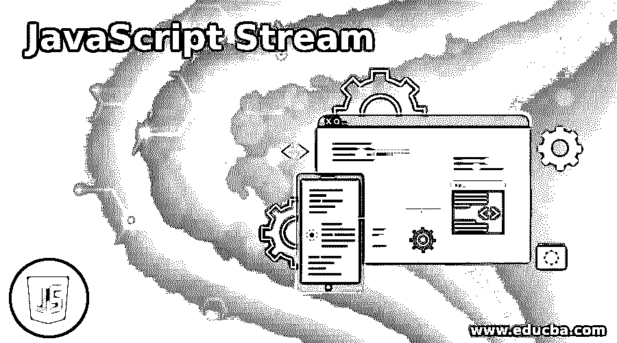
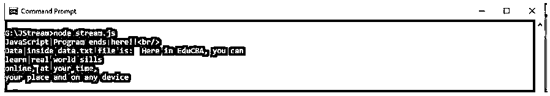
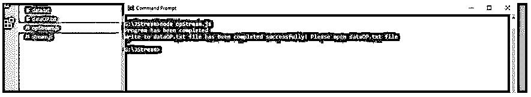
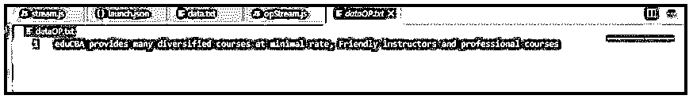
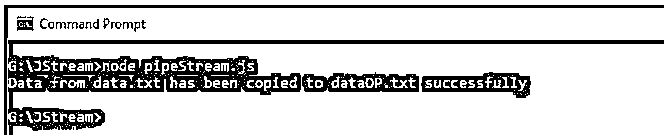
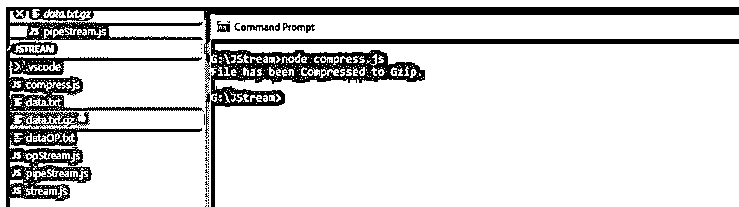
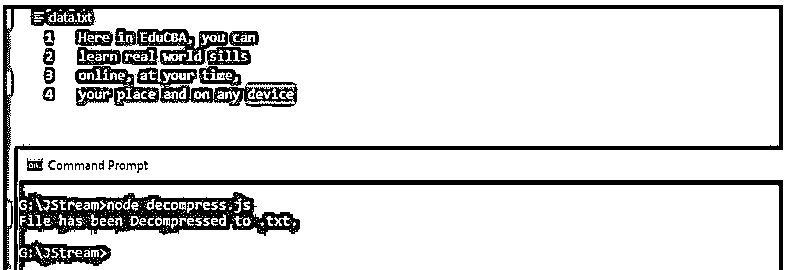

# JavaScript 流

> 原文：<https://www.educba.com/javascript-stream/>




## JavaScript 流简介

JavaScript Stream 允许以编程方式访问网络上接收的数据流。流式传输是将资源或数据分成更小的块，一点一点地进行处理。在 JavaScript 流中，整个序列被加载到内存中，然后被处理。为此，我们不需要太多的内存来保存这些数据以及它们在转换后的结果。以前，当我们想要处理文本或视频之类的数据时，必须在处理之前将其下载并反序列化为所需的格式。现在由于 JavaScript 流，接收到的原始数据可以直接逐位处理。

### JavaScript 流的语法

没有类似于函数或 JavaScript 方法的特殊语法，因为 JavaScript Stream 是一个允许我们处理数据的 API。

<small>网页开发、编程语言、软件测试&其他</small>

有两种类型的流模式:

*   **从流中读取:**var readStream = fs . create readStream(<文件名称>
*   **写入流:**var writeStream = fs . createwritestream(<name _ of _ the _ file>

NodeJS 中的流是可读写的，称为双工流。这是因为 javaScript 流是通用的，所以这些流的主要目的是减少所需的内存。

我们将在 NodeJS 平台上运行所有的 JavaScript 应用程序；NodeJS 是用 JavaScript 语言编写的，所以语法上不会有变化。安装 VSCode 和 NodeJS 来运行下面的例子。

### JavaScript 流的示例

以下是 JavaScript 流的示例:

#### 示例#1

在这里，我们将看到如何创建一个 JS 文件并从 data.txt 文件中读取数据。

**代码:**

**Stream.js:**

```
var fs = require("fs");
var data = '';
var readStream = fs.createReadStream('data.txt');
readStream.setEncoding('UTF8');
readStream.on('data', function(bits) {
data += bits;
});
readStream.on('end',function() {
console.log("Data inside data.txt file is: ", data);
});
readStream.on('error', function(err) {
console.log(err.stack);
});
console.log("JavaScript Program ends here!!");
```

**在 data.txt:**

```
Here in EduCBA, you can
learn real world sills
online, at your time,
your place and on any device
```

**输出:**




这里我们创建一个 ReadableStream，然后通过处理数据流事件和错误堆栈来设置 UTF8 编码。在命令提示符输出中，您可以看到 JStream，这是我们放置 stream.js 文件和 data.txt 文件的文件夹。在运行逻辑时，stream.js 文件将在给定的路径中搜索 data.txt，打开文件，并在控制台中显示内容以及结束行。如果在打开文件时有任何问题，或者如果没有文件本身或任何其他问题，将在控制台中打印错误堆栈。

#### 实施例 2

这里我们将看到 WritableStream 把给定的数据写到一个. txt 文件中。

**代码:**

```
var fs = require("fs");
var data = 'eduCBA provides many diversified courses at minimal rate, Friendly instructors and professional courses';
var writeStream = fs.createWriteStream('dataOP.txt');
writeStream.write(data,'UTF8');
writeStream.end();
writeStream.on('finish', function() {
console.log("Write to dataOP.txt file has been completed successfully! Please open dataOP.txt file");
});
writeStream.on('error', function(err){
console.log(err.stack);
});
console.log("Program has been completed");
```

**输出:**




生成一个新文件 dataOP.txt 让我们检查一下里面的数据。




**Note:** Please ignore launch.json here. So the data has been written to the dataOP.txt file as programmed.

**管道 JS 流:**

一种机制，我们将一个流的输出作为另一个流的输入。数据取自一个流，其输出从该流传递到另一个流。管道操作没有限制。

我们将通过一个例子来看这个管道概念是如何使用的。

#### 实施例 3

**代码:**

```
var fs = require("fs");
var readStream = fs.createReadStream('data.txt');
var writeStream = fs.createWriteStream('dataOP.txt');
readStream.pipe(writeStream);
console.log("Data from data.txt has been copied to dataOP.txt successfully");
```

**输出:**

**下面 data.txt 和 dataOP.txt 中以前的数据:**


**配管后:**




Data.txt 将保持不变，因为只有数据被复制到 dataOP.txt WritableStream。

我们在流中有另一个概念，即链接流。

在这里，我们将一个流的输出连接到另一个流，并同样创建了多个操作的链。与管道概念一起使用。我们将使用这两个概念来压缩和解压缩文件。

#### 实施例 4

**代码:**

```
var fs = require("fs");
var zlib = require('zlib');
fs.createReadStream('data.txt')
.pipe(zlib.createGzip())
.pipe(fs.createWriteStream('data.txt.gz'));
console.log("File has been Compressed to Gzip.");
```

**输出:**




Data.txt 文件保持不变，一个新的 Gzip 文件被创建为 Data.txt。

#### 实施例 5

**代码:**

```
var fs = require("fs");
var zlib = require('zlib');
fs.createReadStream('data.txt.gz')
.pipe(zlib.createGunzip())
.pipe(fs.createWriteStream('data.txt'));
console.log("File has been Decompressed to .txt.");
```

**输出:**




该文件已从. gz 解压缩为. txt 文件。

### JavaScript 流的优势

下面是提到的优点:

*   即使是有基础知识的初学者也可以实现流。
*   确保及时处理数据，减少不必要的浪费。
*   数据不会泄露，并且得到充分处理，从而提高了空间效率。
*   流是编程不可或缺的一部分，帮助程序员在更短的时间内简化代码。

### 结论

我们已经看到了 JavaScript 流及其语法。通过 ReadableStream、WritableStream、PipingStream 和 ChainingStreams 的几个例子说明了它是如何以编程方式工作的。也看到了上面列出的一些优点。即使有这么多其他可用的环境，JavaScript 流也是人们一直使用 NodeJS 的原因之一。

### 推荐文章

这是一个 JavaScript 流的指南。在这里，我们分别讨论 JavaScript 流的介绍以及例子和优点。您也可以看看以下文章，了解更多信息–

1.  [JavaScript 父节点](https://www.educba.com/javascript-parent-node/)
2.  [JavaScript 事件处理程序](https://www.educba.com/javascript-event-handler/)
3.  [JavaScript 倒计时](https://www.educba.com/javascript-countdown/)
4.  [JavaScript onkeyup](https://www.educba.com/javascript-onkeyup/)


