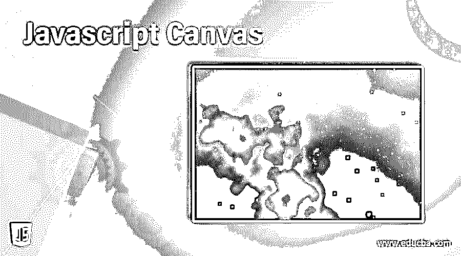
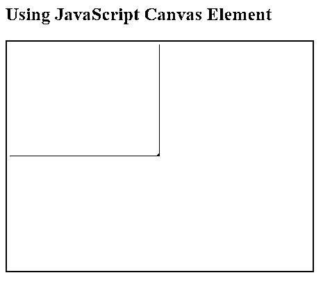
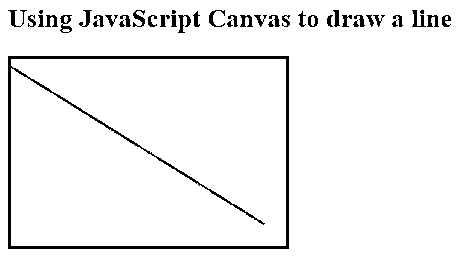
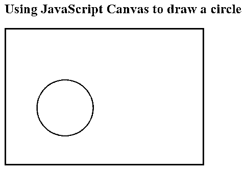
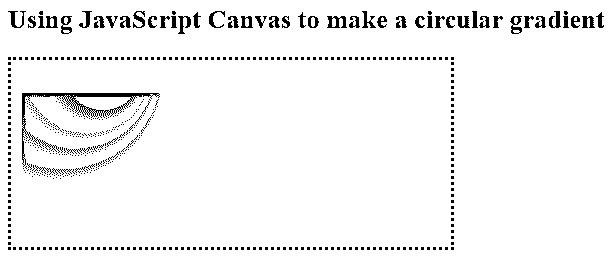
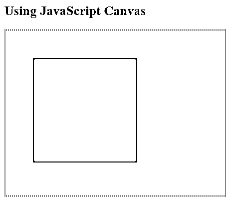
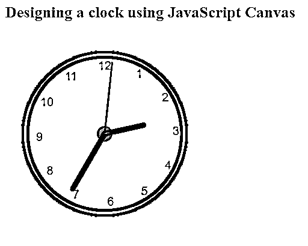

# Javascript 画布

> 原文：<https://www.educba.com/javascript-canvas/>




## Javascript 画布简介

Canvas 是一种模板，用于在软件行业中绘制图片、图形或创建简单的动画。JavaScript Canvas 通过 HTML

<canvas>标记元素获取引用，该元素用于通过 JavaScript 在网页上绘制或编程图形。这个

<canvas>元素是一个图形容器，我们需要使用 JavaScript 将图形显示在 web 应用程序上。我们将研究一些简单而有趣的例子，看看 JavaScript Canvas 是如何工作的。</canvas>

</canvas>

**语法:**

<small>网页开发、编程语言、软件测试&其他</small>

因为 JavaScript canvas 是一个标记元素，所以它显示为:

```
<canvas>
<canvas id=" " width=" " height= " "></canvas>
```

画布是 HTML 网页上的一个矩形区域。默认情况下，它没有边框和内容。必须指定 ID 属性，以便在脚本中与定义画布大小的高度和宽度一起引用。要添加边框或任何类型的 CSS，需要添加一个样式属性。

我们将看到 canvas 元素是如何被用来绘制 2D 图形和动画的。这是苹果公司为 OS X 仪表板首次引入的，已经实现，并且大多数浏览器都支持 canvas。在进入示例之前，必须对 HTML 和 JavaScript 有一个基本的了解，旧版本的浏览器不支持

<canvas>元素，但新版本的浏览器支持</canvas>

画布的默认大小为 300*150 像素(宽*高)。画布的大小也可以定制。我们需要使用一个 JavaScript 上下文对象，它将帮助我们在控制台上创建图形。

### JavaScript 中 Canvas 是如何工作的？

我们将看到一个简单的例子逐步实现。

第一步是找到 Canvas 元素，这是通过 HTML DOM 方法 getElementById()完成的，

```
var canvas = document.getElementById("sampleCanvas");
```

第二步是创建一个绘图对象，借助一个内置的 HTML 对象，getContext()的属性和方法在这里定义

```
var sampleObject = canvas.getContext("2d");
```

第三步是在画布上绘制，需要将对象的填充样式设置为某种颜色。

```
sampleObject.fillStyle = "#FFAABB";
```

fillStyle 属性可以是任何 CSS 颜色、图案或任何渐变，默认 fillStyle 为黑色

fillRect(x，y，width，height)方法将绘制一个矩形，用给定的 fillStyle 填充:

```
sampleObject.fillRect(0, 0,  200, 150)
```

结合所有这些步骤，我们将看到这个例子如何给出输出，

### Javascript 画布示例

下面是提到的不同例子:

#### 示例#1

**代码:**

```
<!DOCTYPE html>
<html>
<body>
<h2>Using JavaScript Canvas Element</h2>
<canvas id="sampleCanvas" width="400" height="300"
style="border:2px solid #c333c3;">
</canvas>
<script>
var canvas = document.getElementById("sampleCanvas");
var sampleObject = canvas.getContext("2d");
sampleObject.fillStyle = "#FFAABB";
sampleObject.fillRect(0,0,200,150);
</script>
</body>
</html>
```

**输出:**




#### 实施例 2

**代码:**

```
<!DOCTYPE html>
<html>
<body>
<h2>Using JavaScript Canvas to draw a line</h2>
<canvas id="sampleCanvas" width="250" height="170" style="border:3px solid #FF0000;"></canvas>
<script>
var canvas = document.getElementById("sampleCanvas");
var sampleObject = canvas.getContext("2d");
sampleObject.moveTo(0,7); // coordinates from where the line should start
// coordinates start from top left corner in graphics
sampleObject.lineTo(230,150);
sampleObject.stroke();
</script>
</body>
</html>
```

**输出:**




#### 实施例 3

**代码:**

```
<!DOCTYPE html>
<html>
<body>
<h2>Using JavaScript Canvas to draw a circle</h2>
<canvas id="sampleCanvas" width="350" height="240" style="border:3px solid #dd33ff;"></canvas>
<script>
var canvas = document.getElementById("sampleCanvas");
var sampleObject = canvas.getContext("2d");
sampleObject.beginPath();
sampleObject.arc(105,140,50,1,3*Math.PI); // Mentioning the required coordinates and attributes for a circle
sampleObject.stroke();
</script>
</body>
</html>
```

**输出:**




#### 实施例 4

**代码:**

```
<!DOCTYPE html>
<html>
<body>
<h2>Using JavaScript Canvas to make a circular gradient</h2>
<canvas id="sampleCanvas" width="400" height="170" style="border:3px dotted #ffaabb;"></canvas>
<script>
var canvas = document.getElementById("sampleCanvas");
var sampleObject = canvas.getContext("2d");
var gradient = sampleObject.createRadialGradient(105, 10, 4, 40, 10, 100);
gradient.addColorStop(0,"blue");
gradient.addColorStop(1,"yellow");
sampleObject.fillStyle = gradient;
sampleObject.fillRect(10,30,200,100);
</script>
</body>
</html>
```

**输出:**




#### 实施例 5

**代码:**

```
<!DOCTYPE html>
<html>
<body>
<h2>Using JavaScript Canvas</h2>
<canvas id="sampleCanvas" width="400" height="300"
style="border:2px dotted #c333c3;">
</canvas>
<script>
const canvas = document.getElementById('sampleCanvas');
const canvasObject = canvas.getContext('2d');
canvasObject.fillStyle = 'orange';
canvasObject.fillRect(50, 50, 190, 190);
</script>
</body>
</html>
```

**输出:**




画布上的文本，需要的属性是字体、fillText 和 strokeText

画布上的图像，方法 drawImage(image，x，y)

引用 getContext()方法覆盖 getContext("2d ")对象的属性和方法，用于在画布上绘制线条、圆形、矩形、文本。

#### 实施例 6

**使用 JavaScript 画布制作时钟**

**代码:**

```
<!DOCTYPE html>
<html>
<body>
<h2>Designing a clock using JavaScript Canvas</h2>
<canvas id="sampleCanvas" width="300" height="300"
style="background-color: yellow">
</canvas>
<script>
var canvas = document.getElementById("sampleCanvas");
var sampleObject = canvas.getContext("2d");
var radius = canvas.height / 2;
sampleObject.translate(radius, radius);
radius = radius * 0.80
setInterval(clockCanvas, 1000);
function clockCanvas() {
faceCanvas(sampleObject, radius);
numbersCanvas(sampleObject, radius);
drawTime(sampleObject, radius);
}
function faceCanvas(sampleObject, radius) {
var grad;
sampleObject.beginPath();
sampleObject.arc(0, 0, radius, 0, 2*Math.PI);
sampleObject.fillStyle = 'white';
sampleObject.fill();
gradient = sampleObject.createRadialGradient(0,0,radius*0.95, 0,0,radius*1.04);
gradient.addColorStop(0, '#330');
gradient.addColorStop(0.5, 'white');
gradient.addColorStop(1, '#330');
sampleObject.strokeStyle = grad;
sampleObject.lineWidth = radius*0.1;
sampleObject.stroke();
sampleObject.beginPath();
sampleObject.arc(0, 0, radius*0.1, 0, 2*Math.PI);
sampleObject.fillStyle = '#330';
sampleObject.fill();
}
function numbersCanvas(sampleObject, radius) {
var ang;
var num;
sampleObject.font = radius*0.15 + "px arial";
sampleObject.textBaseline="middle";
sampleObject.textAlign="center";
for(num = 1; num < 13; num++){
ang = num * Math.PI / 6;
sampleObject.rotate(ang);
sampleObject.translate(0, -radius*0.87);
sampleObject.rotate(-ang);
sampleObject.fillText(num.toString(), 0, 0);
sampleObject.rotate(ang);
sampleObject.translate(0, radius*0.85);
sampleObject.rotate(-ang);
}
}
function drawTime(sampleObject, radius){
var now = new Date();
var hour = now.getHours();
var minute = now.getMinutes();
var second = now.getSeconds();
//hour
hour=hour%12;
hour=(hour*Math.PI/6)+
(minute*Math.PI/(6*60))+
(second*Math.PI/(360*60));
drawHand(sampleObject, hour, radius*0.5, radius*0.07);
//minute
minute=(minute*Math.PI/30)+(second*Math.PI/(30*60));
drawHand(sampleObject, minute, radius*0.8, radius*0.07);
// second
second=(second*Math.PI/30);
drawHand(sampleObject, second, radius*0.9, radius*0.02);
}
function drawHand(sampleObject, pos, length, width) {
sampleObject.beginPath();
sampleObject.lineWidth = width;
sampleObject.lineCap = "round";
sampleObject.moveTo(0,0);
sampleObject.rotate(pos);
sampleObject.lineTo(0, -length);
sampleObject.stroke();
sampleObject.rotate(-pos);
}
</script>
</body>
</html>
```

**输出:**




### 结论

至此，我们结束了对“JavaScript 画布”主题的讨论。我们已经看到了什么是 JavaScript Canvas 及其语法。描述了语法中的每个参数。举例说明一些简单的例子来帮助你理解这个概念。另一个很好的例子是 Canvas Clock，我们用 JavaScript 设计了它，并用逻辑来制作时钟。希望这些例子足以让你轻松了解概念。谢谢！快乐学习！!

### 推荐文章

这是一个 Javascript 画布指南。在这里，我们将讨论 Canvas 如何在 JavaScript 中工作，并一步一步地给出实现的例子。您也可以看看以下文章，了解更多信息–

1.  [JavaScript 绝对值](https://www.educba.com/javascript-absolute-value/)
2.  [卸载 JavaScript](https://www.educba.com/unshift-javascript/)
3.  [JavaScript test()](https://www.educba.com/javascript-test/)
4.  [JavaScript onsubmit](https://www.educba.com/javascript-onsubmit/)


