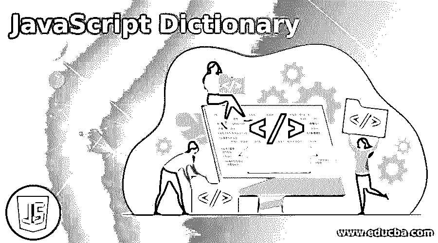
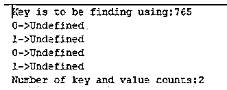
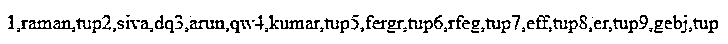
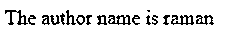

# JavaScript 字典

> 原文：<https://www.educba.com/javascript-dictionary/>




## JavaScript 字典介绍

在 JavaScript 中，字典是数据类型之一；它可以用于脚本中的不同序列，也不包含一些灵活的对象。因为对象是的根本原因，所以所有面向对象的编程语言这里的 JavaScript 是一种动态类型语言，它不使用自然的数据结构向字典提供任何数据。以适当的结构连接在一起的数据集合称为数据结构字典。它可以使用 JavaScript 对象数据类型定义来实现。

**语法:**

<small>网页开发、编程语言、软件测试&其他</small>

我们已经知道 JavaScript 是面向对象编程模型之一。因此，每个变量、数据类型和函数、自变量等。，有自己的语法和格式来实现基于 web 的项目中的目标。

```
<html>
<body>
<script>
var dictionary={""};
var dictionary= new Object();
---some javascript logics—
</script>
</body>
</html>
```

上面的代码是 dictionary 对象的基本语法，我们还在脚本中创建了一个单独的 dictionary 实例。

### JavaScript 字典是怎么做的？

*   字典是 JavaScript 集合包之一，它主要将值表示和声明为键-值对，它位于 Map 接口下，键需要是字符串格式，使用此约束，它可能需要放置映射以简化假设，并与普通 JavaScript 对象等其他功能一起使用，它已在后端存储中分配了内存。所以我们必须在此之前传递字典对象中的参数；我们必须在初始阶段指定用于创建实例的构造函数。
*   在初始阶段，字典创建一个对象，它提供一个带有一个值的键，这两个值必须在数据变量中匹配和映射在一起。我们知道 JavaScript 本身并不提供任何字典数据结构，这种数据结构将在名为 object datatype 的父类的帮助下实现。字典由单个或多个值项组成，这些值项只能用于键和值对。键是否用于选择、搜索和过滤项目，值是否被赋值和用于存储项目内的一些数据。我们将以不同的方式在脚本中创建对象，尤其是在字典数据类型中；我们可以用 3 种不同的方式来使用它。1 .使用一个新的关键字创建一个对象，比如 var v=new objet()。我们可以使用像 var v={}这样的花括号({})来创建对象，同时在堆内存中创建一个单独的实例和内存地址。
*   最后一种方法是，我们必须通过设置一些数据项来创建字典对象，如键/值对 var v={key:value}键和值是否使用任何数据类型，如字符串、整数等。我们可以使用键-值对填充字典项，在这个场景中使用点操作符符号创建项，将其命名为 add 或 populate the dictionary。然后，我们将使用 javascript 中的 delete 关键字删除字典中的条目，我们将使用像 delete dictionary 这样的点或方块格式提供数据项。伊斯梅尔和删除词典[12]；这些是语法代码，当我们在一个键的帮助下从一个字典中删除一个条目时，它们被用来删除这个字典类型中的条目。通常，字典会使用多个键来迭代循环。
*   我们可以在一些循环中使用 JavaScript，比如 for，forEach，while 等等。，主要用于和 forEach，最广泛用于借助键来迭代 keyscript 中的值。我们已经提到过，在键的帮助下，我们可以使用符号或特殊字符(如方括号和点用法)来检索项目。我们将使用键来更改和更新值，主要是更新现有的项目值；它不会被删除；它只是用新项目更改或替换现有项目。然后，使用一些条件语句，如 if-else，我们将验证脚本中的键和值。

### JavaScript 字典示例

以下是 JavaScript 字典的示例:

#### 示例#1

**代码:**

```
<!DOCTYPE HTML>
<html>
<body>
<script>
function dictionary() {
this.a = new Array();
this.b = b;
this.a = new Array();
this.c = c;
this.d = d;
this.e = e;
this.f = f;
this.g = g;
this.h = h;
}
function b(k, v) {
this.a[k] = v;
}
function c(k) {
return this.a[k];
}
function d(k) {
delete this.a[k];
}
function e() {
for (var k in Object.keys(this.a).sort()) {
document.write(k + " -> " + this.a[k]);
}
}
function f() {
for (var k in Object.keys(this.a).sort()) {
document.write(k + " -> " + this.a[k]);
}
}
function g() {
var s = 0;
for (var k in Object.keys(this.a)) {
++s;
}
return s;
}
function h() {
for (var k in Object.keys(this.a)) {
delete this.a[k];
}
}
var book = new Dictionary();
book.b("siva","098");
book.b("raman", "765");
book.b("arun", "432");
document.write("Key is to be finding using: " + book.c("raman"));
book.d("B");
book.e();
book.f();
book.h();
documnet.write("Number of key and value counts: " + book.g());
</script>
</body>
</html>
```

**输出:**




#### 实施例 2

**代码:**

```
<!DOCTYPE HTML>
<html>
<body>
<script>
var dictionary  = { 1: 'ID', raman: 'name',tup: 'city' };
document.write(Object.keys(dictionary));
var dictionary1  = { 2: 'ID', siva: 'name',dq: 'city' };
document.write(Object.keys(dictionary1));
var dictionary2  = { 3: 'ID', arun: 'name',qw: 'city' };
document.write(Object.keys(dictionary2));
var dictionary3  = {4: 'ID', kumar: 'name',tup: 'city' };
document.write(Object.keys(dictionary3));
var dictionary4  = {5: 'ID', fergr: 'name',tup: 'city' };
document.write(Object.keys(dictionary4));
var dictionary5  = {6: 'ID', rfeg: 'name',tup: 'city' };
document.write(Object.keys(dictionary5));
var dictionary6  = {7: 'ID', eff: 'name',tup: 'city' };
document.write(Object.keys(dictionary6));
var dictionary7  = {8: 'ID', er: 'name',tup: 'city' };
document.write(Object.keys(dictionary7));
var dictionary8  = {9: 'ID',gebj: 'name',tup: 'city' };
document.write(Object.keys(dictionary8));
</script>
</body>
</html>
```

**输出:**




#### 实施例 3

**代码:**

```
<!DOCTYPE HTML>
<html>
<body>
<p id="demo"></p>
<script>
var dictionary = {language:"english", book:"siva", author:"raman"};
document.getElementById("demo").innerHTML = "The author name is " + dictionary.author;
</script>
</body>
</html>
```

**输出:**

**

** 

### 结论

在 JavaScript dictionary 中，我们使用来存储和检索脚本或后端数据库中的值，如果需要的话，可以在数据库或内存区域中检索或存储这些值，并在 JavaScript 中快速执行查找操作。

### 推荐文章

这是一本 JavaScript 字典指南。这里我们讨论引言；JavaScript 字典是怎么做的？和示例。您也可以看看以下文章，了解更多信息–

1.  [JavaScript 计数器](https://www.educba.com/javascript-counter/)
2.  [JavaScript 父节点](https://www.educba.com/javascript-parent-node/)
3.  [JavaScript 延迟](https://www.educba.com/javascript-delay/)
4.  [JavaScript 动画](https://www.educba.com/javascript-animation/)


