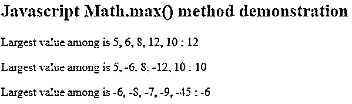
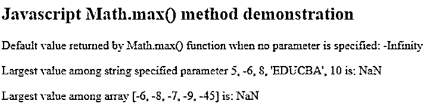
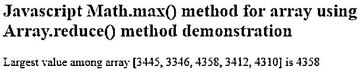
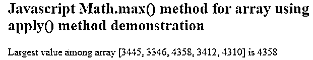
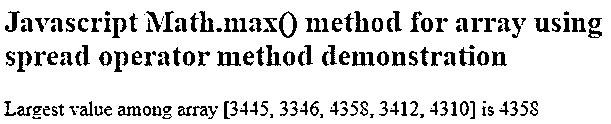

# JavaScript max

> 原文：<https://www.educba.com/javascript-max/>


## JavaScript max 简介

Javascript max 使用 Math.max 在作为参数提供给函数的数值列表中找出最大值。此方法有助于检索最大数值。但是，这不适用于阵列。如果您想要找出数组中最大值的元素，那么您必须使用附加功能，例如 array.reduce 方法或 apply()方法以及 Math.max 方法来找出最大值的元素。在本文中，我们将看到 Math.max 方法的语法、一般用法和工作原理，并借助数字列表和数组的示例演示 Math.max 方法的用法。

**语法:**

<small>网页开发、编程语言、软件测试&其他</small>

```
Math.max([numericValue [, numberValue2 [, ...]]])
```

**JavaScript max 函数的语法定义:**

数学是 JavaScript 中存在的对象，其中定义了多个函数和属性来帮助执行各种数学运算。Max 是 Math 对象中的一个这样的函数，它是静态方法。因此，每当您想要使用 max()函数时，就需要在 max()方法之前用点(.)如 math . max()；

[numericValue [, numberValue2 [, …]]] – This are the optional numeric values that you can pass as the parameter to the max() method to find out the largest value among the passed parameter values. When none of the numeric value is passed, then the result of the max() function is -Infinity that is the initial value of the comparator. Nearly all other numeric values have a value greater than -Infinity; hence, we do not mention any numeric value as a parameter to be compared and get maximum value, the max() function return -Infinity value. When a certain value is passed as a parameter to the max() function that is non-convertible to the number, then the resultant value of max() function output is NaN that stands for Not a Number.

### JavaScript max 示例

以下是 JavaScript max 的示例:

#### 示例#1

考虑一个简单的例子，我们试图在不同的正数和负数中获得最大值，如下所示。

**代码:**

```
<!DOCTYPE html>
<html>
<body>
<h2>Javascript Math.max() method demonstration</h2>
<p id="demo1"></p>
<p id="demo2"></p>
<p id="demo3"></p>
<script>
document.getElementById("demo1").innerHTML = "Largest value among is 5, 6, 8, 12, 10 : "+ Math.max(5, 6, 8, 12, 10);
document.getElementById("demo2").innerHTML = "Largest value among is 5, -6, 8, -12, 10 : "+ Math.max(5, -6, 8, -12, 10);
document.getElementById("demo3").innerHTML = "Largest value among is -6, -8, -7, -9, -45 : "+ Math.max(-6, -8, -7, -9, -45);
</script>
</body>
</html>
```

**输出:**




我们知道，当负数的绝对数值增加时，负数的值会减少，这意味着-45 小于-9，以此类推。因此，作为参数-6，-8，-7，-9，-45 提供的所有负数中最大值的输出是-6。

#### 实施例 2

考虑另一个例子，当没有提供任何参数时，当传递字符串值时，以及当数组值作为参数传递给函数时，我们尝试显示 Math.max()函数返回的值，如下例所示。

**代码:**

```
<!DOCTYPE html>
<html>
<body>
<h2>Javascript Math.max() method demonstration</h2>
<p id="demo1"></p>
<p id="demo2"></p>
<p id="demo3"></p>
<script>
document.getElementById("demo1").innerHTML = "Default value returned by Math.max() function when no parameter is specified: "+ Math.max();
document.getElementById("demo2").innerHTML = "Largest value among string specified parameter 5, -6, 8, 'EDUCBA', 10 is: "+ Math.max(5, -6, 8, 'EDUCBA', 10);
document.getElementById("demo3").innerHTML = "Largest value among array [-6, -8, -7, -9, -45] is: "+ Math.max([-6, -8, -7, -9, -45]);
</script>
</body>
</html>
```

**输出:**




如前所述，对于不可转换为数值的参数，如字符串和数组，Math.max()函数的输出是 NaN。没有指定参数的 Math.max()方法的输出是-Infinity。

#### 实施例 3

现在让我们看看，如何使用下面的例子获得数组元素中的最大值。

**代码:**

```
<!DOCTYPE html>
<html>
<body>
<h2>Javascript Math.max() method for array using Array.reduce() method demonstration</h2>
<p id="demo"></p>
<script>
var array = [3445, 3346, 4358, 3412, 4310];
var maximumValue = array.reduce(function(temp1, temp2) {
return Math.max(temp1, temp2);
});
document.getElementById("demo").innerHTML = "Largest value among array [3445, 3346, 4358, 3412, 4310] is "+ maximumValue;
</script>
</body>
</html>
```

**输出:**




#### 实施例 4

让我们再看一种方法，使用另一种使用 apply()函数的技术来找出数组中的最大值。

**代码:**

```
<!DOCTYPE html>
<html>
<body>
<h2>Javascript Math.max() method for array using apply() method demonstration</h2>
<p id="demo"></p>
<script>
var array = [3445, 3346, 4358, 3412, 4310];
function getMaximumValue(suppliedArray) {
return Math.max.apply(null, suppliedArray);
}
document.getElementById("demo").innerHTML = "Largest value among array [3445, 3346, 4358, 3412, 4310] is  "+ getMaximumValue(array);
</script>
</body>
</html>
```

**输出:**




#### 实施例 5

我们可以使用另一种方法，称为 spread operator 方法，它可以用来获得数组的最大值。

**代码:**

```
<!DOCTYPE html>
<html>
<body>
<h2>Javascript Math.max() method for array using spread operator method demonstration</h2>
<p id="demo"></p>
<script>
var array = [3445, 3346, 4358, 3412, 4310];
var maxValue = Math.max(...array);
document.getElementById("demo").innerHTML = "Largest value among array [3445, 3346, 4358, 3412, 4310] is  "+ maxValue;
</script>
</body>
</html>
```

**输出:**




### 结论

通过使用 javascript 中的 Math.max()函数，我们可以找出指定数值中的最大值作为 max()函数的参数。但是，在将它用于其他类型的值和数组时，我们需要小心。当您想要找出数组中的最大值时，您必须使用一些额外的功能、代码和逻辑以及 Math.max()方法来实现。例如，我们可以使用 apply()方法或 Array.reduce()方法来查找数组中的最大值。

### 推荐文章

这是一个 JavaScript max 的指南。这里我们分别讨论 JavaScript max 的介绍以及相应的例子。您也可以看看以下文章，了解更多信息–

1.  [JavaScript Minify](https://www.educba.com/javascript-minify/)
2.  [JavaScript 随机](https://www.educba.com/javascript-random/)
3.  [JavaScript 窗口对象](https://www.educba.com/javascript-window-object/)
4.  [JavaScript 父节点](https://www.educba.com/javascript-parent-node/)


