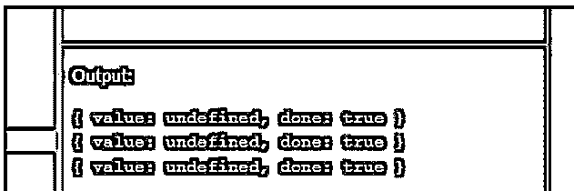
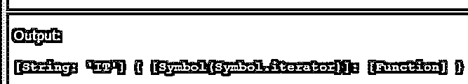
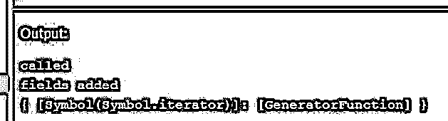

# JavaScript 迭代器

> 原文：<https://www.educba.com/javascript-iterator/>


## JavaScript 迭代器简介

在编程语言中，迭代器是一个对象，它使我们能够遍历对象列表。通过使用 JavaScript 迭代器，我们可以允许 JavaScript 对象定义它们的自定义迭代行为。它还为我们提供了迭代器对象的一些内置类型，但具有默认的迭代行为，即数组、映射。要定义定制迭代，必须实现 iterable 协议，并且需要实现@@iterator 方法。此外，我们需要遵循新的标准，即 Symbol.iterator，这里符号提供的名称是唯一的，不应该与其他属性名称冲突。

Symbol.iterator 将返回迭代器的一个对象，这个迭代器包含以下内容。迭代器协议定义了一种生成值序列的方法，并在所有值生成后返回它们。如果我们想要迭代，对象必须用下面的语法和语义实现 next()方法。

<small>网页开发、编程语言、软件测试&其他</small>

### JavaScript 迭代器中可用的方法

下面给出了 JavaScript 迭代器中可用的方法:

**属性值**

**next()方法:**它是一个无参数方法，至少返回下面提到的两个属性:

*   **值:**可以返回任何 JavaScript 值。如果 done 值为真，那么它将被忽略。这可以是任何类型。它将包含当前值。
*   **done(Boolean):** 它将包含一个布尔值。它基本上表示所有的值是否都已被获取。如果迭代器不能产生下一个值，或者我们可以说不能到达末端，它将有一个假值。换句话说，不需要为 done 变量指定值。
*   如果迭代器已经到达序列的末尾并且能够产生值，那么它将具有真值。

因此，next()方法总是必须返回一个对象，并完成其属性和值。

如果我们试图返回一个非对象值，例如，假或未定义的异常将被抛出。(类型错误::迭代器。Next()返回非对象值)。

### 内置迭代器的例子

下面给出了一些使用迭代器的例子:

#### 示例#1

**代码:**

```
<!DOCTYPE html>
<html>
<body>
<h2>iterator in javascript</h2>
<script>
var str = 'IT';
typeof str[Symbol.iterator];
var iterator = str[Symbol.iterator]();
iterator.next(); // { value: "I", done: false }
iterator.next(); // { value: "T", done: false }
iterator.next();
console.log(iterator.next()); // { value: "I", done: false }
console.log(iterator.next()); // { value: "T", done: false }
console.log(iterator.next()); // { value: undefined, done: true }
</script>
</body>
</html>
```

**输出:**




从上面的例子可以清楚地看出，如果没有序列，它将返回 true，并且该值将是未定义的。这里我们使用 next()只是为了迭代对象。就像我们在普通 java 编程中使用 Java 迭代器一样。

#### 实施例 2

我们还可以有另一个使用@@iterator 的例子。

**代码:**

```
<!DOCTYPE html>
<html>
<body>
<h2>iterator in javascript</h2>
<script>
var str = new String('IT'); // here we are creating explicate string object just to avoid auto-boxing.
str[Symbol.iterator] = function() {
return {
next: function() {
if (this._first) {
this._first = false;
return { value: 'bye', done: false };
} else {
return { done: true };
}
},
_first: true
};
};
console.log(str)
</script>
</body>
</html>
```

**输出:**




#### 实施例 3

我们可以再举一个例子来迭代 n 个自然数。

**代码:**

```
<!DOCTYPE html>
<html>
<body>
<h2>iterator in javascript</h2>
<script>
function num(till = 10) {
let k = 0;
const iteratorFx = () => {
console.log("iretaror called")
const iterator = {
next() {
k += 1;
if (k <= till) {
console.log("false" + k);
return { done: false, value: k };
}
console.log("true" + k);
return { done: true };
},
};
return iterator;
};
return {
[Symbol.iterator]: iteratorFx,
};
}
console.log("iterator called");
const numberList = num(10);
for (i = 0; i < numberList.length; i++) {
console.log(numberList[i] );
}
</script>
</body>
</html>
```

**输出:**


查看开发人员控制台中的输出。

这里迭代器语法比 ES6 更复杂，ES6 提供了一个生成器来以更简单的方式创建迭代器对象。

生成器的工作方式也和迭代器一样，但是语法不同。它是一个返回迭代器的函数。但是在函数关键字和函数名之间有一个星号(*)。这是使用生成器的语法，它提供了使用迭代器的更多清晰性。此外，它还使用了 yield 关键字。

**生成器语法:**

```
function * nameOfFunction(){};
```

这是 yield 函数的一个优点，它暂停函数执行，然后返回迭代器对象，每当调用 next()方法时，就恢复函数执行。

它还包含两个属性值和 done。这个关键字返回具有上述属性的迭代器对象。

*   **属性:值:**属性是表达式的结果。
*   **属性:done:** 属性用于指定函数是否已经完成。

我们可以用一个简单的例子来看看生成器的语法和整体实现。

#### 形容词（adjective 的缩写）用户定义的 Iterable::

**代码:**

```
<!DOCTYPE html>
<html>
<body>
<h2>iterator in javascript</h2>
<script>
var myFirstIterator = {};
myFirstIterator[Symbol.iterator] = function*(){
console.log("called");
yield 10;
yield 9;
yield 8;
};
[...myFirstIterator]; // [10, 9, 8]
console.log("fields added ");
console.log(myFirstIterator);
</script>
</body>
</html>
```

**输出:**




字符串、数组、类型化数组、映射和集合都是内置的可迭代对象，因为它们的每个原型对象都实现了一个@@iterator 方法。

#### b.内置迭代器::

我们有一些可用的内置迭代器，例如映射、集合、字符串、数组、类型化数组；这些都已经可用，因为它们的原型对象实现了@@iterator 方法。

### JavaScript 中迭代器的优势

下面是 JavaScript 中迭代器的优点:

*   它提供了一个内置的方法来遍历对象。
*   异常也得到妥善处理。
*   我们可以使用[Symbol.iterator]定义自定义迭代器。
*   提供更好的性能。

### JavaScript 中迭代器的局限性

下面给出了一些限制:

*   我们不能使用迭代器反向迭代集合对象。
*   我们不能暂停迭代器的执行并返回迭代器的一个对象，然后再次恢复。这只能通过生成器 yield 关键字来实现。

### 结论

通过这篇文章，我们得出结论，迭代器用于在 JavaScript 中迭代集合。基本上，它实现了迭代器协议，并有一个 next()方法，该方法主要用两个属性从集合中返回对象:value 和 done。我们也有很多内置迭代器，比如数组、映射、集合和类型数组，但是它们将遵循默认的迭代行为。为了克服迭代器生成器的一些语法困难。它还在迭代器上为我们提供了带有暂停和恢复功能的 yield 关键字，但两者的语法不同。

### 推荐文章

这是一个 JavaScript 迭代器的指南。这里我们分别讨论介绍、方法、例子、优点和局限性。您也可以看看以下文章，了解更多信息–

1.  [在 JavaScript 中排序字符串](https://www.educba.com/sort-string-in-javascript/)
2.  [JavaScript 表单](https://www.educba.com/javascript-modulo/)
3.  [JavaScript 获取 API](https://www.educba.com/javascript-fetch-api/)
4.  [JavaScript 自动完成](https://www.educba.com/javascript-auto-complete/)


