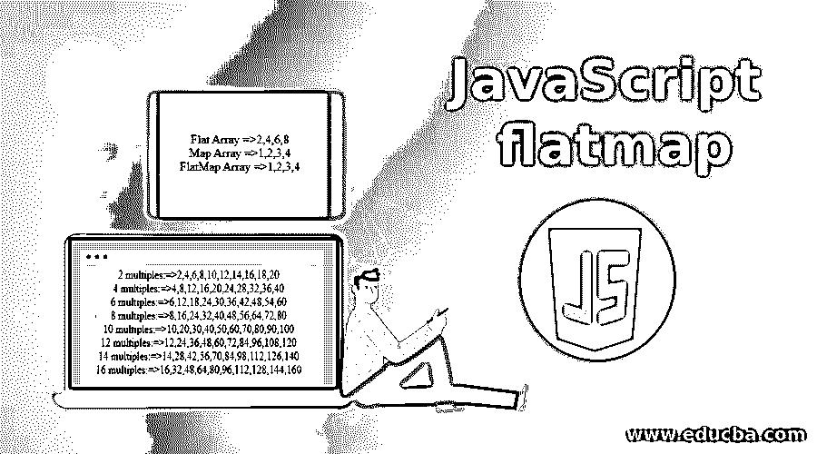
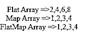
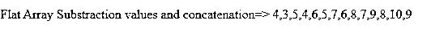
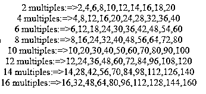
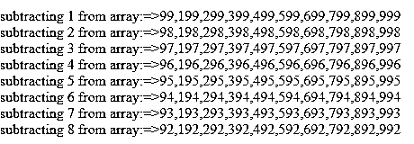
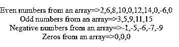
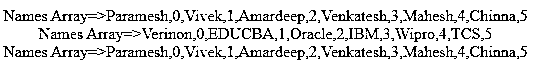

# JavaScript 平面图

> 原文：<https://www.educba.com/javascript-flatmap/>




## JavaScript 平面图简介

JavaScript 中的 flatMap()函数被定义为映射元素，并将结果映射元素放入一个新数组中。这意味着它使成为一维数组。flatMap()函数的返回类型是数组([])。

**举例:**

<small>网页开发、编程语言、软件测试&其他</small>

```
String[] flatMap=array.flatMap();
```

### 用在哪里？

*   当 JavaScript 函数返回一个可观察值时，结果不会是一个流。但是它将返回一个可观察的实例。所以，flatMap()函数将这个实例映射到一个流中。
*   可观察对象是产生一连串事件的对象。

**举例:**

1.  [3,4,5].map(x => [a，a-1])
    // [[3，2]，[4，3]，[5，4]] //map 给出 JavaScript 中的值
2.  [3,4,5].flatMap(x => [a，a-1])
    // [3，2，4，3，5，4] // flatMap 展平所有值，不能因键值对而异(使成为一维数组)

**map()、flat()和 flatMap()函数的区别**

map()只映射值，flat()函数返回数组，而 flatMap()函数只返回一维数组。

### flatMap()在 JavaScript 中是如何工作的？

flatMap()可以在 JavaScript 中工作，方法是在任何数组上应用 flatmap()函数，然后返回类型变成数组([])。

**语法:**

```
array.flatMap(function callback(presentValue, position, arrayReference)) //lambda expression
{
//return array of elements
}
```

*   **presentValue:** 传递当前数组值。
*   **位置:**通过指标。这是一个可选参数。
*   **arrayReference:** 传递数组引用。这也是一个可选参数。

### 实现 JavaScript 平面图的示例

下面是要实现的示例，如下所示:

#### 示例 1–元素划分的 flatmap()逻辑

**代码:**

```
let arrayValues = [2, 4, 6, 8];
var out1=arrayValues.flat(x => x/2); //line 1
document.write("Flat Array =>"+out1+"<br>");
var out2=arrayValues.map(x => [x/2]);// line 2
document.write("Map Array =>"+out2+"<br>");
var out3=arrayValues.flatMap(x => [[x/2]]);//line 3
document.write("FlatMap Array =>"+out3);
```

**输出:**




**说明:**

*   **Line 1** 将一个数组做成平面数组。
*   **第 2 行**将一个数组做成一个 map 数组。
*   **第 3 行**将一个数组做成一个 flatMap 数组。

#### 示例 2–拆分字符串的 flatMap()逻辑

**代码:**

```
let stringArray = ["Hi Hello How are you", "Where are you?", "Amardeep"];
var strOut1=stringArray.map(a => a.split(" "));//line 1
document.write("Map String=> "+strOut1+"<br>");
var strOut2=stringArray.flatMap(a => a.split(" ")); //line 2
document.write("FlatMap String=>"+strOut2+"<br>");
```

**输出:**


**说明:**

*   **Line 1** 用逗号分隔符分割字符串并存储在 map 中。
*   **第 2 行**用逗号分隔符分割字符串，并存储在平面图中。

#### 示例 3–flat map()将数字与其他数组连接起来

**代码:**

```
var array = [4,5,6,7,8,9,10];
array.flatMap(a => [a,a-1]);
var concat=array.reduce((temp, a) => temp.concat([a, a-1]), []); //line 1
document.write("Flat Array Substraction values and concatenation=> "+concat+"<br>");
```

**输出:**




**说明:**

*   **第 1 行**连接数字并返回一个平面图。

#### 示例# 4–flat map()打印多份

**代码:**

```
var array = [1,2,3,4,5,6,7,8,9,10];
var flatMap=array.flatMap(a => a*2);//line 1
document.write("2 multiples:=>"+flatMap+"<br>");
var flatMap=array.flatMap(a => a*4);//line 2
document.write("4 multiples:=>"+flatMap+"<br>");
var flatMap=array.flatMap(a => a*6); //line 3
document.write("6 multiples:=>"+flatMap+"<br>");
var flatMap=array.flatMap(a => a*8); //line 4
document.write("8 multiples:=>"+flatMap+"<br>");
var flatMap=array.flatMap(a => a*10); //line 5
document.write("10 multiples:=>"+flatMap+"<br>");
var flatMap=array.flatMap(a => a*12); //line 6
document.write("12 multiples:=>"+flatMap+"<br>");
var flatMap=array.flatMap(a => a*14); //line 7
document.write("14 multiples:=>"+flatMap+"<br>");
var flatMap=array.flatMap(a => a*16); //line 8
document.write("16 multiples:=>"+flatMap);
```

**输出:**




**说明:**

*   **第 1 行**给出最多 10 个值的 2 倍逻辑。
*   **第 2 行**给出最多 10 个值的 4 倍逻辑。
*   **第 3 行**给出 6 个倍数逻辑，最多 10 个值。
*   **第 4 行**给出 8 个倍数逻辑，最多 10 个值。
*   **第 5 行**给出 10 个倍数逻辑，最多 10 个值。
*   **第 6 行**给出 12 个倍数逻辑，最多 10 个值。
*   **第 7 行**给出 14 个倍数逻辑，最多 10 个值。
*   **第 8 行**给出 16 个逻辑倍数，最多 10 个值。

#### 示例 5–从数组中减去的 flatMap()

**代码:**

```
var array = [100,200,300,400,500,600,700,800,900,1000];
var flatMap=array.flatMap(a => a-1);//line 1
document.write("subtracting 1 from array:=>"+flatMap+"<br>");
var flatMap=array.flatMap(a => a-2); //line 2
document.write("subtracting 2 from array:=>"+flatMap+"<br>");
var flatMap=array.flatMap(a => a-3); //line 3
document.write("subtracting 3 from array:=>"+flatMap+"<br>");
var flatMap=array.flatMap(a => a-4); //line 4
document.write("subtracting 4 from array:=>"+flatMap+"<br>");
var flatMap=array.flatMap(a => a-5); //line 5
document.write("subtracting 5 from array:=>"+flatMap+"<br>");
var flatMap=array.flatMap(a => a-6); //line 6
document.write("subtracting 6 from array:=>"+flatMap+"<br>");
var flatMap=array.flatMap(a => a-7); //line 7
document.write("subtracting 7 from array:=>"+flatMap+"<br>");
var flatMap=array.flatMap(a => a-8); //line 8
document.write("subtracting 8 from array:=>"+flatMap+"<br>");
```

**输出:**




**说明:**

*   **第 1 行**给出了从数组中减去 1 的逻辑。
*   **第 2 行**给出了从数组中减去 2 的逻辑。
*   **第 3 行**给出了从数组中减去 3 的逻辑。
*   **第 4 行**给出了从数组中减去 4 的逻辑。
*   **第 5 行**给出了从数组中减去 5 的逻辑。
*   **第 6 行**给出了从数组中减去 6 的逻辑。
*   **第 7 行**给出了从数组中减去 7 的逻辑。
*   **第 8 行**给出了从数组中减去 8 的逻辑。

#### 示例 6–数组中偶数、奇数、负数和零的平面图

**代码:**

```
const array = [2,3,5,6,8,9,10,11,0,12,14,15,0,-1,-5,-6,-7,-9,0];
var evenNumbers=array.flatMap(array => {
return array%2==0 ? [array] : [] //line 1
})
document.write("Even numbers from an array=>"+evenNumbers+"<br>");
var oddNumbers=array.flatMap(array => {
return array%2==1 ? [array] : [] //line 2
})
document.write("Odd numbers from an array=>"+oddNumbers+"<br>");
var negativeNumbers=array.flatMap(array => {
return array<0 ? [array] : [] //line 3
})
document.write("Negative numbers from an array=>"+negativeNumbers+"<br>");
var zeroNumbers=array.flatMap(array => {
return array==0 ? [array] : [] //line 4
})
document.write("Zeros from an array=>"+zeroNumbers);
```

**输出:**




**说明:**

*   **第 1 行**给出显示偶数的逻辑。
*   **第 2 行**给出显示奇数的逻辑。
*   **第 3 行**给出显示负数的逻辑。
*   **第 4 行**给出了显示数组中多个零的逻辑。

#### 示例# 7–具有键值对的平面图

**代码:**

```
var nameArray = ['Paramesh', 'Vivek','Amardeep','Venkatesh','Mahesh','Chinna' ];
var namesOut = nameArray.flatMap((names, position) => [names, position]); //line
document.write("Names Array=>"+namesOut+"<br>");
var companyArray = ['Verinon', 'EDUCBA','Oracle','IBM','Wipro','TCS' ];
var companyOut = companyArray.flatMap((company, position) => [company, position]);//line 2
document.write("Names Array=>"+companyOut+"<br>");
var coursesArray = ['Java', 'Python','C','C#','Spring','Servlets' ];
var coursesOut = nameArray.flatMap((courses, position) => [courses, position]);//line 3
document.write("Names Array=>"+coursesOut);
```

**输出:**




**说明:**

*   **第 1 行**给出了显示名称索引及其相应值的逻辑。
*   **第 2 行**给出显示公司指数及其对应值的逻辑。
*   **第 3 行**给出了显示课程索引及其相应值的逻辑。

### 推荐文章

这是 JavaScript flatmap 的指南。在这里，我们讨论介绍以及 flatmap()如何在 javascript 中工作，同时讨论不同的示例及其代码实现。您也可以阅读以下文章，了解更多信息——

1.  [JavaScript 字符串浮动简介](https://www.educba.com/javascript-string-to-float/)
2.  [JavaScript 数字格式的方法](https://www.educba.com/javascript-number-format/)
3.  [JavaScript 滚动到顶部|示例&代码](https://www.educba.com/javascript-scroll-to-top/)
4.  [用 JavaScript 实现睡眠功能](https://www.educba.com/javascript-sleep/)


