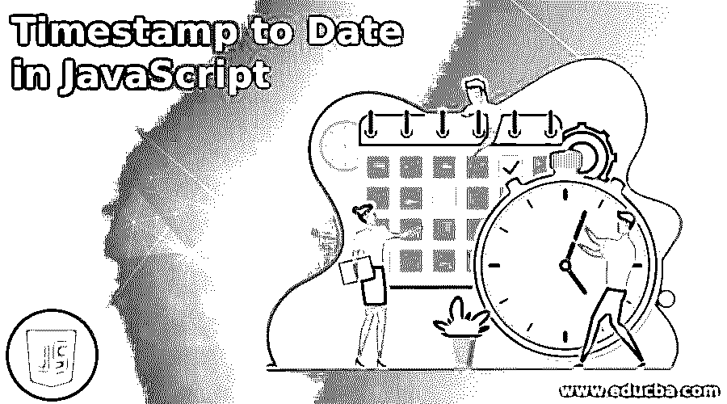
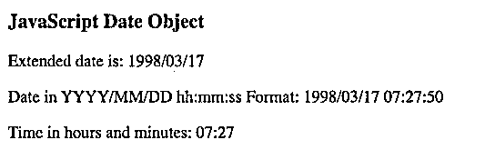

# JavaScript 中的时间戳

> 原文：<https://www.educba.com/timestamp-to-date-in-javascript/>




## JavaScript 中的时间戳简介

JavaScript 中的时间戳是程序员最常用的场景之一。在 JavaScript 中，程序员可以使用 date()对象提供的各种方法来检索完整日期的各个元素。一旦提取了所有的元素，用户就可以根据自己的喜好在代码中打印或使用它们。在处理 JavaScript date 对象时需要注意的一点是，将 Unix 时间戳转换成 JavaScript 时间戳需要以毫秒为单位的时间戳。因此，不同的程序员使用不同的方法以他们指定的格式和时区提取日期和时间。

**语法**

<small>网页开发、编程语言、软件测试&其他</small>

下面给出了使用 date()对象提供的各种方法在 JavaScript 中提取日期和时间的时间戳转换的基本语法:

```
<script>
// converting timestamp into milliseconds
var t_stamp = xyz;
var t_stamp_ms = t_stamp *1000;
//creating the date object
var obj = date(t_stamp_ms);
var hours = getHours(obj);
var min = getMinutes(obj);
…
…
…
…
//printing values on the console
</script>
```

其中 xyz 是一个数字 UNIX 时间戳值。

### 如何在 JavaScript 中将时间戳转换成日期？

在 JavaScript 中，可以使用 date()对象将 unix 时间戳转换为日期和时间。为了从程序员提供的时间戳中检索日期和时间值，程序员必须理解 JavaScript 中 Date()对象提供的各种方法，以提取整个时间戳的各个元素。

*   **getDate():** 这个方法为用户给出的时间戳提供日期。其值介于范围(1–31)之间。
*   **getHours():** 这个方法返回用户提供的时间戳的实际小时数。其值介于 0-11 之间。
*   **getMinutes():** 这个方法返回用户提供的时间戳的实际分钟数。其范围在 0- 59 之间。
*   **getSeconds():** 这个方法返回用户提供的时间戳的秒数。其值介于 0-59 之间。
*   **getMonth():** 这个方法为用户提供了一个 2 位数的月份作为时间戳，它位于 0-11 之间。结果需要增加 1，以匹配实际的日历月。
*   **getFullYear():** 顾名思义，这个方法为提供给用户的时间戳提供 4 位数的完整年份。

下面给出了在 JavaScript 中将时间戳转换为日期和时间需要执行的一些步骤:

*   需要记住的最重要的一点是，date()函数接受的时间戳以毫秒为单位，而不是 JavaScript 中的秒。所以为了将 Unix 时间戳转换成 JavaScript 时间戳，程序员的首要任务是将给定的时间戳乘以 1000 转换成毫秒。
*   将乘以 1000 后返回的时间戳值传递给 date()，以创建 Date 对象。
*   一旦创建了 date 对象，几乎所有的事情都会被排序。现在从 Date 对象中提取单个值，比如使用 getMinutes()方法提取分钟值，使用 getSeconds()提取秒值，使用 getMonths()提取月值，等等。
*   为了提取月份、日期、小时和秒的后两位数字，使用了 slice()函数，并使用额外的“0”进行填充。
*   根据程序员的要求，通过使用所需的分隔符(/、:、–)将所有单独的日期、时间、秒值连接起来，最终日期将打印在控制台上。

### JavaScript 中迄今为止的时间戳示例

下面是 JavaScript 中的时间戳示例:

**代码:**

```
<!DOCTYPE html>
<html>
<body>
<h3>JavaScript Date Function </h3>
<p id="demo"></p>
<p id ="demo1"> </p>
<p id = "demo2"> </p>
<script>
// unix timestamp
var timestamp = 890099870;
// convert unix timestamp to milliseconds
var timestamp_ms = timestamp * 1000;
// initializing the Date object
var d_obj = new Date(timestamp_ms);
// extracting date from the date object as 2 digit
var date = ("0" + d_obj.getDate()).slice(-2);
// extracting hours from the date object as 2 digit
var hrs = ("0" + d_obj.getHours()).slice(-2);
// extracting minutes from the date object as 2 digit
var mins = ("0" + d_obj.getMinutes()).slice(-2);
// extracting the seconds from the date object as 2 digit
var sec = ("0" + d_obj.getSeconds()).slice(-2);
// extracting year from the date object as 4 digit
var yr = d_obj.getFullYear();
// extracting month from the date object as 2 digit
var mth = ("0" + (d_obj.getMonth() + 1)).slice(-2);
//printing the values of the date and time in different formats on the console
document.getElementById("demo").innerHTML = "Extended date is: " + yr + "/" + mth + "/" + date;
document.getElementById("demo1").innerHTML = "Date in YYYY/MM/DD hh:mm:ss Format: " + yr + "/" + mth + "/" + date + " " + hrs + ":" + mins + ":" + sec;
document.getElementById("demo2").innerHTML = "Time in hours and minutes: " + hrs + ":" + mins;
</script>
</body>
</html>
```

**输出:**




**说明:**

*   在上面的代码中，创建了 3 个段落 id，分别名为“p1”、“p2”和“p3”。然后，用变量‘timestamp’初始化 Unix 时间戳。接下来，通过将其转换为毫秒(乘以 1000)，将其转换为 JavaScript 时间戳。最后，使用传递时间戳值的 date()函数创建日期对象‘d _ obj’。
*   使用 Date()函数提取单个值，如 getHours()、getMinutes()、getFullYear()等，并用“0”填充。切片函数用于切片或提取相应函数的最后 2 位数字。最后，为了以各自的格式打印整个日期，使用'+'运算符进行连接，并使用'/'和': '等分隔符。

### 结论

上面的描述清楚地解释了 Date()函数如何在 JavaScript 中工作，以及如何在 JavaScript 中将时间戳转换为日期。程序员在代码中广泛使用日期来执行各种与日期和时间相关的任务。虽然 JavaScript 使用浏览器的时区来显示时间和日期，但是我们可以使用 JavaScript 库中提供的函数来切换到不同的时区。

### 推荐文章

这是一个 JavaScript 中的时间戳指南。这里我们讨论一下入门，如何在 JavaScript 中把时间戳转换成日期？还有例子。您也可以看看以下文章，了解更多信息–

1.  [JavaScript 中的选择排序](https://www.educba.com/selection-sort-in-javascript/)
2.  [在 JavaScript 中排序字符串](https://www.educba.com/sort-string-in-javascript/)
3.  [JavaScript MD5](https://www.educba.com/javascript-md5/)
4.  [JavaScript 获取 API](https://www.educba.com/javascript-fetch-api/)


