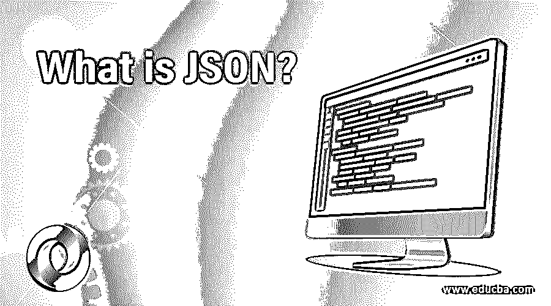

# JSON 是什么？

> 原文：<https://www.educba.com/what-is-json/>




## JSON 简介

JSON 可以定义为一种 Java 脚本对象符号文件格式，用于发送、接收和存储来自网络中相同或不同系统的数据。它通常用在 REST 请求和响应应用程序接口(API)服务中，因为 JSON 并不复杂，并且是一种可读的格式。与传统使用的可扩展标记语言(XML)不同，它支持更快的可访问性，内存优化本质上更短更简单，并且不包含复杂的语法和标记。

我们可能必须遵循以下语法规则:

<small>网页开发、编程语言、软件测试&其他</small>

*   数据总是以键/值对的形式出现。
*   逗号分隔每个数据对象。
*   对象放在花括号内(像这样的花括号' {} ')。
*   数组放在方括号中。

### jsonobject

典型的对象如下:

**代码:**

```
{
"Name": "Alex",
"Occupation": "Teacher",
"Places visited": ["San Francisco", "California", "Houston"]
}
```

在上面的例子中，“姓名”、“职业”、“参观过的地方”是关键字，“亚历克斯”、“教师”和数组[“旧金山”、“加利福尼亚”、“休斯顿”]是相应关键字的值，花括号中包含的全部数据构成了 JavaScript 对象符号对象。这些值可以是字符串、另一个对象、布尔值、空值或数字。

对象也可以是嵌套的，也可以是数组的形式。

### 例子

下面是提到的例子:

#### 1.嵌套对象

**代码:**

```
{
"Role": "Student",
"Name": {
"First name": "Alex",
"Last name": "Hill"
}
}
```

外面的花括号形成了嵌套到另一个对象的主要 JSON 对象，键“Name”后面是内部花括号中的数据。接下来，让我们看看对象的数组。

#### 2.一组对象

**代码:**

```
{
"Grade": 6,
"Student names": [
{
"First name": "Alex",
"Last name": "Hill"
},
{
"First name": "Neal",
"Last name": "Hunter"
},
{
"First name": "Peter",
"Last name": "Jones"
}
]
}
```

正如您所看到的，外面的花括号形成了主要的 JSON 数据对象，并且有一个方括号对包围了一组对象，这是对象的数组。

#### 3.数据类型

值必须具有下列数据类型之一。

*   **字符串:**

**代码:**

```
{"name": "Johnny"}
```

*   **编号:**

**代码:**

```
{"age": 21}
```

*   **对象:**

**代码:**

```
{ *"*employee”: {"name": "John", "age": 221}
}
```

**Note:** The objects in the JSON objects that are nested must also follow the same syntax rules as that of a normal JSON object.

*   **布尔:**

**代码:**

```
{"sale": true}
```

#### 4.JSON 解析

让我们以 Python 为例[编程语言](https://www.educba.com/what-is-a-programming-language/)，看看如何处理数据对象。

1.导入 json

# json 是 python 中处理其数据对象的模块

2.string_a = "{"name": "Alex "，"年龄": " 22 "，"职业":"老师" } "

#让我用语法规则解释一下字符串格式的例子

3.JSON _ object = JSON . loads(string _ a)

#现在 json_object 将 string_a 作为 json 对象，键值可以像下面这样引用

print("姓名是"，json_object["姓名"])
print(json_object["姓名"，"年龄是"，json_object['年龄']))

因此，在使用 python 的 JSON 解析中，JSON 对象采用字典的形式，键将在索引中引用，如上例所述。

**我们如何用 Python 从文件中解析 JSON 对象**

1.导入 json

# json 是 python 中处理其对象的模块

2.file _ handler = open(' JSON _ data _ file . JSON '，' r ')

# open 是 python 中打开文件的函数，json 文件以扩展名
#存储。json，在这个例子中是以阅读模式' r '打开

3.json_object = json.load(文件处理程序)

# json.load()是接受 json 文件的文件处理程序，从文件
中读取其数据
# objects print("名字是"，json_object["名字"])
print(json_object["名字"，"年代是"，json_object['年龄'])

**Note:** You can either read the file, extract the content as a string & use json.loads() method to get the json object or directly use the load method to extract passing the file handler as the parameter.

### 数据对象的交换

几乎所有的编程语言都可以生成和处理字典、散列或关联数组。因此，需要在客户机和服务器之间交换的数据需要根据所使用的编程语言转换成这些形式中的一种。

### JSON 与 XML

传统上，用于在客户机和服务器之间交换数据的协议是使用 XML(可扩展标记语言)的 SOAP(简单对象访问协议)。然而，随着 REST(表述性状态协议)的引入，JavaScript 对象符号的使用变得广为人知。

以下是它们之间的一些相似之处:

*   两者都很直观，易于阅读。
*   两者都可以嵌套和分层。
*   两者都可以用各种各样的语言来解析。
*   两者都通过网络请求进行数据传输。

以下是它们之间的一些差异:

*   它没有标签格式。
*   它是存储最佳的，因为它比 XML 相对较短。
*   读写更快。
*   它可以使用数组，但在 XML 中却不容易。

### 不足之处

虽然我们看到了它的优点，但也不是没有缺点。

*   它并不完全安全。
*   它在支持的数据类型方面受到限制。

### 关于 JSON 的知识对你的职业生涯有什么帮助？

这是一种用于在客户端和服务器之间交换信息的数据格式。想象一下，如果您可以开发一个优化的数据表示模式，使用更少的数据来交换大量数据，那将是一件非常棒的事情。整个世界都在向 RESTful API 服务迈进。这就是为什么大量使用这种语言会帮助你开发出很酷的 API 服务。

### 结论

它是访问、存储和理解数据的一种很酷的数据格式。如果您正在寻找快速、轻量级的数据交换，那么您总是可以期待使用 JavaScript 对象表示法。

### 推荐文章

这是一本关于什么是 JSON 的指南？在这里，我们借助例子讨论了 JSON 的工作方式，以及它如何以及在什么地方有助于职业发展。您也可以浏览我们推荐的其他文章，了解更多信息——

1.  [JavaScript 是什么？](https://www.educba.com/what-is-javascript/)
2.  [什么是 PHP 数组？](https://www.educba.com/what-is-php-array/)
3.  [Python 中的 JSON](https://www.educba.com/json-in-python/)
4.  [Java 中的 JSON](https://www.educba.com/json-in-java/)


