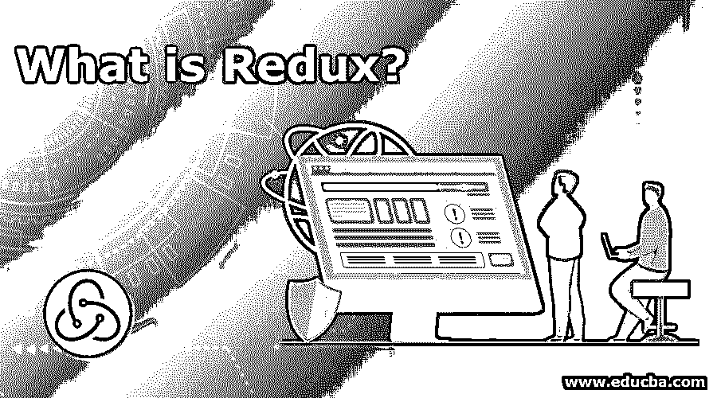

# Redux 是什么？

> 原文：<https://www.educba.com/what-is-redux/>

## Redux 简介

Redux 是一个用于管理应用程序状态的开源 JavaScript 库。Redux 通常与 Angular 或 React 等库一起使用来构建用户界面。它是由安德鲁·克拉克和丹·阿布拉莫夫创造的。

当应用程序变得非常大时，管理应用程序中每个组件的状态变得非常困难。它有助于更新和维护应用程序中每个组件的状态。

<small>网页开发、编程语言、软件测试&其他</small>

### 了解 Redux 及其工作原理

Redux 只不过是一个包含应用程序状态的开源 javascript 库。Redux 的工作原理很容易理解。Redux 有三个构建部分——存储、操作和 Reducers。用我们熟悉的例子来理解 Redux 吧——

假设我们从亚马逊网站订购了一个耳机。订购耳机后，可以在给定的指定时间内从送货员处获得送货。在这种情况下，订购耳机是一个动作，这是 Redux 的概念之一。

在这里完成动作后，必须等到交货。每次从最喜欢的电子商务网站订购东西时，都有一个需要时间和遵循的过程。同理，在 redux 中，执行完动作后，有一个术语叫 Dispatch，将动作发送给 Reducer **。**当您下订单时，您的包裹会被运送到离您的地址最近的仓库。通过调度在 Redux 中执行类似的过程。

现在，Reducer 查看动作，并相应地做它需要做的事情，以便将数据存储在存储中。它包括开关盒状态，用于存储数据并从存储器返回更新的状态值。每当状态出现一些波动时，存储中的值就会更新。商店有能力有效地保护状态并保存应用程序状态。这强调了商店使用户能够保持其状态安全和良好的重要性。

### 为什么要用 Redux？

JS 库 React 有助于将应用程序分成不同的组件，但无法提供关于数据、状态以及如何处理所有其他事件的输入。React 不处理如何管理状态对象，确保修复它的唯一方法是通过 Redux。react 应用程序数据从父组件流向子组件。可以将数据以 props 的形式从父组件发送到子组件。要反应的组件太多了，这使得很难跟踪从父组件到子组件的数据流。因此，我们使用 Redux，因为它有能力管理组件的所有状态。

它还确保了更好的开发人员体验。使用 redux，可以隔离具有状态的存储，因此所有组件都可以与它相关联，以从中获得所需的状态对象。

### 我们应该什么时候使用它？

以下是我们应该考虑的一些原因

1.  **缓存页面状态–**当用户浏览一个页面，然后转到另一个页面并返回时，期望页面处于相同的状态。当 reducers 初始化并在整个会话中存在时，它们可以保留页面的状态。
2.  **组件的状态管理****–**Redux 在我们需要管理组件的状态时使用。
3.  **全局组件易于访问—**它们具有支持小吃店、通知、工具提示等的应用寿命。当涉及到为调度命令创建动作时，这是最重要的。举个例子——如果一个代码生成一个异步请求，当请求相对于后端失败时，它将产生一个小吃店动作。在用户不使用 Redux 的情况下，它需要另一个事件系统，否则它需要在使用小吃店组件时实例化它。
4.  如果一个高端组件有许多相关的道具，但只有其中的一些被使用，那么可以考虑用 Redux 来重构它们。
5.  这主要发生在不需要大量数据或配置的包装组件中。因此，在这种情况下，必须将侧链还原为低级组分。
6.  同一块应用程序状态需要映射到多个容器组件。它为共享状态提供了一种方便且最佳的方式。

### Redux 的优势

1.  中央存储——借助 redux，任何组件都可以从存储中访问任何状态。它还在组件被卸载后保留组件事件的状态。
2.  当状态改变时，它返回一个新的状态，并防止不必要的重新渲染。
3.  它将在测试中受益，因为它将 UI 和数据管理分开。
4.  状态的历史被维护，这有助于实现像撤销这样的特性。
5.  Redux 使调试应用程序变得容易。借助 redux，很容易理解网络错误、编码错误和其他形式的 bug。
6.  其有组织的代码使专业人员能够全面理解各种 Redux 应用程序的结构。这反过来又使它成为一个易于使用的开源 JavaScript 库。

### 这项技术如何帮助你在运营商的增长

React and Angular 在全球以及印度的科技公司中广受欢迎。每个进入 React 世界的人都需要了解如何处理应用程序的状态。每个人学习不同技术的原因都不一样，但是学习 redux 肯定会增加你的技能。

### 结论

在上面的脚本中，我们提出了展示 Redux 优势的要点。这也是对 Redux 的一个清晰的理解。如果您的项目需要一个状态管理工具，从长远来看，Redux 是获得收益的最佳选择。

### 推荐文章

这是一个什么是 Redux 的指南。在这里，我们讨论了 Redux 的工作、职业发展和优势。您也可以浏览我们推荐的其他文章，了解更多信息——

1.  [Python 是什么](https://www.educba.com/what-is-python/)
2.  [JavaScript 是什么？](https://www.educba.com/what-is-javascript/)
3.  [什么是 PowerShell](https://www.educba.com/what-is-powershell/)
4.  [JIRA vs TFS](https://www.educba.com/jira-vs-tfs/)

