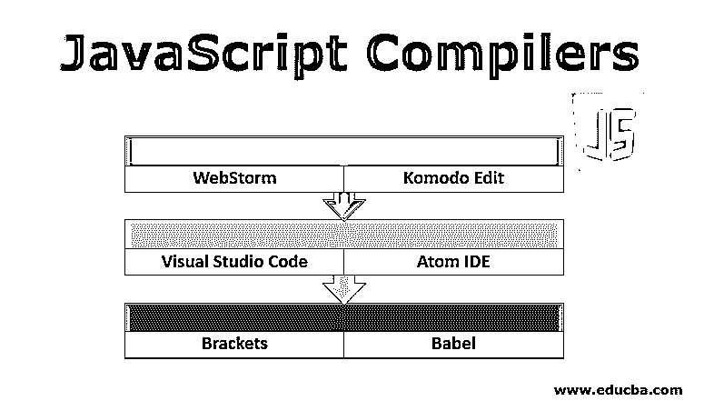

# JavaScript 编译器

> 原文：<https://www.educba.com/javascript-compilers/>

## JavaScript 编译器简介

编译器是一种软件，它将开发人员编写的高级代码转换成机器语言的低级二进制代码，处理器可以轻松理解和执行这些代码，这个过程称为编译或代码编译。将低级代码转换为高级代码的过程称为反编译。Javascript 是一种[编程语言](https://www.educba.com/what-is-a-programming-language/)，其中[包含一个 Javascript](https://www.educba.com/what-is-javascript/) 编译器，并被迄今为止所有浏览器普遍接受和理解。然而，有些人错误地认为 javascript 不是编译的，而是解释的。现代的 Javascript 编译器实际上执行实时编译，需求很大。

### JavaScript 的编译器

Javascript IDE 用于编写代码以及实时编译代码。让我们了解更多当今最流行的 Javascript IDE 和编译器。

<small>网页开发、编程语言、软件测试&其他</small>

#### 1.网络风暴

它是目前市场上使用最多的 Javascript IDE。它由 JetBeans 提供，并不是免费的。它为现代 JavaScript 开发和智能编码能力提供了一个健壮的选择。它包括代码自动完成、上下文错误检测和几种语言(如 HTML、Node.js、CSS 和 JavaScript)的重构等功能。它有一个内置调试器，可以调试前端[代码和 Node.js](https://www.educba.com/how-node-dot-js-works/) 应用。程序员不用退出 IDE 就可以测试代码[。我们还可以在 WebStorm 内部执行测试，它会生成一个报告卡，其中包含调试测试和 spy-JS 检测 JS 代码中任何瓶颈的可视化数据，以减轻这些瓶颈。](https://www.educba.com/what-is-ide/)

#### 2\. Komodo Edit

Komodo Edit 也是 JavaScript IDE 的流行选项之一。它可以被认为是 Komodo 最新 IDE 的较低版本，因为它比以往任何时候都简化了开发。这是一个强大而简单的编辑器，支持多种语言。编辑器很直观，也能处理大多数问题。Komodo Edit 提供了对 Node.js 的所有功能以及其他当前 web 开发框架的支持。该编辑器包括调试、单元测试、与其他系统的协作或集成等条款。它的高级功能集包括一个变化跟踪系统、同步选择、快速书签、系统代码块和一个智能语言检测系统。然而，它不是免费的，但它为其他有兴趣的人提供了 21 天的免费试用。

#### 3.Visual Studio 代码

它是市场上最受欢迎的 IDE，不仅是 JS，还有其他几种语言，因为它支持 40 多种语言。这是一个免费的跨平台 IDE，非常适合前端项目的开发。VS Code 提供了显著的特性，比如带有 IntelliSense 的智能完成特性、内置的 Git 集成、从编辑器本身调试代码的能力等等。它的优点在于它具有很强的可扩展性，并且可以通过它所支持的许多扩展来定制选项。它还支持多种语言；使其更容易理解为什么它被选为 stack overflow 2019 年开发者调查中最受欢迎的开发者工具。

#### 4\. Atom IDE

Atom IDE 是由 GitHub 提供的，已经存在了相当一段时间。它是一个可选软件包的组合，旨在为 Atom 带来类似的功能，如 IDE。它不仅能很好地处理 Javascript，而且[还提供了对 CSS](https://www.educba.com/what-is-css/) 和 NodeJS 的支持。Atom 的 JS 包提供了一个特性集，包括各种特性，比如特定于上下文的自动完成。导航代码比以往任何时候都方便借助文档的概述视图，您可以定位所有引用，并轻松导航到定义。它还允许开发人员悬停在某些代码行上以提取信息，并发现完整的测试工具集，以了解更多关于错误和警报的信息，从而更好地了解他们的代码。幸运的是，Atom 是免费的，而且是开源的。

#### 5.括号

它是 web 开发中最好的代码编辑器之一，归 Adobe 所有。因为它是使用前端组件开发的；括号为软件开发人员和程序员提供了类似本机的流畅编辑体验，没有任何与兼容性相关的问题。特别是由于其预览输出的功能，括号与浏览器集成，可以直接将代码编辑推送到浏览器。[软件开发人员](https://www.educba.com/career-as-a-software-developers/)可以毫无困难地同时修改和检查代码文件和基于浏览器的实时预览。此外，快速编辑 UI 确保开发人员手头有一套合适的可用工具，不管他们开发的是哪种代码。有了所有这些特性，它就监督着括号是免费的，是开源的。

#### 6.巴比伦式的城市

EcmaScript 的最新版本 [ES6 提供了许多](https://www.educba.com/what-is-es6/)强大的概念，尽管它的支持并非随处可用。因此，使用它的一种常见方式是将其转换成 ES5 代码。这可以通过咕噜、大口、网络包或巴别塔来实现。巴别塔是由脸书的 JS 开发者塞巴斯蒂安·麦肯齐于 2014 年创建的。它最初被称为 6to5，但后来被重新命名为巴别塔。Babel 是一个库，它主要用于将 2015 年以后版本的 ECMAScript 代码转换为向后兼容的代码，以便在当前和旧版本的浏览器或环境中平稳运行。下面是 Babel 可以帮助您实现的主要事情，比如它可以帮助您转换语法，提供您的目标环境中缺少的功能，还可以帮助您转换源代码！巴别塔的最新版本，巴别塔 6 致力于使巴别塔更可插拔。Babel 位于 NPM 目录中，可以使用以下命令在本地安装:

npm 安装–save-dev @ babel/core @ babel/CLI

有几个工具可用于安装 Babel off，BabelCLI 是推荐的内置方法，可在命令行上运行。

几乎每年我们都有新的 JavaScript IDE、编译器和翻译器出现在市场上。但是，只有那些通过提供高级功能(如代码完成、错误检测、调试、单元测试、协作、跟踪更改、多重选择、快速书签、代码折叠和代码块)来节省开发人员时间的软件才能继续留在市场上，并且总是有很大的需求。有了这些特性，开发人员可以更容易地在更短的时间内构建兼容所有浏览器的 web 应用程序。

### 推荐文章

这是 JavaScript 编译器指南。这里我们讨论当今最流行的 Javascript IDE 和编译器的基本概念。你也可以看看下面的文章来了解更多-

1.  [JavaScript 中的模式](https://www.educba.com/patterns-in-javascript/)
2.  [JavaScript 中的 Case 语句](https://www.educba.com/case-statement-in-javascript/)
3.  [JavaScript 中的数组](https://www.educba.com/arrays-in-javascript/)
4.  [JavaScript 调试器](https://www.educba.com/javascript-debugger/)

