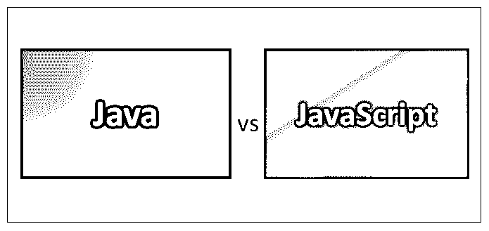

# Java 和 JavaScript

> 原文：<https://www.educba.com/java-and-javascript/>

## Java 和 Javascript 的区别

事实上，Java 和 JavaScript 是两种不同的 JavaScript 编程语言。在互联网的早期网景时代，Java 和 JavaScript 确实有着共同的简史，这也解释了为什么会有相似的名字。然而，这两者后来大相径庭。如今程序员之间一个常见的笑话是，Java vs JavaScript 就像火腿和仓鼠一样相似。但是除了笑话和琐事，本文将对 JavaScript 编程语言进行更详细的比较，探索 Java 和 JavaScript 的不同之处，是的，Java 和 JavaScript 也有相似之处。

大约五年或更久以前，Java 和 JavaScript 之间的区别很容易总结。Java 是一种通用语言，而 JavaScript 编程语言是网站专用的，用于创建动画和交互元素。今天，情况有所不同。在过去的几年里，Java 和 JavaScript 都得到了快速的发展和成熟。从 web 开发的角度来看，以下是 Java 和 JavaScript 之间的区别。

<small>网页开发、编程语言、软件测试&其他</small>

我们关于 Java 和 JavaScript 之间差异的文章结构如下

*   [Java 和 Javascript 的相似之处](#Similarities)
    *   浏览器兼容
    *   服务器兼容的
    *   框架和库
*   [Java 和 Javascript 的区别](#Differences)
    *   # 1–执行风格
    *   # 2–社区影响力
    *   # 3–编写和部署
    *   # 4–调试 Java 和 JavaScript 之间的差异
    *   # 5–Java 和 JavaScript 之间更高层次的差异
    *   # 6–编程或脚本
    *   # 7–继承
    *   # 8–血统的差异
    *   # 9–其他技术差异
    *   # 10–最终用户演示
*   [为什么选择 JavaScript？](#Why)
*   [结论–Java 和 JavaScript](#Conclusion)

### Java 和 JavaScript 信息图表

下面是 Java 和 JavaScript 的五大对比

### Java 与 Javascript 的相似之处

#### Java 和 JavaScript 都是浏览器兼容的

如前所述，JavaScript 编程语言是特定于站点的。目前，它可以在大多数现代浏览器上运行，一些网站利用它来改善用户体验。Java 小程序在某种程度上也得到支持，但其受欢迎程度一直在下降，主要是由于安全性和兼容性问题。大多数网站访问者默认启用 JavaScript，禁用 Java 小程序，尤其是移动浏览器。

#### Java 和 JavaScript 都是服务器兼容的

Java 已经成为网络应用服务器的重要组成部分，比如 T2、Apache Tomcat、JBoss 和 WebSphere。这些服务器运行着公共网站上的大部分网络应用程序，并受到企业防火墙的保护。另一方面，JavaScript 已经在服务器端试验了一段时间。带节点。JS 越来越受欢迎，越来越多的 JavaScript 编码的应用服务器开始使用。

#### Java 和 JavaScript 都有框架和库

框架和库是用来帮助程序员的。他们可以访问特定用途和通用用途的代码，这些代码可以在不同的产品中重用。如果使用得当，框架和库可以显著减少开发时间。Java 和 javascript 都已经达到了一个成熟的阶段，在这个阶段，它们已经高度发展，并且有各种各样的框架和库可供各种场景使用。

### Java 和 Javascript 的区别

#### # 1–执行风格

Java 和 JavaScript 的一个关键区别是它们的执行方式。Java 代码通常在集成开发环境或 IDE 中编写，并编译成可由 Java 虚拟机运行但人类无法读取的字节码。另一方面，JavaScript 通常由 JavaScript 引擎使用与编写时相同的语法来执行，这意味着它们至少在理论上是可读的。实际上，在线发送的 JavaScript 文件通常被压缩成难以辨认的格式。这里的可读性是一个重要的区别，因为在 [Java IDE](https://www.educba.com/best-java-ide/) 中进行更改可能需要几个步骤和专门的软件来编译和部署更改。然而，JavaScript 可以用简单的文本编辑器编辑。

#### # 2–社区影响力

编程社区对这两者都产生了巨大的影响。Java 社区进程被 Java 用来通过 Java 规范请求接受关于语言中未来包含的输入。Java 目前的所有者 Oracle 使用这些请求来开发该语言的下一个官方实现。同时，JavaScript 是 ECMAScript 语言的衍生物，ECMAScript 是由非盈利标准组织欧洲计算机制造商协会(ECMA)定义的。老实说，编程语言需要有一个开放的更新过程，以防止它们变得专有和过时。

#### # 3–编写和部署

下面是 Java 和 JavaScript 的另一个关键区别。Java 是专门为开发人员设计的，他们只需写下一次代码，然后就可以将它部署在他们选择的任何操作系统中，而无需进行任何修改。一般来说，这确实像设计的那样工作，但是根据编码和 JVM 的不同，中间可能会有一些小问题。与此同时，JavaScript 更容易受到执行环境变化的影响，尽管它遵循开放的 ECMAScript 标准。这可能会让开发人员感到沮丧，但好的一面是程序可以自己查询环境，以确定需要为该环境运行的代码分支。

#### # 4–调试 Java 和 JavaScript 之间的差异

Java 是在运行之前编译的，所以代码中的任何结构问题都是显而易见的。一旦运行，ide 可以帮助开发人员连接到 JVM 进行实时调试。另一方面，JavaScript 不是以同样的方式编译的，因为它实时地删除错误，因此 JavaScript 的调试能力高度依赖于广泛变化的执行环境。

#### # 5–Java 和 JavaScript 之间更高层次的差异

现在是时候更上一层楼，看看更高层次的差异了。关于它们的受欢迎程度、技术规格和性能，还有其他一些比较。假设你对 Java 有很好的理解，至少对 JavaScript 有基本的了解，你会如何解释这两种语言之间的区别？以下是 Java 和 JavaScript 之间的一些更高层次的差异:

#### # 6–编程或脚本

Java 是一种面向对象的编程语言，创建在浏览器或虚拟机上运行的应用程序，需要编译代码。另一方面，JavaScript 是一种 OOP 脚本语言，单独在浏览器上运行，不创建独立的应用程序。它通常是 HTML 的一部分，能够实现网站的交互性，这是 HTML 所不能实现的。

#### # 7–继承

Java 将实例和类作为独立的继承概念。为了进行继承，您需要使用基类来形成一个新类，然后使用这个新类来产生派生的实例。虽然 JavaScript 和 Java 一样是面向对象的语言，但它不使用类。您不需要定义类或从它们创建对象。事实上，JavaScript 不是基于类的，而是基于原型的。为了进行继承，您可以使用原型的任何对象实例。

#### # 8–血统的差异

如前所述，这两种语言有一些共同的历史，但也有不同之处。太阳微系统公司的詹姆斯·高斯林创造了 Java，而网景公司开发了 JavaScript，最初称为 LiveScript。JavaScript 是作为 Java 的一个非常松散的版本开发的，因为两者都是面向对象的语言，并且共享相似的编程结构。然而，JavaScript 拥有比 Java 更简单、更小的命令集。

如果你想知道什么是面向对象编程或 OOP，这里有一个快速浏览。OOP 是一个编程概念，其中各部分的总和构成一个整体。例如，假设您正在编写一辆汽车的代码。首先，您构建引擎，该引擎可以清楚地识别为引擎，并且可以独立存在。接下来，您构建底盘，它也可以独立存在。你建造的每一个组件，从内部到门，都是独立的，清晰可辨的。在这个意义上，他们每个人都是一件物品。但是直到所有的部分或物体结合在一起，它们才充分发挥作用。汽车的每个部分使用的材料也不同于其他部件。你不会用同样的材料制造引擎和汽车座椅吧？同样，程序中的所有对象都使用某个类。

#### # 9–其他技术差异

虽然 Java 和 JavaScript 具有相同的面向对象方法，但前者可以独立存在，而后者必须主要放在 HTML 文档中才能发挥作用。Java 在这里是更复杂和更大的语言，创建独立的应用程序。Java 小程序是完全包含的程序，而 JavaScript 是由浏览器处理和解释的文本。然而，今天的 web 应用程序模糊了传统桌面应用程序和使用传统 web 技术(如 CSS、HTML 和 JavaScript)构建的应用程序之间的界限。

#### # 10–最终用户演示

另一个关键区别是语言如何呈现给最终用户。Java 必须用机器语言编译。如前所述，语言在发送出去之前必须进行编译，这涉及到将文本代码转换成一种更小的语言，这种语言被格式化以便被计算机解释为设定的程序。在不完全破坏程序的情况下，此时不能在程序中添加或删除任何内容。同时，JavaScript 是基于文本的，因为你可以把它写到 HTML 文档中，文档不需要编译就可以直接通过浏览器运行。你可以在它运行一次又一次后改变它。一旦 Java 被编译，你就不能改变它。你仍然可以修改原文，然后重新编译。

### 为什么选择 JavaScript？

如你所见，Java 高度独立于 HTML，而 JavaScript 几乎完全依赖于它。对于更好的 web 应用程序，哪种语言更好？答案因程序员而异，有些人喜欢 JavaScript 的动态编码能力，有些人喜欢 Java 更广泛的能力和优势。

JavaScript 最大的优势之一是它能被人类理解。这使得在 JavaScript 上编码更加容易，也使得语言更加健壮。在速度方面，它也比 Java 有很大的优势。使用 JavaScript 可以比使用 Java 更快地创建网页事件和元素。JavaScript 的许多命令也被称为事件处理程序。这些命令直接嵌入到现有的 [HTML 命令中。](https://www.educba.com/html-commands/)

除了易用性，JavaScript 对程序员来说也比 Java 稍微宽容一些。它给了程序员更多的自由来创建基于原型的对象。同时，Java 更加严格，需要定义和表示所有的类和实例。JavaScript 还使您能够调用已经存在的项目，如浏览器本身或状态栏，并让您只玩那一部分。Java 就没那么多了。它更适合于几乎所有时间都需要它的地方，而 JavaScript 适合于网页，它只是显示页面的一部分。

然而，两者都可以制作出好的网页事件，而且 Java 和 JavaScript 都可以在网站和用户之间提供比单独使用 HTML 更高层次的交互。然而，他们在大多数方面并不平等。

### 结论

所以，现在你知道了 Java 和 JavaScript 之间的一些相似之处和不同之处，最后的问题是:你应该选择哪一个？答案是:哪种语言更适合您的需求。任何一种语言都不比另一种语言优越。JavaScript 和小应用程序通常作为功能齐全的项目在互联网上提供。这意味着只要您拥有所需的权限，您就可以简单地从互联网上获得它们，并在您自己的页面上使用它们。事实上，有几个网站专门提供小程序和 JavaScript。他们什么也不做。对于小程序，Gamelan.com 是更受欢迎的供应商之一。Javascripts.com 是 JavaScript 脚本的另一个常见选项，有超过 2300 种脚本可以免费获得。

如果你想学习如何在你的网页上实现这些项目，你可以在网上找到很多很棒的教程和资源。JavaScript 教程和 HTML Goodies Applet 正是这样做的。然而，请记住，他们不会教你如何编写语言；他们只是告诉你如何把它们放在你的网站上。它可以很好地向您介绍这两种格式。一旦你学会了如何实现它们，你将能够更好地理解它们的结构，并可以尝试学习更多的语言知识，甚至有一天可以制作你自己的小程序或 JavaScript 元素！

### 推荐文章

这是 Java 与 Javascript 的对比指南。在这里，我们讨论 Java 和 Javascript 之间的 10 大区别，以及信息图表和实际例子。您还可以从以下文章中了解更多相关信息-

1.  [Java vs Node JS](https://www.educba.com/java-vs-node-js/)
2.  [大一新生 Java 面试问题](https://www.educba.com/java-interview-questions/)
3.  [Java 堆 vs 栈](https://www.educba.com/java-heap-vs-stack/)
4.  [JavaScript 大写](https://www.educba.com/javascript-uppercase/)

