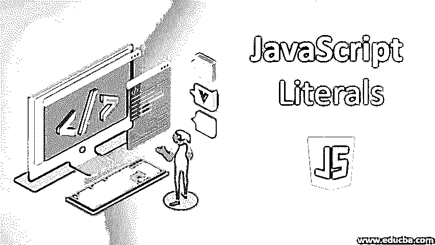
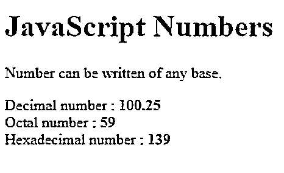
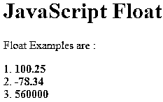
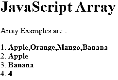
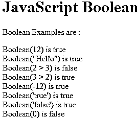

# JavaScript 文字

> 原文：<https://www.educba.com/javascript-literals/>




## JavaScript 文字简介

JavaScript 文字是常量值，可以赋给称为文字或常量的变量。JavaScript 文字是不同类型数据的语法表示，如数字、字符串、布尔、数组等数据。JavaScript 中的文字提供了一种在我们的程序中表示特定值的方法。考虑一个例子，var name = "john "，一个名为 name 的字符串变量被声明并被赋予一个字符串值" john "。文字“john”代表变量名的值 john。JavaScript 支持不同类型的文字。

### JavaScript 文字有哪些类型？

Javascript 文字包含不同类型的值。JavaScript 文字的示例如下:

<small>网页开发、编程语言、软件测试&其他</small>

#### 1.整数文字

整数文字是数字，必须至少有一个数字(0-9)。整数中不允许有空格或逗号。它可以存储正数或负数。在整数中，JavaScript 中的文字可以在三种不同的基础上得到支持。以 10 为基数的十进制数(十进制数包含数字(0，9))，例如 234，-56，10060。第二个是八进制的基数 8(八进制数字包含数字(0，7)，前导 0 表示该数字是八进制的)，0X 073，-089，02003。第三个是以 16 为基数的十六进制数(十六进制数包含(0，9)个数字和(A，F)或(A，F)个字母，前导 0x 或 0X 表示该数是十六进制数)，十六进制数的示例有 0X8b、–0X 89、0X2003。

让我们用示例代码来理解。

**举例:**

```
<!DOCTYPE html>
<html>
<head>
<meta charset= "utf-8" >
<title> This is an example for numeric literals </title>
</head>
<body>
<h1>JavaScript Numbers </h1>
<p> Number can be written of any base.</p>
Decimal number : <b id="no1"></b><br>
Octal number : <b id="no2"></b><br>
Hexadecimal number : <b id="no3"></b><br>
<script>
document.getElementById("no1").innerHTML = 100.25;
</script>
<script>
document.getElementById("no2").innerHTML = 073;
</script>
<script>
document.getElementById("no3").innerHTML = 0X8b;
</script>
</body>
</html>
```

**输出:**




#### 2.浮点数文字

浮点数是十进制数或分数，甚至可以有一个指数部分。十六进制数的例子有 78.90，-234.90，78.6e4 等。

让我们用示例代码来理解。

**举例:**

```
<!DOCTYPE html>
<html>
<head>
<meta charset= "utf-8" >
<title> This is an example for float literals </title>
</head>
<body>
<h1>JavaScript Float </h1>
<p> Float Examples are : </p>
1\. <b id="no1"></b><br>
2\. <b id="no2"></b><br>
3\. <b id="no3"></b><br>
<script>
document.getElementById("no1").innerHTML = 100.25;
</script>
<script>
document.getElementById("no2").innerHTML = -78.34;
</script>
<script>
document.getElementById("no3").innerHTML = 56e4;
</script>
</body>
</html>
```

**输出:**




#### 3.字符串文字

字符串是零个或多个字符的序列。一个字符串文字要么用单引号括起来，要么用双引号括起来，分别为( ' )和( " )，要连接两个或多个字符串，我们可以使用+运算符。字符串的示例有“你好”、“你好世界”、“123”、“你好”+“世界”等。

JavaScript 字符串中可以使用的特殊字符[有。](https://www.educba.com/javascript-string-format/)

*   **\b:** 退格。
*   **\n:** 新行
*   **\t:** 标签
*   **\f:** 表格进给
*   **\r:**
*   **\\:** 反斜杠字符(\)
*   **\' :** 单引号
*   **\":** 双引号

让我们用一个示例代码来理解——

**举例:**

```
<!DOCTYPE html>
<html>
<head>
<meta charset= "utf-8" >
<title> This is an example for float literals </title>
</head>
<body>
<h1>JavaScript String </h1>
<p> String Examples are : </p>
1\. <b id="no1"></b><br>
2\. <b id="no2"></b><br>
3\. <b id="no3"></b><br>
4\. <b id="no4"></b><br>
<script>
var str = "This is first string";
document.getElementById("no1").innerHTML = str;
</script>
<script>
var strobj = new String("This is string store as object");
document.getElementById("no2").innerHTML = strobj;
</script>
<script>
var str = "This is first string";
document.getElementById("no3").innerHTML = str.length;
</script>
<script>
var str = "This is first string";
document.getElementById("no4").innerHTML = str+" This is second string";
</script>
</body>
</html>
```

**输出:**


#### 4.数组文字

数组文字是表达式或其他常量值的列表，每个表达式称为一个数组元素。数组文本包含方括号“[ ]”中的元素列表。如果没有值，则当它[创建一个长度为零的空数组](https://www.educba.com/javascript-empty-array/)时为通过。如果传递了元素，那么它的长度被设置为传递的元素数。string 的例子有 var color = [ ]，var fruits = ["Apple "，" Orange "，" Mango "，" Banana"](四个元素的数组)。

让我们用示例代码来理解。

**举例:**

```
<!DOCTYPE html>
<html>
<head>
<meta charset= "utf-8" >
<title> This is an example for float literals </title>
</head>
<body>
<h1>JavaScript Array </h1>
<p> Array Examples are : </p>
1\. <b id="no1"></b><br>
2\. <b id="no2"></b><br>
3\. <b id="no3"></b><br>
4\. <b id="no4"></b><br>
<script>
var fruits = ["Apple", "Orange", "Mango", "Banana"];
document.getElementById("no1").innerHTML = fruits;
</script>
<script>
document.getElementById("no2").innerHTML = fruits[0];
</script>
<script>
document.getElementById("no3").innerHTML = fruits[fruits.length - 1];
</script>
<script>
document.getElementById("no4").innerHTML = fruits.length;
</script>
</body>
</html>
```

**输出:**




#### 5.布尔文字

JavaScript 中的布尔文字只有两个文字值，即 true 和 false。

让我们用一个示例代码来理解。

**举例:**

```
<!DOCTYPE html>
<html>
<head>
<meta charset= "utf-8" >
<title> This is an example for Boolean literals </title>
</head>
<body>
<h1>JavaScript Boolean </h1>
<p> Boolean Examples are : </p>
<script>
document.write('Boolean(12) is ' + Boolean(12));
document.write('<br>');
document.write('Boolean("Hello") is ' + Boolean("Hello"));
document.write('<br>');
document.write('Boolean(2 > 3) is ' + Boolean(2 > 3));
document.write('<br>');
document.write('Boolean(3 > 2) is ' + Boolean(3 > 2));
document.write('<br>');
document.write('Boolean(-12) is ' + Boolean(-12));
document.write('<br>');
document.write("Boolean('true') is " + Boolean('true'));
document.write('<br>');
document.write("Boolean('false') is " + Boolean('false'));
document.write('<br>');
document.write('Boolean(0) is ' + Boolean(0));
</script>
</body>
</html>
```

**输出:**




#### 6.对象文字

对象文本是一个逗号分隔的列表的零个或多个键值对的集合，这些键值对用一对花括号“{ }”括起来。带有声明的对象文字的示例有 var userObject = { }，var student = { f-name : "John "，l-name : "D "，" rno" : 23，" marks" : 60}
用一个示例代码让大家理解——

**举例:**

```
<!DOCTYPE html>
<html>
<head>
<meta charset= "utf-8" >
<title> This is an example for Object literals </title>
</head>
<body>
<h1>JavaScript Object </h1>
<p> Object Examples are : </p>
<p id= "no1"> </p>
<script>
// Create an object:
var student = {firstName:"John", lastName:"D", "rno" : 23, "marks" : 60 };
// Displaying some data from the object:
document.getElementById("no1").innerHTML =
student.firstName + " got " + student.marks + " marks.";
</script>
</body>
</html>
```

**输出:**


### 推荐文章

这是 javascript 文字的指南。这里我们讨论 Javascript 文字的介绍和类型，包括整数文字、浮点文字和布尔文字等。您也可以阅读以下文章，了解更多信息——

1.  [Javascript void](https://www.educba.com/javascript-void/)
2.  [C#文字量](https://www.educba.com/c-sharp-literals/)
3.  [Javascript 原型](https://www.educba.com/javascript-prototype/)
4.  [C 文字量](https://www.educba.com/c-literals/)


