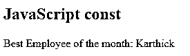
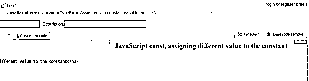
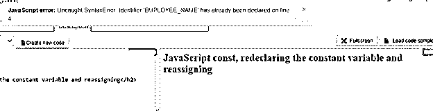
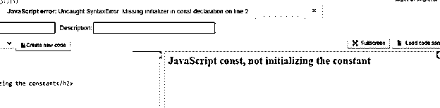
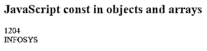
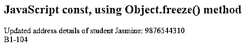

# Javascript 常量

> 原文：<https://www.educba.com/javascript-constants/>


## JavaScript 常量介绍

今天，我们将研究 JavaScript 常量。从任何编程逻辑开始，我们首先需要有一些常量和变量，这对逻辑是有用的。这些 JavaScript 常量是只读的，用 const 关键字声明，该关键字在声明时被赋值。常量可以是全局的，也可以是局部的，在声明的地方起作用。我们有两个新的 JavaScript 关键字，即 let 和 const。用 const 定义的变量表现为 let 变量，不能被重新赋值或重新声明。被阻塞的 JavaScript 常量的作用域类似于使用 let 关键字声明的变量。

### 句法

下面是提到的语法:

<small>网页开发、编程语言、软件测试&其他</small>

```
const <name of the variable> = value;
```

在 JavaScript 中命名常量有一些规则，用于命名变量、保持 const 关键字的完整性和全局常量。如果删除了关键字“const ”,则标识符表示为变量。

因此要声明一个常量变量，需要使用关键字' const '而不是' let '

例如，

```
const employeeName = "Karthick";
```

在这里，变量 employeeName 是带有 vale 'Karthick "的常量。

如果您试图将 employeeName 的值更改为“Anusha”，您将会遇到一个错误，因为您不能重新分配一个常量

只有当程序员确信该变量不会面临任何变化时，才可以使用 const 来声明它，以保证该变量是一个常数

JavaScript 值在执行过程中不能被编程改变，它是一个常量，很容易处理，对吗？是的，但是我们对这些常量有一个命名约定。JavaScript 是一种解释型语言，以前我们习惯将值存储在变量中，即使它们是常量值。为了区分变量和常数，ECMAScript 6 遵循一些命名常数的准则。

*   一个主要的事情是大写，这肯定有助于我们了解程序中的常量值和变量。

```
var EMPLOYEE_AGE = 24;
```

*   ES6 帮助人们声明 const，这是一个常量，并添加了新的关键字“const”和“let”
*   所以你可能会怀疑，当我们有了关键字' const '时，为什么要大写，或者我们是否需要大写使用 const 关键字声明的任何内容。
*   Const 创建一个具有只读引用的常数；变量保存的值是不可变的，这没有任何意义。
*   一些常量引用可以根据编程逻辑而改变。
*   所以这里的 const 只是防止用户试图重新分配变量名，但是 object 属性可以作为对象通过引用传递。
*   总的来说，常量可以用大写或小写来声明，最常用和最常见的约定是全部用大写字母。

### Javascript 常量的示例

以下是 Javascript 常量的示例:

#### 示例#1

const 关键字的使用。**代码:**

```
<!DOCTYPE html>
<html>
<body>
<h2>JavaScript const</h2>
<p id="demo"></p>
<script>
const EMPLOYEE_NAME = "Karthick";
document.write('Best Employee of the month: ' + EMPLOYEE_NAME);
</script>
</body>
</html>
```

**输出:**




#### 实施例 2

在上面的代码中分配或更改常量 EMPLOYEE_NAME 的值。

**代码:**

```
<!DOCTYPE html>
<html>
<body>
<h2>JavaScript const, assigning different value to the constant</h2>
<p id="demo"></p>
<script>
const EMPLOYEE_NAME = "Karthick";
EMPLOYEE_NAME = "Saideep";
document.write('Best Employee of the month: ' + EMPLOYEE_NAME);
</script>
</body>
</html>
```

**输出:**




你可以看到屏幕截图上的错误为“在线常量变量赋值 3。”

#### 实施例 3

重新声明常数并重新赋值。

**代码:**

```
<!DOCTYPE html>
<html>
<body>
<h2>JavaScript const, redeclaring the constant variable and reassigning</h2>
<p id="demo"></p>
<script>
const EMPLOYEE_NAME = "Karthick";
document.write('Best Employee of the month: ' + EMPLOYEE_NAME);
const EMPLOYEE_NAME = "Anusha";
</script>
</body>
</html>
```

**输出:** 




常量 EMPLOYEE_NAME 已经声明，这是一个语法错误

#### 实施例 4

没有初始化常量。

**代码:**

```
<!DOCTYPE html>
<html>
<body>
<h2>JavaScript const, not initializing the constant</h2>
<p id="demo"></p>
<script>
const EMPLOYEE_AGE;
</script>
</body>
</html>
```

**输出:**




我们只是声明了常量 EMPLOYEE_AGE，并没有用一个值来初始化它。因此缺少初始化器语法错误。

#### 实施例 5

数组和对象中的 JavaScript 常量

**代码:**

```
<!DOCTYPE html>
<html>
<body>
<h2>JavaScript const in objects and arrays</h2>
<p id="demo"></p>
<script>
const COMPANY = {'key': 'value'};
// COMPANY = {'SAMPLE': 'value'};
COMPANY.key = '1204';
document.write(COMPANY.key + "<br/>");
const COMPANY_ARRAY = [];
COMPANY_ARRAY.push('INFOSYS');
// COMPANY_ARRAY = ['Capgemini'];
document.write(COMPANY_ARRAY);
</script>
</body>
</html>
```

**输出:**




注释行，你们可以通过取消注释来尝试。它将给出一个错误，如“错误:未捕获的类型错误:常量变量的赋值”

使用常量的一个有趣之处是了解 Object.freeze()方法。

如果希望任何对象都是不可变的，我们需要使用 Object.freeze()方法，这样通过冻结对象的属性来冻结对象，而不是对象所引用的属性。让我们举一个例子，

#### 实施例 6

对 const 使用 Object.freeze()方法。

**代码:**

```
<!DOCTYPE html>
<html>
<body>
<h2>JavaScript const, using Object.freeze() method</h2>
<p id="demo"></p>
<script>
const SCHOOL = Object.freeze({
studentName: 'Jasmine',
studentAddress: {
street: 'Totavari Street',
city: 'Visakhapatnam',
state: 'Andhra Pradesh',
zipcode: 520070,
country: 'India',
}
});
SCHOOL.studentAddress.phNumber = 9876544310;
SCHOOL.studentAddress.flatNumber = 'B1-104';
document.write('Updated address details of student Jasmine: ', SCHOOL.studentAddress.phNumber + '<br/>' + SCHOOL.studentAddress.flatNumber);
</script>
</body>
</html>
```

**输出:**




学校对象是常量并被冻结；没有其他细节是可变的，但是 SCHOOL.studentAddress 对象是可变的，可以添加新的属性。

### 结论

至此，我们结束了“JavaScript 常量”这一主题。我们已经看到了 JavaScript 常量及其语法。举例说明几个简单的例子，你们可以尝试一下。Const 关键字表示变量是一个常量，不能被重新赋值或重新声明。新的方法 Object.freeze()，它将帮助您向一个对象添加属性，我们已经看到了一个说明这一点的示例。

### 推荐文章

这是一个 Javascript 常量的指南。这里我们讨论什么是 JavaScript 常量及其语法，以及一些简单的例子。您也可以看看以下文章，了解更多信息–

1.  [JavaScript 迭代数组](https://www.educba.com/javascript-iterate-array/)
2.  [JavaScript 计数器](https://www.educba.com/javascript-counter/)
3.  [JavaScript onkeyup](https://www.educba.com/javascript-onkeyup/)
4.  [JavaScript 随机](https://www.educba.com/javascript-random/)


