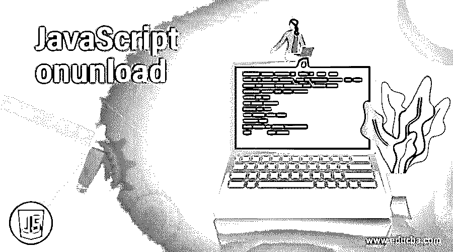
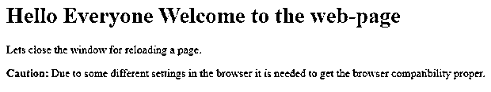
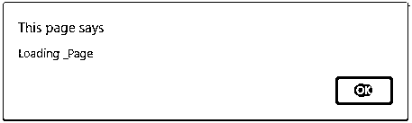

# JavaScript onunload

> 原文：<https://www.educba.com/javascript-onunload/>




## JavaScript onunload 简介

JavaScript onunload 是当用户试图加载某个页面时发生的事件，页面保持停滞状态意味着它保持卸载状态。当浏览器在加载页面时关闭时，onunload 事件也有可能发生。当用户在单击、提交和关闭浏览器窗口时导航离开页面时，Onunload 事件主要到达 onunload 状态。当用户试图重新加载网页并在加载时访问信息时，也会发生此事件。

**语法**

<small>网页开发、编程语言、软件测试&其他</small>

```
object.onunload = function()
{
JavaScript Body;
};
```

语法流如下，其中对象在脚本执行时调用 onunload 事件，然后调用 JavaScript 的 onunload 函数。

### onunload 事件在 JavaScript 中是如何工作的？

事件通常是由于在实现任何功能时执行了不必要的操作，或者试图执行一些其他操作，但导航后得到一些其他无效输出而导致的。即使与现实生活中的场景相比，也会发生同样的事情，包括试图尝试并获得一些价值，但最终却获得了一些其他的价值。当用户导航并最终到达一些不需要的页面时，也会发生 onunload，但页面仍然试图加载自己，但由于两个线程并行运行以实现加载和卸载活动，因此会挂起。

当用户试图点击任何链接、提交表单或关闭窗口中任何不应该出现的浏览器时，就会发生这种情况。所以让我们进入现实生活中的事件；例如，假设程序员试图创建一个图形用户界面，该界面涉及许多要提交的菜单和表单，然后试图增强整个 UI，那么发生的情况是，在修改或增强时，程序员离开主要组件，然后试图加载文件，并观察到在点击链接时或在提交用于测试和验证组件的表单时加载网页的事件失败。

JavaScript 中的这些事件是不需要的，但是由于程序员执行的不需要的动作而频繁发生，导致 onunload 事件，其中情况变得非常麻烦，因为程序员需要解决挂起情况下的修改，然后在处理的剩余部分执行整个动作。因此，当这些事件与现实生活相比较时，就会变得相关，从而有助于获得事件的本质，它们如何使用户意识到 JavaScript 中的每个组件或每个增强和修改，以便进一步使用。

事件在 JavaScript 支持各种浏览器的情况下，如 google chrome，具有最高优先级的浏览器，具有与事件的用户兼容性以及与活动性能相关的其他属性，如 onunload。因此，由于一些不同的浏览器设置，事件可能会受到阻碍，如果使用不当，所有其他事件的行为也可能受到阻碍，并且事件也可能无法按预期正常工作。

有一些事件对象，作为 JavaScript onunload 函数的一部分，可以使用其工作的属性和方法；因此，作为这个 JavaScript onunload 事件的一部分的所有其他事件对象可以包括像 MouseEvent 和 KeyBoard Event 这样的对象，它们可以在任何时间和任何地点访问任何事件对象。当统一合并到事件对象中时，一些 HTML 数据对象形成工作中的事件和功能的操作事件对象。

大多数事件通常用于在用户启动触发器之前进行测试和验证，例如在使用鼠标点击任何链接进行验证时。因此，大多数事件类型，包括 abort、afterprint、beforeprint 等。，负责触发事件对象。必须记住的一点是，当事件对象和数据对象与 JavaScript 中的函数结合时，将使 JavaScript onunload 成为可能。

### JavaScript onunload 示例

下面提到了不同的例子:

#### 示例#1

这个程序演示了 JavaScript 中的 onunload 函数，其中用户使用 onunload 函数，然后尝试调用其函数的网页，然后尝试关闭窗口，以使用脚本验证函数的重新加载，然后使用脚本分配一个 alert 函数，如输出所示。

**代码:**

```
<!DOCTYPE html>
<html>
<body onunload="One_Func()">
<h1>Hello Everyone Welcome to the web-page</h1>
<p>Lets close the window for reloading a page. </p>
<p><strong>Caution:</strong> Due to some different settings in the browser it is needed to get the browser compatibility proper. </p>
<script>
function One_Func() {
alert("Thanks for visiting the web-page");
}
</script>
</body>
</html>
```

**输出:**




#### 实施例 2

该程序演示了作为事件对象一部分的 onload 功能，它也对 JavaScript 的 onunload 函数负责，因为它试图加载一个网页，然后要求该函数调用该网页，然后在调用 trail 函数时抛出一个加载整个页面的警告，单击输出中所示的 ok 按钮，它显示并加载文件以便正确查看。

**代码:**

```
<!DOCTYPE html>
<html>
<body onload="trial_func()">
<h1>Welcm Everyone!</h1>
<script>
function trial_func() {
alert("Loading _Page");
}
</script>
</body>
</html>
```

**输出:**




**Note**: One important thing to keep in mind while executing these JavaScript loading and unloading of the file involves the event object, and the data object should be in sync.

### 结论

JavaScript Onunload 是一个非常重要的事件，必须持续检查。这些事件函数涉及大量的事件和对象，这些事件和对象被相应地执行，并且应该在组件中包含适当的流程和同步。因此，只有他们才能天衣无缝地工作。

### 推荐文章

这是一个 JavaScript onunload 的指南。在这里，我们讨论了 onunload 事件如何在 JavaScript 中工作，并给出了代码和输出。您也可以看看以下文章，了解更多信息–

1.  [禁用 JavaScript](https://www.educba.com/disable-javascript/)
2.  [JavaScript 窗口事件](https://www.educba.com/javascript-window-events/)
3.  [JavaScript join()](https://www.educba.com/javascript-join/)
4.  [JavaScript 鼠标事件](https://www.educba.com/javascript-mouse-events/)


