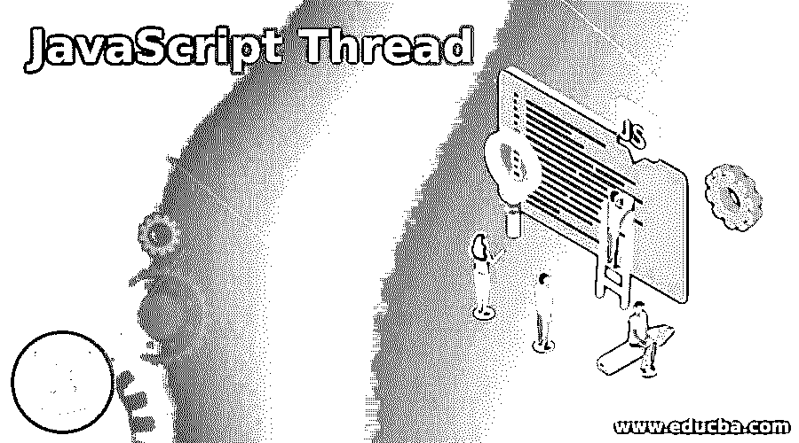
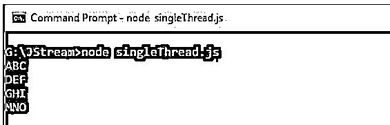
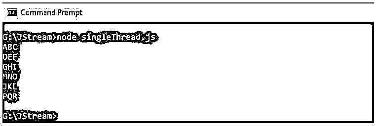

# JavaScript 线程

> 原文：<https://www.educba.com/javascript-thread/>




## JavaScript 线程简介

在软件中，“线程”是由调度程序独立管理的程序指令的最小执行序列，是操作系统的一部分。默认情况下，JavaScript 线程是单线程的，用于在 web 应用程序中运行脚本，执行布局和垃圾收集。单线程就是在进程中的任何时候只执行一组指令。这是 JavaScript 中的主要缺点，它导致了服务器端异步 I/O 的实现，这将通过减少线程间的竞争来帮助我们实现多线程。

让我们看看 JavaScript 线程’是如何进化的？在 JavaScript 中，我们有执行函数的循环，但这本身对于执行时间更长的函数来说是不够的。例如，如果我们想以 60FPS 执行我们的进程，那么在下一个代码帧之前，只剩下 16ms 来执行代码。JavaScript 不支持多线程，因为浏览器中的 JavaScript 解释器是单线程的。即使是我们著名的网络浏览器 Google Chrome，也不会让一个 JavaScript 页面同时运行，因为这会导致应用程序出现问题。一个单独的线程处理整个事件周期。因此，JavaScript 为我们面临的限制引入了一个新概念，即网络工作者。

<small>网页开发、编程语言、软件测试&其他</small>

Web Workers 可以执行长时间运行的任务，而不会影响执行线程。worker 是使用构造函数创建的对象，它将运行 JavaScript 文件。该 JavaScript 文件包含将在工作线程中运行的代码；这些工作线程在另一个不同于当前窗口的全局上下文中运行。

### JavaScript 线程的示例

以下是 JavaScript 线程的示例:

#### 示例#1

JavaScript 单线程。

**代码:**

```
<!DOCTYPE html>
<html>
<head>
<title>JavaScript Single Thread</title>
</head>
<body>
<script>
document.write("Karthick ")
setTimeout(() => {
document.write("Anusha")
}, 5000)
document.write("Samuel")
</script>
</body>
</html>
```

**输出:**


5000 毫秒后，生成一个未定义的值，然后在控制台中显示值“Anusha”。


**说明:**

*   Write('Karthick ')将首先打印，因为它首先在堆栈上。
*   然后 JavaScript 引擎会注意到不被 JavaScript 处理的 setTimeout，并将其推送到 WebAPI 进行异步执行。
*   控制台上打印的下一个数据是“Samuel ”,而不关心处理给 WebAPI 的代码。
*   在此之后，JavaScript 引擎进入画面，等待事件加载，直到事件完成，setTimeout 等待 5000 毫秒，打印 undefined(这里，在控制台中 undefined 不打印，但会消耗一些时间)。
*   最后，一旦超时完成，它将输出值‘an usha’

#### 实施例 2

使用异步 AJAX 调用代替 Web Workers。

**代码:**

```
<!DOCTYPE html>
<html>
<head>
<title>JavaScript Single Thread</title>
</head>
<body>
<script>
document.write("ABC ");
setTimeout(function(){
document.write("MNO ");
},0);
document.write("DEF ");
setTimeout(function(){
document.write("JKL ");
},2000);
document.write("GHI ");
setTimeout(function(){
document.write("PQR ");
},3000);
</script>
</body>
</html>
```

**输出:**




根据 setTimeout 计时器，其余数据打印在控制台上。




#### 实施例 3

网络工作者。

**代码:**

```
<!DOCTYPE html>
<html>
<body>
<p>Count: <output id="resultNum"></output></p>
<button onclick="startWorker()">Start Count</button>
<button onclick="stopWorker()">Stop Count</button>
<script>
var num;
function startWorker() {
if(typeof(Worker) !== "undefined") {
if(typeof(num) == "undefined") {
num = new Worker("demo_workers.js");
}
num.onmessage = function(event) {
document.getElementById("resultNum").innerHTML = event.data;
};
} else {
document.getElementById("resultNum").innerHTML = "Something went wrong.... Your browser might nto support Web Workers";
}
}
function stopWorker() {
num.terminate();
num = undefined;
}
</script>
</body>
</html>
```

在 demo_workers.js 文件中

```
var i = 0;
function counter() {
i = i + 1;
postMessage(i);
setTimeout("counter ()",500);
}
counter();
```

**输出:**


点击开始计数，计数将在每次超时后增加。


点击 stop 时，计数器将停止增加并保持静止。

*   我们将创建一个 web Worker 文件并编写我们的计数器逻辑，它存储为一个 demo_workers.js 文件。
*   代码中最重要的部分是 postMessage()，用于将消息发送回 HTML 页面。
*   然后我们需要创建一个 web worker 对象来调用 HTML 页面的 Web Worker 文件。
*   我们需要一个事件侦听器“onmessage”来发送和接收来自 web worker 的消息。
*   因此，当 web worker 发布任何消息时，事件侦听器都会执行其代码，并将数据存储在 event.data 中。
*   为了终止 web worker 或释放计算机资源，我们使用。terminate()方法。
*   如果在终止 web worker 后将 worker 变量设置为 undefined，我们可以重用这段代码。

概括地说，让我们用所用的语法总结一下上面的例子；网络工作者如何工作？

*   WebWorkers 使用 JavaScript 文件的 URL 进行初始化，该文件包含 worker 将执行的逻辑

```
var worker = new Worker("sample.js");
```

*   如果。js 文件存在，浏览器会让一个新线程异步下载；否则将返回 404 错误并失败。
*   也可以导入多个 JavaScript 文件。

```
importScripts("sample.js", "sample1.js");
```

*   一旦这个连接正常工作，web Workers 之间的通信就使用 postMessage()方法完成。
*   使用 onmessage 事件访问 Web Worker 传递的任何数据。
*   主 html 页面将产生一个 web Worker 来执行代码并产生结果。
*   终止 Web Worker。

```
worker.terminate()
```

*   被解雇的员工将不再响应任何类型的计算。
*   我们还可以在这里使用。

```
worker.onerror()
```

### 结论

我们已经看到了 JavaScript 中的单线程，但例子很少。异步 AJAX 调用使多线程成为可能。我们还看到了一个新的概念，Web Workers，它在 JavaScript 中实现了多线程。用一个很好的例子说明了这一点。通过线程化，工作被分配到多个线程和内存中。我们可以通过线程实现高效的服务。Web 工作者帮助访问具有严格执行环境的 web 和移动浏览器环境。可能会迫使用户在多线程之间复制对象，并让我们相应地规划我们的应用程序。

### 推荐文章

这是一个 JavaScript 线程指南。这里我们分别讨论 JavaScript 线程的介绍和例子。您也可以看看以下文章，了解更多信息–

1.  [JavaScript 动画](https://www.educba.com/javascript-animation/)
2.  [JavaScript object.is()](https://www.educba.com/javascript-object-is/)
3.  [JavaScript 数组切片](https://www.educba.com/javascript-array-slice/)
4.  [卸载 JavaScript](https://www.educba.com/unshift-javascript/)


