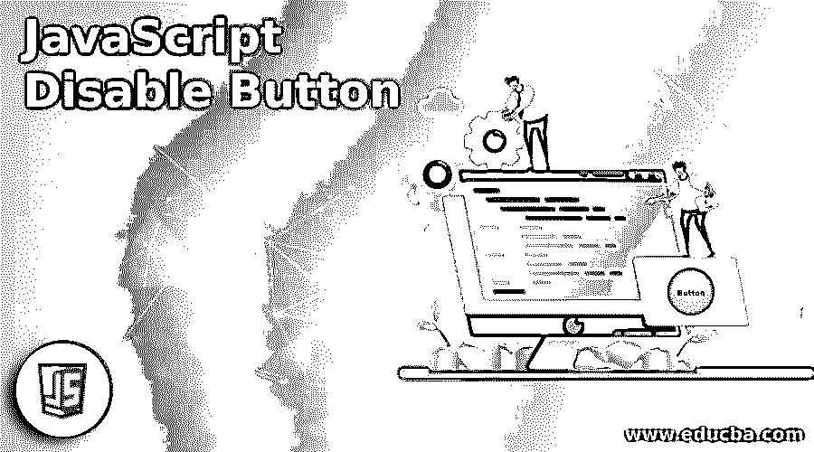
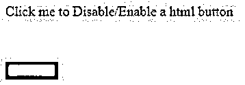
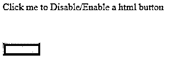
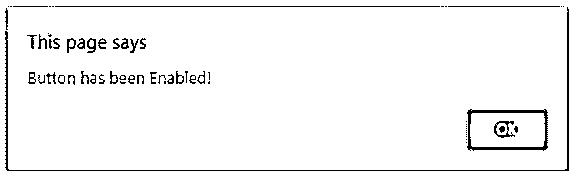
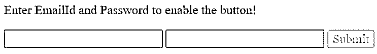
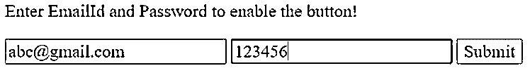
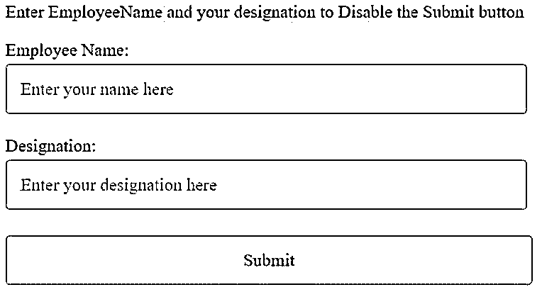
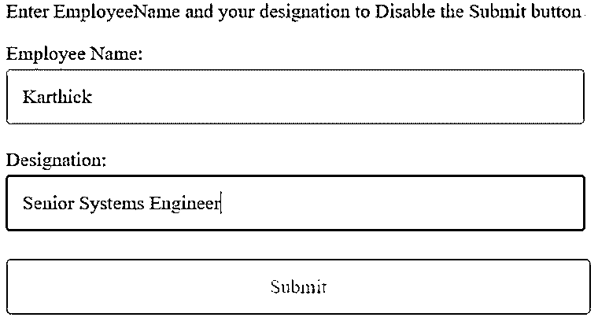

# JavaScript 禁用按钮

> 原文：<https://www.educba.com/javascript-disable-button/>




## JavaScript 禁用按钮简介

今天，我们将探讨如何使用 JavaScript 禁用按钮。基本上，禁用任何按钮是我们在大多数 web 应用程序中看到的功能之一。JavaScript 禁用按钮不可用，也不是可点击的按钮，可以使用 JavaScript 编程编码。JavaScript 可以删除禁用的值，并使按钮启用进一步的功能。我们有一个 HTML 按钮，它有自己的表单控件状态。无论按钮是否被禁用，disabled 属性都将返回。在所有浏览器中，任何被禁用的元素都默认显示为灰色。

如果我们按照语法来看，它看起来会像下面这样:

<small>网页开发、编程语言、软件测试&其他</small>

```
document.getElementById("btn").disabled = true/ false;
```

所以这个语法行将帮助我们基于我们触发的布尔值来启用或禁用。因此，true 表示“1”表示启用，false 表示“0”表示禁用。

### JavaScript 禁用按钮的示例

以下是 JavaScript 禁用按钮的示例:

#### 示例#1

这里我们将使用一个被禁用的按钮，启用时会在浏览器上弹出一个警告。

**代码:**

```
<!DOCTYPE html>
<html>
<head>
<title>Enter data in multiple text boxes to Enable/ Disable button</title>
<style>
.show {
width: 100px;
height: 100px;
}
.click {
cursor: pointer;
padding-bottom: 50px;
}
</style>
</head>
<body>
<div class="click">Click me to Disable/Enable a html button</div>
<div class="show">
<input id="Button" type="button" value=" Button " style="background-color:blue" />
</div>
</body>
<script>
var samplebutton = document.getElementById("Button");
var clickButton = document.getElementsByClassName('click')[0];
samplebutton.disabled = true;
clickButton.addEventListener('click', function(event) {
samplebutton.disabled = !samplebutton.disabled;
});
samplebutton.addEventListener('click', function(event) {
alert('Button has been Enabled!');
});
</script>
</html>
```

这里，我们将根据所需的功能来设置启用或禁用按钮的逻辑。我们将通过使 disable = true 来禁用按钮，并添加一个事件“click ”,以便在单击已启用的按钮时，我们将得到一个警告“按钮已被启用！”.

**输出:**




因此，在运行我们的程序时，我们将得到如上所示的结果，按钮被禁用。除非启用，否则我们将无法单击该按钮。所以，如果我们点击文本，按钮就会被激活。




你可以看到两幅图像之间的差异。现在，单击一个按钮，我们将得到一个警告消息，说“按钮已被启用！”.




还有另一种方法可以使用 JavaScript disabled 属性禁用按钮，这是最简单的方法。

**语法:**

```
object.disabled
```

JavaScript disabled 属性是一个取 true 或 false 的布尔属性。将 disabled 属性设置为 true 将启用按钮，设置为 false 将禁用按钮，即不可点击。

让我们看一个例子，其中我们将显示两个文本框来输入 EmailID 和密码，使用它们可以启用按钮。

#### 实施例 2

**代码:**

```
<!DOCTYPE html>
<html>
<head>
<style>
* { font: 20px Times New Roman; }
</style>
</head>
<body>
<h3>Enter EmailId and Password to enable the button!</h3>
<input type="text" id="emailtext" value = "" onkeyup="manageBtn(this)" />
<input type="text" id="pswrdtxt" value= "" onkeyup="manageBtn(this)" />
<input type="submit" id="btnSubmit" disabled />
</body>
<script>
function manageBtn(txt) {
var btn = document.getElementById('btnSubmit');
if (emailtext.value != '' && pswrdtxt.value != '') {
btn.disabled = false;
}
else {
btn.disabled = true;
}
}
</script>
</html>
```

**输出:**




仅在两个文本框中输入一些值时，按钮将被激活，如下所示。




#### 实施例 3

**代码:**

```
<!DOCTYPE html>
<html>
<head>
<title>Enter data in multiple text boxes to Enable/ Disable button</title>
<style>
* { box-sizing: border-box; font: 20px Times New Roman; width: 99%; }
input {
padding: 15px;
margin: 4px 0;
border: 2px solid #ccc;
border-radius: 5px;
}
input[type=submit] { cursor: pointer; }
</style>
</head>
<body>
<h3>Enter EmployeeName and your designation to Disable the Submit button</h3>
<p>
Employee Name: <input type="text" id="employeename" placeholder="Enter your name here"
onkeyup="manageBtn(this)" />
</p>
<p>
Designation:
<input type="text" id="designation" placeholder="Enter your designation here"
onkeyup="manageBtn(this)" />
</p>
<input type="submit" id="submit" enabled />
</body>
<script>
function manageBtn(txt) {
var btn = document.getElementById('submit');
var element = document.getElementsByTagName('input');
for (i = 0; i < element.length; i++) {
if (element[i].type == 'text' && element[i].value == '') {
btn.disabled = true;
return false;
}
else {
btn.disabled = true;
}
}
}
</script>
</html>
```

**输出:**




因此，在这里，雇员姓名和职务是两个文本框，它们需要值来禁用按钮。不要迷茫；通常，我们会在输入值时启用该按钮，但在这里我将向您展示如何禁用该按钮。




只有在文本框中输入一些数据时，提交按钮才会被禁用。

因此，您可以从之前的屏幕截图中看到该按钮现在看起来是灰色的，您可以看到该按钮由于 JavaScript disabled 属性而高亮显示并可点击。

### 结论

我们已经看到了 JavaScript 中的禁用按钮与 HTML 编程中的不同之处。举例说明 3 个例子，让你更好地理解，你可以使用这些例子作为参考，并以自己的方式编码。这只是 JavaScript 中的一个属性的问题，我们在这里使用的是“disabled ”,得到一个布尔值“true”或“false ”,用它来启用或禁用按钮。所以剩下的就是我们自己的逻辑，在什么条件下我们希望按钮被禁用或启用。

### 推荐文章

这是一个 JavaScript 禁用按钮的指南。这里我们分别讨论 JavaScript 禁用按钮的介绍和例子。您也可以看看以下文章，了解更多信息–

1.  [JavaScript 父节点](https://www.educba.com/javascript-parent-node/)
2.  [JavaScript 事件处理程序](https://www.educba.com/javascript-event-handler/)
3.  [JavaScript 倒计时](https://www.educba.com/javascript-countdown/)
4.  [JavaScript 延迟](https://www.educba.com/javascript-delay/)


