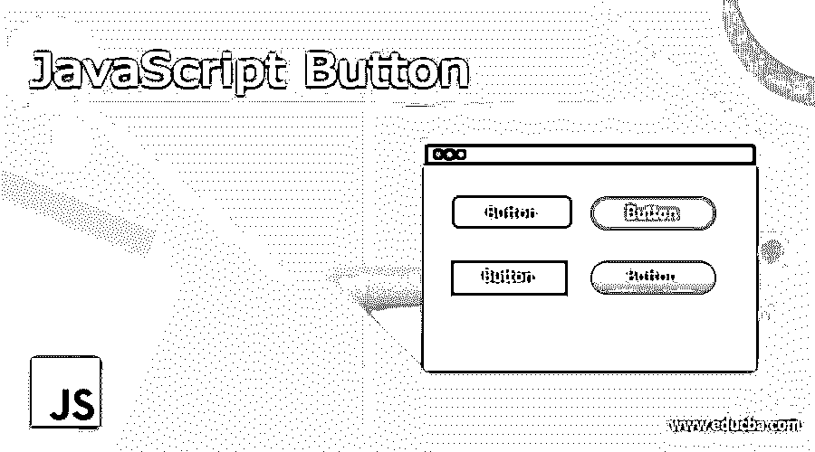
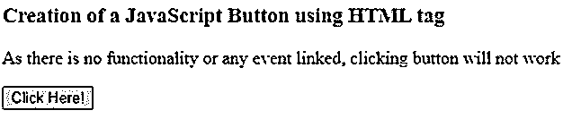
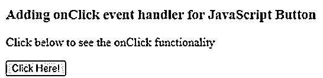
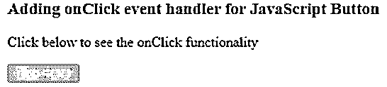
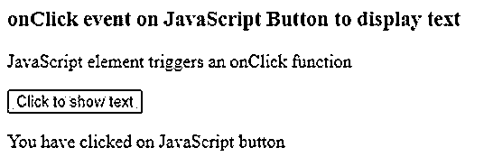
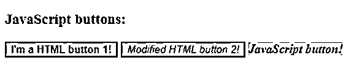
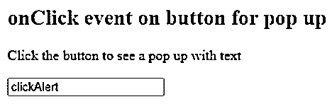
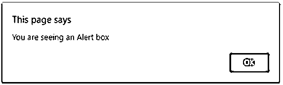
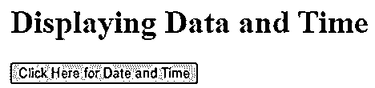
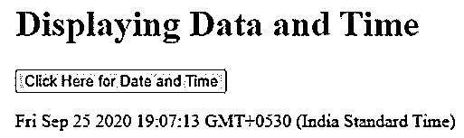

# JavaScript 按钮

> 原文：<https://www.educba.com/javascript-button/>




## JavaScript 按钮简介

JavaScript 按钮是 JavaScript 元素中的一个，它给网页带来效果。JavaScript 按钮给网站一个好的外观和感觉。这些 JavaScript 按钮可用于发送数据或接收数据、触发点击事件或改变颜色或文本等。HTML 标签<button>用于定义可点击按钮的 JavaScript 框架中。每当网页上呈现一个按钮时，都会触发一个事件来执行一项功能。我们将通过使用 createElement()和用于 JavaScript 框架的 HTML 标签来研究 JavaScript 按钮的创建。</button>

**语法:**

<small>网页开发、编程语言、软件测试&其他</small>

为 JavaScript 按钮使用 <button>HTML 标签</button>

```
<button onclick="sampleFunction()">Sample Text</button>
```

以上是 ReactJs、AngularJs 等 JavaScript 框架中最常用的语法。

```
varsampleButton = document.createElement(btn);
```

上面是用于创建 JavaScript 按钮的纯 JavaScript 语法。

### JavaScript 按钮的示例

看看下面的例子，了解 JavaScript 按钮是如何创建的？

#### 示例#1

使用<button>标签创建一个 JavaScript 按钮</button>

**代码:**

```
<!DOCTYPE html>
<html>
<body>
<h3>Creation of a JavaScript Button using HTML tag</h3>
<p>As there is no functionality or any event linked, clicking button will not work</p>
<button type="button" id="btn">Click Here!</button>
<p id="samplebtn"></p>
<script>
</script>
</body>
</html>
```

**输出:**




所以在上面的例子中，我们只是使用带有 id 的 HTML <button>标签来创建一个按钮。单击不起作用，因为没有适用的事件处理程序或功能。</button>

#### 实施例 2

向按钮添加一个单击事件。

**代码:**

```
<!DOCTYPE html>
<html>
<body>
<h3>Adding onClick event handler for JavaScript Button</h3>
<p>Click below to see the onClick functionality</p>
<button type="button" id="btn" onclick="sampleClick()">Click Here!</button>
<p id="samplebtn"></p>
<script>
function sampleClick() {
varbtnX = document.getElementById("btn");
btnX.disabled = true;
}
</script>
</body>
</html>
```

**输出:**




点击时，




在上面的例子中，我们使用 onClick 功能来禁用按钮。.disabled 是帮助按钮被禁用的方法，单击将不起作用。

#### 实施例 3

点击按钮显示文本。

**代码:**

```
<!DOCTYPE html>
<html>
<body>
<h3>onClick event on JavaScript Button to display text</h3>
<p>JavaScript element triggers an onClick function</p>
<button onclick="clickText()">Click to show text</button>
<p id="btn"></p>
<script>
function clickText() {
document.getElementById("btn").innerHTML = "You have clicked on JavaScript button";
}
</script>
</body>
</html>
```

**输出:**


点击时，




#### 实施例 4

**代码:**

```
<!DOCTYPE html>
<html>
<head>
<style>
body {
text-align: left;
}
/* Styling for the btn1 class */
.btn1 {
background-color: #4FFF8A;
}
/* Styling for id=htmbtn1 */
#htmlbtn1 {
font-weight: bold;
}
/* Styling for id=htmlbtn2 */
#htmlbtn2 {
font-style: italic;
}
/* Styling for id=jsbtn */
#jsbtn {
font-weight: bold;
font-style: italic;
}
</style>
</head>
<body>
<h3>JavaScript buttons:</h3>
<button id='htmlbtn1' class='btn1'>I'm a HTML button 1!</button>
<button id='htmlbtn2' class='btn1'>I'm a HTML button 2!</button>
<script>
/* Creating a javascript button element */
varclickBtn= document.createElement('btn1');
/* Setting the button's text label */
clickBtn.innerHTML = 'JavaScript button!';
/* Setting the button's id */
clickBtn.id = 'jsbtn';
/* Setting the button's style class */
clickBtn.className = 'btn1';
/* Adding the button to the html page */
document.body.appendChild(clickBtn);
/* Getting the element with id='htmlbtn2' */
varhtmlbtn = document.getElementById('htmlbtn2');
/* Modifying the text label for htmlbtn2 */
htmlbtn.innerHTML = 'Modified HTML button 2!';
</script>
</body>
</html>
```

**输出:**




让我们浏览代码，以便更好地理解，

*   使用创建 JavaScript 按钮

document . createelement(' Bt n1 ')；创建可单击的按钮对象，并被引用为“clickBtn”

*   innerHTML 有助于设置内部内容，也称为标签。
*   id = 'jsbtn '，设置按钮 id
*   设置 CSS 样式的按钮
*   body.appendChild(clickBtn)帮助将 clickBtn 作为子级附加到文档的主体。

当页面呈现时，我们看到所有三个按钮的背景样式都来自 btn1 类，而且每个按钮都有特定于 id 的不同字体样式。

最初，htmlbtn2 的文本标签是“我是 HTML 按钮 2！”，我们使用了 JavaScript，并将文本标签修改为“修改的 HTML 按钮 2！”.

#### 实施例 5

**代码:**

```
<!DOCTYPE html>
<html>
<body>
<h2>onClick event on button for pop up</h2>
<p>Click the button to see a pop up with text</p>
<input type="btn" value="clickAlert" onclick="alert('You are seeing an Alert box')">
</body>
</html>
```

**输出:**




点击后，您会看到一个警告框，




#### 实施例 6

显示日期和时间。

**代码:**

```
<!DOCTYPE html>
<html>
<body>
<h1>Displaying Data and Time</h1>
<button type="btn"
onclick="document.getElementById('demo').innerHTML = Date()">
Click Here for Date and Time</button>
<p id="demo"></p>
</body>
</html>
```

**输出:**




点击后，我们会看到当前的日期和时间，




有更多的事件处理程序可以应用于 JavaScript 按钮，

*   点击按钮时
*   鼠标悬停在按钮上
*   当鼠标离开按钮时
*   提交表格/数据时点击按钮(Post 方法)
*   从源中检索数据(Get 方法)
*   将焦点从按钮上移开
*   在按钮上应用焦点
*   使用禁用按钮。使残废
*   论变革方法
*   还有更多…..

### 结论

至此，我们将结束“JavaScript 按钮”这个主题。我们已经看到了 JavaScript 按钮是什么以及它们是如何使用的。描述按钮的不同方式，一种是使用 JavaScript createElement()，另一种是使用 HTML 标签<button>。我列出了一些例子，并有清晰的解释，让你更好地理解。由于我们有许多适用于 JavaScript 按钮的事件处理方法，已经列出了一些。你甚至可以尝试参与其他活动。JavaScript 按钮使网页看起来更优雅，因为大多数基本网页都有各种功能的按钮。</button>

### 推荐文章

这是一个 JavaScript 按钮指南。在这里，我们还讨论了 javascript 按钮的介绍和语法，以及不同的例子和代码实现。您也可以看看以下文章，了解更多信息–

1.  [JavaScript 对象符号](https://www.educba.com/javascript-object-notation/)
2.  JavaScript onchange
3.  [JavaScript 动画](https://www.educba.com/javascript-animation/)
4.  [JavaScript 数组切片](https://www.educba.com/javascript-array-slice/)


