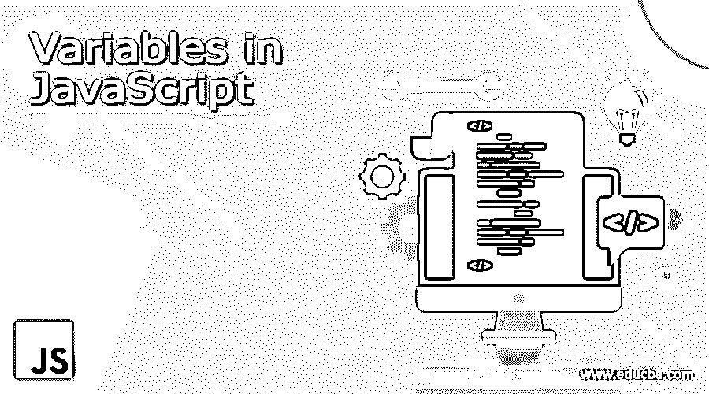
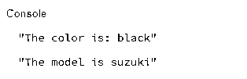
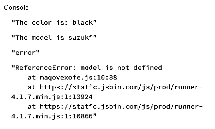
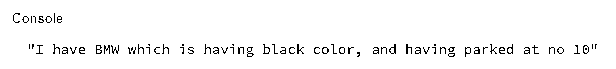
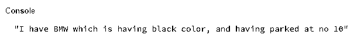
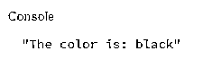

# JavaScript 中的变量

> 原文：<https://www.educba.com/variables-in-javascript/>




## JavaScript 中变量的介绍

在开始 JavaScript 变量之前，我们应该知道这个术语的实际含义。一般来说，变量意味着不断变化的东西。用编程术语来说，变量不过是对我们已经存储了一些值的内存的引用。目前我们有三种不同的方法来声明变量。每一个都有其使用的重要性。这些建议如下:

1.  定义变量
2.  让
3.  常数

以上三个都是 JavaScript 中的关键词。一般来说，我们必须用关键字 var 声明一个变量。在 ES2015 中(EcmaScript 2015)引入了两个新的关键字来声明变量，即 let 和 const。这两者都是块范围的。但现在，我们将专注于 var。

<small>网页开发、编程语言、软件测试&其他</small>

### JavaScript 中变量的语法

javascript 变量带有作用域。JavaSript 有两个作用域:局部作用域和全局作用域。在 ES2015 的后期，我们引入了 with block scope。

让我们专注于全局范围和局部范围。任何在代码顶部声明的变量对所有人来说都是全局的。任何人都可以访问它。另一方面，在任何函数内部声明的变量都是该函数的局部变量，不能从该作用域之外访问。

#### 示例#1

**代码:**

```
var color = "black";
function car(){
var model = "suzuki";
console.log("The model is "+model);
}
console.log("The color is: " + color);
car();
```

**输出:**




在上面的例子中，变量 color 是全局变量[而变量 model 是局部变量。可变模型是其功能范围的局部。从外面是无法接近的。如果我们试图这样做，那么我们将得到一个错误。我们去看看。](https://www.educba.com/python-global-variable/)

#### 实施例 2

**代码:**

```
var color = "black";
function car(){
var model = "suzuki";
console.log("The model is "+model);
}
console.log("The color is: " + color);
car();
console.log(model);
```

**输出:**




### 各自声明的语法

以下语法适用于各自的声明:

*   **为 var:**

    ```
    var variable_name;
    ```

*   **为让:**

    ```
    let variable_name;
    ```

*   **为常量:**

    ```
    const variable_name;
    ```

### Javascript 变量的规则

以下是 javascript 变量的规则:

1.  Javascript 变量名必须以字母开头。范围是 a-z 和 A-Z
2.  可能以$和 _ 开头。
3.  Javascript 变量不应该以数字开头。
4.  我们可以在名字之间使用数字。例如:house1
5.  JavaScript 是区分大小写的，所以声明为 price 和 Price 的变量是不同的。
6.  JavaScript 变量名不应该有名字或者[关键字](https://www.educba.com/c-sharp-keywords/)。例如:变量 const 这是不允许的，因为 const 是一个关键字。

### JavaScript 中变量是如何工作的？

JavaScript 变量是基于范围的。让我们先了解一下 JavaScript 中的作用域是什么。JavaScript 在其词汇环境下工作。有些人觉得这很棘手，但这很简单:

*   让我们从变量的声明开始。声明变量就是写变量名。在 JavaScript 中，我们遵循先写 var，后写 var 变量名的规则。分号(；)在 javascript 中是可选的。但是如果你付出了，这是很有帮助的，这是一种值得推荐的方式。用分号来表示语句结束的位置。

**代码:**

```
var  price;
```

*   在上面的例子中，关键字是 var，变量名是 price 一个标识符。如果你学过 JavaScript 中的操作符，你就会知道我们在这里使用了赋值操作符(=)。在 JavaScript 中，我们赋予变量的任何名称都被称为标识符。
*   赋值右边给出的任何值都存储在左边的变量中。
*   建议对变量使用小写字母。我们有一个装骆驼的箱子。for 变量中使用的小写 camel case。
*   现在关于 JavaScript 声明已经说得够多了。让我们继续这个变量的初始化。
*   变量初始化是给变量赋值的过程。现在，问题来了，哪个值？JavaScript 中我们有数据类型吗？答案是肯定的。
*   JavaScript 是动态语言。这意味着我们没有用特定的类型显式声明变量。JavaScript 编译器本身会对特定的数据类型进行类型强制。
*   JavaScript 中有数字、字符串、布尔、未定义和空数据类型。
*   JavaScript 有一个惯例，给所有未初始化的变量赋值。并且该值是未定义的。

**代码:**

```
var price =10; //initializing variable with value of 10
```

*   在上面的例子中，我们已经初始化了变量。如果我们不给变量任何值呢？让我们在 JavaScript 控制台中尝试下面的代码，看看结果。

**代码:**

```
var price;
console.log (price); //printing value to the console
```

在 JavaScript 中，我们使用如上所示的 console.log 方法在控制台上显示输出。

**输出:**


请记住，JavaScript 本质上是区分大小写的。现在，让我们看看如果我们给变量赋值，输出会是什么。

**代码:**

```
var price =10; // initialized variable with the value 10
console.log(price);
```

**输出:**


默认情况下，用关键字 var 声明变量属于它的全局范围。我们可以在同一行上声明多个变量。为此，我们需要用逗号(，)分隔每个变量。

此外，这里要注意的关键是变量值是数字，不应该用引号引起来。如果你用引号把数字括起来，那么用 JavaScript 把它写成一个字符串。

### JavaScript 中变量的例子

以下是 javascript 中变量的一些示例:

#### 示例#1

JavaScript var 可以存储任何类型的数据。让我们来看一个例子。

**代码:**

```
var color = "black";
var car = "BMW";
var no = 10;
console.log("I have " + car +
" which is having "+ color+
" color, and having parked at no " +no);
```

**输出:**




#### 实施例 2

我们可以在同一行中声明上述所有变量，请看下面的代码。

**代码:**

```
var color = "black", car = "BMW", no = 10;
console.log("I have " + car +
" which is having "+ color+
" color, and having parked at no " +no);
```

**输出:**




我们只是用逗号分隔每个变量，同时，我们初始化它。

#### 实施例 3

现在，我们已经看了一次声明变量。如果我们重新声明变量会发生什么？看下面的例子。

**代码:**

```
var color = "black";
var color;
console.log("The color is: " + color);
```

**输出:**




即使我们在这里重新声明了名为 color 的变量，它也不会丢失它的值。它给我们黑色作为输出。

### 结论

JavaScript 是解释语言，本质上是动态的。所以理解它是如何工作的非常重要。学习 JavaScript 时，变量的范围是一个非常重要的方面。

### 推荐文章

这是 JavaScript 中变量的指南。这里我们用语法例子和重要方面详细讨论变量 javascript 中的深度学习。您也可以浏览我们的其他相关文章，了解更多信息——

1.  [JavaScript 中的条件语句](https://www.educba.com/conditional-statements-in-javascript/)
2.  [c#中的变量](https://www.educba.com/variables-in-c-sharp/)
3.  [Java 中的变量](https://www.educba.com/variables-in-java/)
4.  [JavaScript 对象](https://www.educba.com/javascript-objects/)


