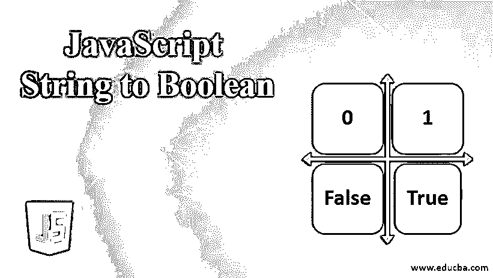
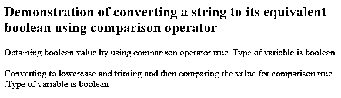
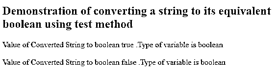
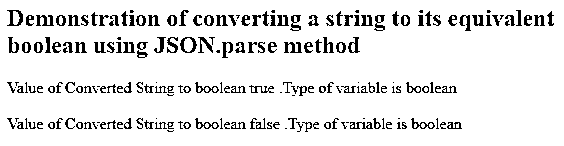
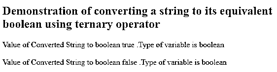
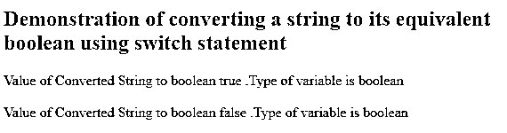

# JavaScript 字符串到布尔值

> 原文：<https://www.educba.com/javascript-string-to-boolean/>




## JavaScript 字符串到布尔的介绍

在用 javascript 编码时，我们可能会遇到这样一种情况，当我们想从字符串中检索布尔值时，该字符串存储了诸如“真”、“假”、“是”、“否”、“1”、“0”、“开”或“关”之类的值。我们可以使用许多方法来实现从字符串中获取布尔值的目标。然而，我们在实现我们的逻辑时应该小心，因为一些经过深思熟虑的方法，例如使用 Boolean()函数调用并将我们的字符串参数传递给它，可能会产生意想不到的结果。另一个双重否定字符串值的技巧是！!“假”将使结果为真，这不是预期的结果。在这篇文章中，我们将学习不同的方法，使用这些方法我们可以高效准确地从字符串中检索布尔值。

在实时情况下，这通常发生在当我们想要获得以字符串格式存储在我们的数据库中的值，并且在获得它的布尔值之后，根据检索到的布尔值决定下一个任务应该进一步采取什么步骤时。

<small>网页开发、编程语言、软件测试&其他</small>

下面是我们可以用来获得以字符串格式存储的布尔值的可能方法的列表。

*   使用比较运算符
*   使用测试方法和正则表达式
*   使用 JSON.parse 方法
*   使用三元运算符
*   Using switch 语句

### JavaScript 字符串到布尔的方法及实例

我们将逐一讨论所有的方法，并借助下一节中的示例来理解它们的实现。

#### 1.使用比较运算符

我们可以使用“==”或“===”将字符串变量与字符串文字“true”和“false”进行比较，以确认字符串变量的布尔值，然后将比较所得的结果存储在一个布尔变量中。存储的字符串变量可能有大写字母或中间有空格。在这种情况下，我们需要在比较时格外小心。我们应该使用内置的 JavaScript 函数，比如 to lowercase()将字符串转换成小写字母，并使用 trim()删除字符串之间的空格。让我们借助一个例子来看看我们如何实现这一点。

##### 例子

**代码:**

```
<!DOCTYPE html>
<html>
<head>
<title>Demonstration of converting a string to its equivalent boolean</title>
</head>
<body>
<h2>Demonstration of converting a string to its equivalent boolean using comparison operator</h2>
</body>
<script>
var sampleBooleanString1 = "true";
var booleanValue1 = (sampleBooleanString1 =="true");
document.write("Obtaining boolean value by using comparison operator "+booleanValue1+" .Type of variable is "+typeof(booleanValue1)+"</br></br>");
var sampleBooleanString2 = " True ";
var booleanValue2 = (sampleBooleanString2.toLowerCase().trim() =="true");
document.write("Converting to lowercase and triming and then comparing the value for comparison "+booleanValue2+" .Type of variable is "+typeof(booleanValue2));
</script>
</html>
```

**输出:**




#### 2.使用测试方法和正则表达式

从字符串中获取布尔值的另一种方法是使用 javascript 的 test()内置方法。测试方法在其参数中检查指定的正则表达式，并通过正则表达式分析字符串。如果字符串是可解析的，则返回 true，否则返回 false。测试函数的返回值存储在布尔变量中，该变量表示字符串的布尔等价形式。这里有一个例子说明我们如何做到这一点。

##### 例子

**代码:**

```
<!DOCTYPE html>
<html>
<head>
<title>Demonstration of converting a string to its equivalent boolean</title>
</head>
<body>
<h2>Demonstration of converting a string to its equivalent boolean using test method</h2>
</body>
<script>
var sampleString1 = "true";
var booleanValue1 = (/true/i).test(sampleString1);
document.write("Value of Converted String to boolean "+booleanValue1+" .Type of variable is "+typeof(booleanValue1)+"</br></br>");
var sampleString2 = "false";
var booleanValue2 = (/true/i).test(sampleString2);
document.write("Value of Converted String to boolean "+booleanValue2+" .Type of variable is "+typeof(booleanValue2));
</script>
</html>
```

**输出:**




#### 3.使用 JSON。解析方法

在这种情况下，如果字符串是 JSON 格式的，那么如果我们使用上述方法来检索布尔值，结果是不合适的。为此，我们需要使用 JSON.parse()方法，该方法根据参数中指定的字符串解析 JSON 字符串，解析结果可以存储在布尔变量中。让我们看一个同样的例子。

##### 例子

**代码:**

```
<!DOCTYPE html>
<html>
<head>
<title>Demonstration of converting a string to its equivalent boolean</title>
</head>
<body>
<h2>Demonstration of converting a string to its equivalent boolean using JSON.parse method</h2>
</body>
<script>
var sampleString1 = "true";
var booleanValue1 = JSON.parse(sampleString1);
document.write("Value of Converted String to boolean "+booleanValue1+" .Type of variable is "+typeof(booleanValue1)+"</br></br>");
var sampleString2 = "false";
var booleanValue2 = JSON.parse(sampleString2);
document.write("Value of Converted String to boolean "+booleanValue2+" .Type of variable is "+typeof(booleanValue2));
</script>
</html>
```

**输出:**




#### 4.使用三元运算符

从字符串中检索布尔值的另一种方法是使用三元运算符，其中所提到的条件的结果可以进一步决定我们必须做什么，如果结果为真或假。如果我们将字符串与字符串文字“true”进行比较的条件评估为 true，否则为 false，我们将返回 true，并根据需要将该变量存储在一个布尔变量中。这里有一个例子，我们可以使用相同的。

##### 例子

**代码:**

```
<!DOCTYPE html>
<html>
<head>
<title>Demonstration of converting a string to its equivalent boolean</title>
</head>
<body>
<h2>Demonstration of converting a string to its equivalent boolean using ternary operator</h2>
</body>
<script>
var sampleString1 = "true";
var booleanValue1 = sampleString1.toLowerCase() == 'true' ? true : false;
document.write("Value of Converted String to boolean "+booleanValue1+" .Type of variable is "+typeof(booleanValue1)+"</br></br>");
var sampleString2 = "false";
var booleanValue2 = sampleString2.toLowerCase() == 'true' ? true : false;
document.write("Value of Converted String to boolean "+booleanValue2+" .Type of variable is "+typeof(booleanValue2));
</script>
</html>
```

**输出:**




#### 5.Using Switch 语句

如果我们的字符串变量可能有不同的值，如“1”、“真”、“真”、“真”、“开”等，需要在布尔变量中称为真，否则为假，那么我们可以在 javascript 中使用 switch 语句为字符串值的多种可能情况返回真，在默认情况下，如果上述情况都不匹配，我们将返回假。让我们看一个如何使用 switch 语句从字符串中获取布尔值的例子。

##### 例子

**代码:**

```
<!DOCTYPE html>
<html>
<head>
<title>Demonstration of converting a string to its equivalent boolean</title>
</head>
<body>
<h2>Demonstration of converting a string to its equivalent boolean using switch statement</h2>
</body>
<script>
function convertToBoolean(sampleValue){
switch(sampleValue){
case true:
case "true":
case 1:
case "1":
case "on":
case "yes":
return true;
default:
return false;
}
}
var sampleString1 = "true";
var booleanValue1 = convertToBoolean(sampleString1);
document.write("Value of Converted String to boolean "+booleanValue1+" .Type of variable is "+typeof(booleanValue1)+"</br></br>");
var sampleString2 = "false";
var booleanValue2 = convertToBoolean(sampleString2);
document.write("Value of Converted String to boolean "+booleanValue2+" .Type of variable is "+typeof(booleanValue2));
</script>
</html>
```

**输出:**




### 推荐文章

这是一个 JavaScript 字符串到布尔值的指南。这里我们讨论 javascript 字符串到布尔的介绍和方法，以及不同的例子和代码实现。您也可以阅读以下文章，了解更多信息——

1.  [JavaScript 字符串格式](https://www.educba.com/javascript-string-format/)
2.  [JavaScript 字符串长度](https://www.educba.com/javascript-string-length/)
3.  [JavaScript 字符串函数](https://www.educba.com/javascript-string-functions/)
4.  [在 JavaScript 中反转字符串](https://www.educba.com/reverse-string-in-javascript/)


