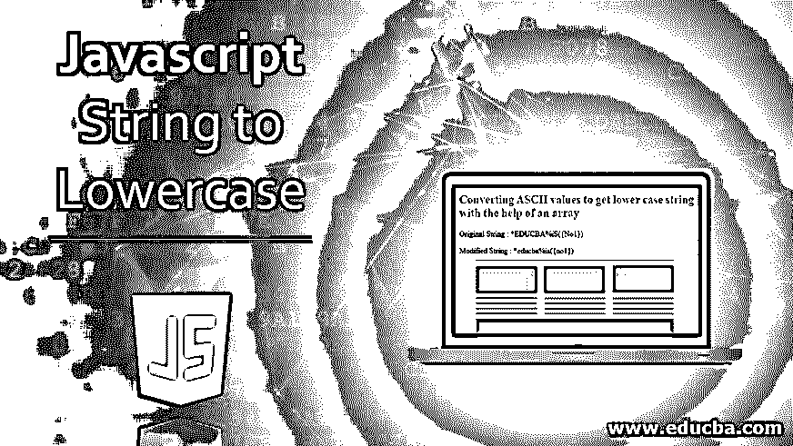
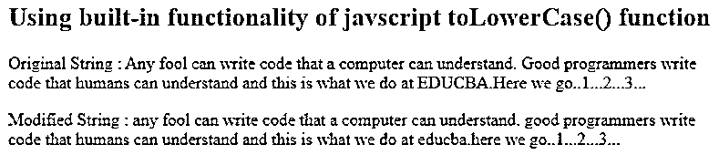
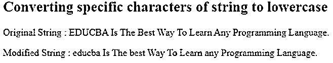
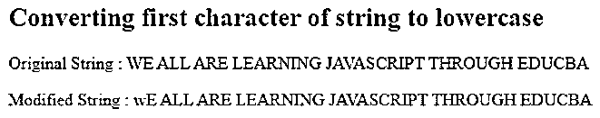
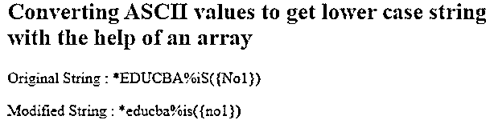

# Javascript 字符串转换为小写

> 原文：<https://www.educba.com/javascript-string-to-lowercase/>




## Javascript 字符串转换成小写字母简介

我们经常会遇到这样的情况，当我们想把一个特定的字符串或字符串中的某些特定字符转换成小写格式时。在 javascript 中，我们可以通过多种方式做到这一点。最常见的是使用 javascript 的内置功能，它提供了一个名为 toLowerCase()的方法，当我们想要将字符串中的所有字符转换为小写时，这是最常用的方法。在所有其他情况下，我们手动编写代码，并根据我们的特定需求添加实现逻辑。在本文中，我们将学习所有的方法，并借助语法和它们的例子来更好地理解。在这个主题中，我们将学习 Javascript 字符串转换成小写字母。

第一种也是最首选的方法是使用 toLowerCase()方法。此方法将所有大写字母转换为它们对应的小型大写字母，而字符串中的数字、特殊字符和小型大写字母保持不变。我们应该记住，这个方法不修改传递的原始字符串，而是创建一个包含小写字符串的新字符串对象。此方法没有任何参数。这个方法是在 javascript 的 ECMAScript 1 版本中引入的。

<small>网页开发、编程语言、软件测试&其他</small>

**语法**

```
var resultantString = inpuString.toLowerCase();
```

*   **input string**–要转换成小写的字符串。
*   **resultant string**–函数的输出或返回值，它完全是一个字符串类型的新对象，包含所需的小写字符串。

### Javascript 字符串转换为小写的示例

下面举几个例子

**代码:**

```
<!DOCTYPE html>
<html>
<body>
<h2>Using built-in functionality of javscript toLowerCase() function</h2>
<p id="sampleDemo1"></p>
<p id="sampleDemo2"></p>
<script>
var sampleText = "Any fool can write code that a computer can understand. Good programmers write code that humans can understand and this is what we do at EDUCBA. Here we go..1...2...3...";
document.getElementById("sampleDemo1").innerHTML = "Original String : " + sampleText;
document.getElementById("sampleDemo2").innerHTML = "Modified String : " + sampleText.toLowerCase();
</script>
</body>
</html>
```

**输出:**




除此之外，javascript 中还提供了另一个方法 toLocaleLowerCase()，它可以帮助我们根据主机的当前语言环境(取决于浏览器的语言设置)来检索小写的字符串。在大多数情况下，此方法返回的值与 toLowerCase()方法返回的值相同。只是在一些特殊情况下，当 Unicode 映射的输出稍有变化时，会发生语言冲突。例如，当地区设置为土耳其语时。

#### 示例# 1–将特定字符转换为小写

现在，假设我们遇到一种情况，我们只需要将特定的字符转换成小写字母。那时，我们将不得不为其中的每个字符迭代整个字符串。

**代码:**

```
<!DOCTYPE html>
<html>
<body>
<h2>Converting specific characters of string to lowercase</h2>
<p id="sampleDemo1"></p>
<p id="sampleDemo2"></p>
<script>
let myCharacters = ['E','D','U','C','B','A'];
let sampleString = "EDUCBA Is The Best Way To Learn Any Programming Language."; let resultantString = "";
for(let characterOfString of sampleString){ if(myCharacters.includes(characterOfString)){
resultantString += characterOfString.toLowerCase();
}else{
resultantString += characterOfString;
}
}
document.getElementById("sampleDemo1").innerHTML = "Original String : " + sampleString; document.getElementById("sampleDemo2").innerHTML = "Modified String : " + resultantString;
</script>
</body>
</html>
```

**输出:**




#### 示例 2–将起始字符转换为小写值

让我们再举一个例子，我们只想把字符串的第一个字符转换成小写。我们可以在 slice 函数的帮助下这样做，该函数通过指定所需字符串部分的起始和结束索引，帮助我们只检索所需的字符串部分。这里有一个例子来说明这一点。

**代码:**

```
<!DOCTYPE html>
<html>
<body>
<h2>Converting first character of string to lowercase</h2>
<p id="sampleDemo1"></p>
<p id="sampleDemo2"></p>
<script>
let sampleString = "WE ALL ARE LEARNING JAVASCRIPT THROUGH EDUCBA";
let temporarystring = sampleString.slice(0,1).toLowerCase() + sampleString.slice(1, sampleString.length);
document.getElementById("sampleDemo1").innerHTML = "Original String : " + sampleString;
document.getElementById("sampleDemo2").innerHTML = "Modified String : " + temporarystring;
</script>
</body>
</html>
```

**输出:**




通过使用 slice 函数，我们可以获取任意位置的字符，并将其转换为小写。

#### 示例# 3–使用 ASCII 值和数组

我们甚至可以使用一个数组将字符串转换成其等价的小写字符串。toLowerCase 函数在内部检查字符的 ASCII 值，以决定该字符是小写还是大写。ASCII 值被分配给每个特殊字符、数字、小写和大写字符。每个 ASCII 值代表一个特定的字符。在我们的下一个例子中，当使用数组将字符串转换为小写时，我们将使用 ASCII 值并将字符转换为 ASCII 值，这将最终导致字符的转换，因为内部字符是由其 ASCII 值决定的。

charCodeAt()方法帮助我们检索字符的 ASCII 值。大写字母的 ASCII 范围在 65 到 90 之间。在 32 个 ASCII 值之后，小写字母的范围开始。我们将首先确定当前字符是否是大写 ASCII 值保存字符，如果是，我们将把 32 值加到它的 ASCII 值上，以获得等价的小写 ASCII 字符，并附加到我们的结果字符串中。这里有一个例子展示了我们如何做到这一点。

**代码:**

```
<!DOCTYPE html>
<html>
<body>
<h2>Converting ASCII values to get lower case string with the help of an array </h2>
<p id="sampleDemo1"></p>
<p id="sampleDemo2"></p>
<script>
let sampleString = "*EDUCBA%iS({No1})"; let resultantString = "";
for(let characterOfSourceString of sampleString){ let value = characterOfSourceString.charCodeAt();
if(value >= 65 && value <= 90){
resultantString += String.fromCharCode(value + 32);
}else{
resultantString += characterOfSourceString;
}
}
document.getElementById("sampleDemo1").innerHTML = "Original String : " + sampleString; document.getElementById("sampleDemo2").innerHTML = "Modified String : " + resultantString;
</script>
</body>
</html>
```

**输出:**




### 推荐文章

这是一个 Javascript 字符串到小写的指南。这里我们讨论 Javascript 字符串转换成小写的例子，以及代码和输出。您也可以看看以下文章，了解更多信息–

1.  [JavaScript 滚动到顶部](https://www.educba.com/javascript-scroll-to-top/)
2.  [要浮动的 JavaScript 字符串](https://www.educba.com/javascript-string-to-float/)
3.  [JavaScript 中的向量](https://www.educba.com/vectors-in-javascript/)
4.  [在 JavaScript 中反转字符串](https://www.educba.com/reverse-string-in-javascript/)


