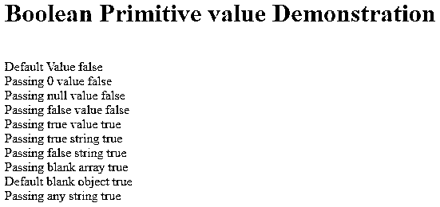
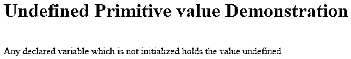
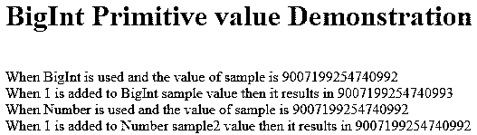

# JavaScript 中的原始数据类型

> 原文：<https://www.educba.com/primitive-data-types-in-javascript/>


## JavaScript 中基本数据类型的介绍

JavaScript 中的原始数据类型主要分为两种，即原始数据类型和用户自定义数据类型。[原始数据类型](https://www.educba.com/primitive-data-types-in-java/)是系统为语言定义的内置数据结构。用户定义的数据类型是由用户/程序员自己定义的数据结构。有两种语言。强类型语言和松散类型语言。这些通常被称为静态和动态语言。强类型语言强制用户指定被声明变量的数据类型，而松散耦合语言允许在不指定数据类型的情况下声明变量。松散耦合语言中的变量不与任何特定的数据类型相关联，并且可以根据操作进一步转换为其他类型。Javascript 是一种松散类型的语言。

### JavaScript 中的原始数据类型

ECMA International(ECMAScript)在其最新版本中指定了 javascript 中 8 种可能的数据类型。其中七个是原始的，一个是非原始的。原始数据类型都是不可变的，这意味着无论何时将值赋给这种数据类型变量，它们的值都不能改变，如果这样做，将导致为相同的变量进行新的内存分配。下面是 javascript 中基本数据类型的列表。

<small>网页开发、编程语言、软件测试&其他</small>

*   布尔代数学体系的
*   空
*   不明确的
*   数字
*   比吉斯本
*   线
*   标志

剩下的非原始数据类型是对象。我们将在文章的下一部分逐一讨论所有的原始数据类型。

#### 1.布尔代数学体系的

被认为是可以有真值或假值的逻辑实体。0、-0、null、false、NaN、undefined 或空字符串("")都被布尔对象视为 false 值。除上述值之外的所有其他值将被视为真值布尔值，它也包括空数组和字符串“false”。让我们借助一个例子来理解它的工作原理。

**代码:**

```
<!DOCTYPE html>
<html>
<head>
<title>Boolean Primitive value Demonstration</title>
</head>
<body>
<h1>Boolean Primitive value Demonstration</h1>
<script>
document.write("<br/>Default Value "+new Boolean());
document.write("<br/>Passing 0 value "+new Boolean(0));
document.write("<br/>Passing null value "+new Boolean(null));
document.write("<br/>Passing false value "+new Boolean(false));
document.write("<br/>Passing true value "+new Boolean(true));
document.write("<br/>Passing true string "+new Boolean('true'));
document.write("<br/>Passing false string "+new Boolean('false'));
document.write("<br/>Passing blank array "+new Boolean([]));
document.write("<br/>Default blank object "+new Boolean({}));
document.write("<br/>Passing any string "+new Boolean('RandomString'));
</script>
</body>
</html>
```

**输出:**




#### 2.空

该数据类型只有一个可能的空值。空值意味着该变量/对象中不存在为其赋值的对象。

#### 3.不明确的

在 javascript 中，它是一个不可写、不可枚举和不可配置的原语值，表示对象还没有被赋予任何值。任何对象的默认值都是未定义的。让我们看一个例子。

**代码:**

```
<!DOCTYPE html>
<html>
<head>
<title>Undefined Primitive value Demonstration</title>
</head>
<body>
<h1>Undefined Primitive value Demonstration</h1>
<script>
let anyDeclaredVariable;
document.write("<br/>Any declared variable which is not initialized holds the value "+anyDeclaredVariable);
</script>
</body>
</html>
```

**输出:**




#### 4.数字

它是 javascript 的内置数值类型，是 64 位二进制格式的 IEEE 754 值，是双精度的，其范围是-(2531)和(2531)。number 数据类型也有三个符号值，即+Infinity、-Infinity 和 NaN，NaN 代表非数字。号码。最大值和数量。MIN_VALUE 可以用来获取+-Infinity 的最大值和最小值。在数字格式中，只有一个整数有两个 0 的表示。它的两种表示是+0 和-0.0 是+0 的别名。在实践中，它们看起来是一样的，但在处理价值分割时，它们表现为两个不同的实体，并产生相应的结果。让我们借助一个例子来研究他们的行为。

**代码:**

```
<!DOCTYPE html>
<html>
<head>
<title>Number Primitive value Demonstration</title>
</head>
<body>
<h1>Number Primitive value Demonstration</h1>
<script>
document.write("<br/>When two numbers with + and - sign compared with each other result "+(+897==-897));
document.write("<br/>When 0 with + and - sign compared with each other result "+(+0==-0));
document.write("<br/>When any number divided with +0 results in "+(42 / +0));
document.write("<br/>When any number divided with -0 results in "+(42 / -0));
</script>
</body>
</html>
```

**输出:**


#### 5.比吉斯本

数字数据类型有一些安全的整数限制。但是，通过使用 BigInt，我们可以表示任意精度的整数，并且超出了安全整数限制。我们可以通过将 BigInt 作为参数传递给 BigInt 或者在数值的末尾追加 n 来使用它。让我们看一个同样的例子。

**代码:**

```
<!DOCTYPE html>
<html>
<head>
<title>BigInt Primitive value Demonstration</title>
</head>
<body>
<h1>BigInt Primitive value Demonstration</h1>
<script>
let sample = 2n ** 53n;
let demo = sample + 1n;
document.write("<br/>When BigInt is used and the value of sample is  "+sample);
document.write("<br/>When 1 is added to BigInt sample value then it results in "+demo);
let sample2 = 2 ** 53;
let demo2 = sample2 + 1;
document.write("<br/>When Number is used and the value of sample is  "+sample2);
document.write("<br/>When 1 is added to Number sample2 value then it results in "+demo2);
</script>
</body>
</html>
```

**输出:**




#### 6.线

Javascript 字符串是不可变的，这用于文本表示。它是一组保存每个元素的无符号 16 位整数。每个元素都有它的位置。第一个放在 0 个索引处，第二个放在 1 个索引处，依此类推。元素的总数就是该字符串的长度。尽管它是不可变的，javascript 还是提供了大量的字符串方法，可以用来操作原始字符串和检索修改后的字符串。例如，如果我们想获得一个字符串的子串，我们可以使用 String.substr()方法来实现。对于串联，我们可以使用 String.concat()方法。

#### 7.标志

ECMAScript 2015 中新引入了符号数据类型。它可以用作对象的键。这是一个不变的唯一值。在一些编程语言中，符号被称为原子。

### 推荐文章

这是 JavaScript 中基本数据类型的指南。这里我们讨论 JavaScript 中 7 种主要数据类型的简要概述，以及代码实现和输出。您也可以浏览我们推荐的其他文章，了解更多信息——

1.  [JavaScript 字符串格式](https://www.educba.com/javascript-string-format/)
2.  [Javascript 嵌套函数](https://www.educba.com/javascript-nested-functions/)
3.  [JavaScript 日期函数](https://www.educba.com/javascript-date-function/)
4.  [JavaScript 字符串替换](https://www.educba.com/javascript-string-replace/)


