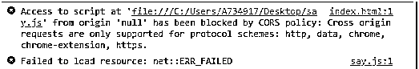

# JavaScript 模块

> 原文：<https://www.educba.com/javascript-modules/>


## JavaScript 模块简介

模块是一个脚本文件，它实现使用导出和导入指令加载到主脚本中的功能。模块封装了功能，并将其作为库公开给其他 JavaScript 文件。export 关键字用于标记函数、变量、常量等。需要在模块外部可访问，且 import 关键字允许将功能导入到其他模块中使用。

因此，可以说每个模块由三个部分组成:

<small>网页开发、编程语言、软件测试&其他</small>

1.  依赖关系也称为导入。
2.  密码
3.  电子竞技

当我们实现一个模块时，它们默认启用严格模式，并且它们的执行被延迟，即脚本文件(模块)仅在 HTML 文档被解析后执行。在编写脚本元素时，我们可以通过将值“module”赋给 type 属性来告诉浏览器将脚本元素视为一个模块。

**代码:**

```
<script type="module" src="module.mjs"></script>
```

需要注意的是，模块只计算一次，即使它们被导入到多个其他模块中。而当我们将脚本添加到 DOM(文档对象模型)时，会随时对它们进行评估。由于脚本元素上的*类型*属性，浏览器认为它是一个模块。在上面的例子中，文件扩展名是*。mjs* ，以确保查看该文件的任何人都理解它是一个模块而不是一个脚本，因为模块与“经典”脚本是不同的。

### 实现 JavaScript 模块的示例

下面是提到的例子:

#### 示例#1:基本

**代号:**# index.html

```
<!Doctype html>
<script type="module">
import {greetings} from './say.js';
document.body.innerHTML = greetings('Adam');
</script>
```

**代码:** # say.js

```
export function greetings(user) {
return `Hola, ${user}!`;
}
```

**输出:**


#### 例 2:一个模块被评估一次。

**代号:**# index.html

```
<!doctype html>
<script type="module">
import './say.js';    // Module is evaluated!
import './say.js';    // prints nothing
</script>
document.body.innerHTML = greetings('Adam');
</script>
```

**代码:** # say.js

```
console.log("Module is evaluated!");
```

**输出:**


一个模块可以导入多个元素，我们需要做的就是在这些元素前面加上 export 关键字。我们将使用-+"* "符号导入整个模块，而不是该模块中的函数或变量。此外，我将使用名称空间导入(演示)。名称空间 import–demo 是一个对象，其属性和行为由命名的导出定义。见例 3。

#### 实施例 3

**代号:**# index.html

```
<!doctype html>
<script type="module">
import * as demo from './say.js';
console.log("Area of Rectangle:" ,demo.rectArea(7,8));
console.log("Square Root of 25 :" ,demo.sqroot(25));
</script>
</html>
```

**代码:** # say.js

```
export const sqrt = Math.sqrt;
export function rectArea(l,b) {
return l * b;
}
export function sqroot(sqr) {
return sqrt(sqr);
}
```

**输出:**


使用 CORS(跨源资源共享——如果用户和服务器不在同一个域中，用户和服务器可以通过这种方式进行通信)获取模块。使用的模块脚本必须实现允许跨站点加载的 CORS 头，如 Access-Control-Allow-Origin: *，否则将抛出错误，并确保浏览器允许 CORS 策略运行。下面显示了一个示例:




下面列出了运行 JavaScript 源代码的不同方式，这有助于我们理解 JavaScript 模块是如何加载到浏览器和服务器上的，以及这些年来它们是如何发展的。

|  | **运行于** | **已加载** | **文件名扩展名。** |
| 脚本 | 浏览器 | 异步ˌ非同步(asynchronous) | .射流研究… |
| CommonJS 模块 | 服务器 | 同步 | -是啊 |
| AMD 模块 | 浏览器 | 异步ˌ非同步(asynchronous) | .射流研究… |
| ECMAScript 模块 | 浏览器和服务器 | 异步ˌ非同步(asynchronous) | .联署材料。麦可斯 |

我们可以看到，在我们的例子中，我们使用了*。mjs* 扩展，用于指示那些脚本文件是模块，虽然不是强制的，但是有助于指示这些文件是应用程序的模块。

### 结论

在本文中，我们了解了 JavaScript 中的模块是什么，它是如何实现的，它给表格带来的好处，以及它与普通脚本的不同之处。模块通过清晰的接口和依赖关系将代码分成几个部分。接口是其他模块可以看到的可见部分，依赖是其他模块使用的部分。

关于模块，需要记住的要点是:

*   默认情况下，模块具有 use strict
*   模块执行一次。
*   web 浏览器自动加载并执行脚本模块。
*   模块通过导入/导出交换功能。
*   模块有自己的本地顶级范围。
*   模块执行被推迟。

### 推荐文章

这是一个 JavaScript 模块的指南。在这里，我们讨论一个介绍，三个模块组成，代码和输出实现的例子。您也可以浏览我们的其他相关文章，了解更多信息——

1.  [JavaScript 睡眠](https://www.educba.com/javascript-sleep/)
2.  [JavaScript 承诺](https://www.educba.com/javascript-promise/)
3.  [JavaScript WeakMap](https://www.educba.com/javascript-weakmap/)
4.  [JavaScript if 语句](https://www.educba.com/javascript-if-statement/)


