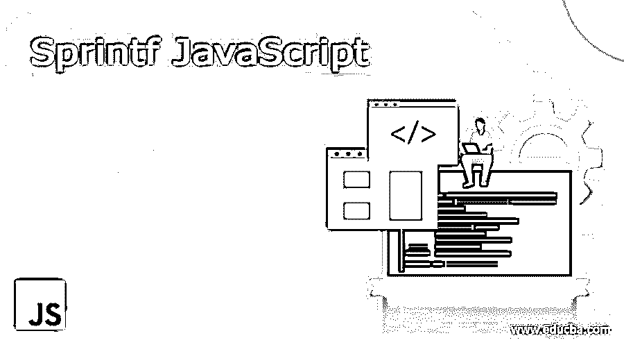
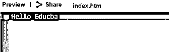
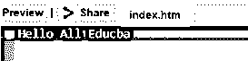

# Sprintf JavaScript

> 原文：<https://www.educba.com/sprintf-javascript/>




## Sprintf JavaScript 简介

Sprintf 是一个 JavaScript 库。这是一个独立的库，用于生成打印语句。因此，sprint 背后的想法是在控制台上执行打印语句。sprintf 以非常复杂的方式生成这些打印语句，node.js 用于实现 sprintf 语句。对于在控制台中打印语句的 java 脚本来说，sprintf 语句是一个很好的优势。sprint 包中打印语句的执行方式非常稳定。sprintf 的主要优点是它返回格式化的字符串作为输出。因此，发布格式化字符串的 sprintf 语句是关键的优势。这里的另一个关键方面是 sprintf 与 vsprintf 关系非常密切。与 vsprintf 相比，sprintf 将接受多个数组作为参数。

### sprintf-js 的安装

sprint 可以通过 NPM 和浏览器安装。这是将 sprint-js 安装到系统中的两种不同方式。因此，使用 NPM 的 sprint-js 安装在 NPM。而同样的安装发生在浏览器的 sprint-js 中。下面是用于在 NPM 和浏览器中安装 sprintf-js 的命令。这里的 npm 是一个包管理器，在 JavaScript 编程语言中使用。npm 包管理器是 GitHub 引入的一个附属工具。

<small>网页开发、编程语言、软件测试&其他</small>

*   npm install sprint-js 是用于在 npm 包管理器中安装 sprint-js 的命令。
*   浏览器安装 sprintf 是用于在浏览器中安装软件包的命令。

### sprint-js 中的格式规范

*   通过使用美元($)符号来确定需要用于获得特定值的自变量索引。这个美元符号表示需要使用哪些索引值。当符号不存在时，就像输入字符串一样，参数将以相同的顺序排列。就指数而言，这些是主要项目。
*   浮点数的总位数也可以由此确定。这可以根据基于浮点的值的预期总位数来确定。这用一个点来表示，点后面是实际的数字。因此，根据点号后给出的数字，将确定要显示的浮点数。这个可选的数字说明符表示结果应该包含的字符数。当可选数为 2 时，则可以填充两个值，当可选数为 3 时，则可以填充三个值，当可选数为 4 时，则填充四个值，类似地，当可选数为 5 时，则填充 5 个值，如此继续。
*   当一个数值前面有一个加号时，这将允许数值在前缀中有一个加号。这同样适用于负号。格式中使用负号来表示负数。
*   填充值由填充说明符确定。填充值表示需要使用什么样的填充值。可选说明符提到需要什么填充值。空格是使用的默认填充值。
*   当需要打印到控制台上的结果需要左对齐时，则使用负号。负号表示 sprint print 语句中使用的值的合理性。
*   为了确定与结果相关的值的总数，使用了可选的数字说明符。这个可选的数字说明符表示结果应该包含的字符数。当可选数为 2 时，则可以填充两个值，当可选数为 3 时，则可以填充三个值，当可选数为 4 时，则填充四个值，类似地，当可选数为 5 时，则填充 5 个值，如此继续。

### Sprintf JavaScript 说明符

**类型说明符可以是以下任何一种:**

**o %**–字符%由该说明符表示。
**o b**–将产生二进制数。
**o c**–产生基于 ASCII 值的整数字符。
**o e**–将产生科学符号值。
**o u**–产生不与任何符号值关联的十进制数。
**of**–预计会产生一个浮点值。

### Sprintf JavaScript 的例子

下面给出了 sprintf 的真实 Javascript 示例。我们来看几个例子。

#### 示例#1

**代码:**

```
name: 'Educba'
sprintf('Hello %(name)s')
```

**输出:**




**说明:**

在这里，我们可以注意到，说明符 educba 的分配使得输出将值打印到控制台上，与现有值 Hello 一起被称为 Educba。因此，总的来说，它变成了一个合并的打印值“Hello Educba”。

#### 实施例 2

**代码:**

```
var values = [
{item: 'Hello All'},
{item: 'Educba'},
]
sprintf('%(values[0].item)s, %(users[1].item)s', {values: values})
```

**输出:**




**说明:**

这里,“hello all”和“Educba”在同一个说明符中被连接使用，它们通过索引的方式被调用。因此，索引 0 表示变量中的第一项，而索引 1 表示变量中的第二项。因此，总的来说，描述为“Hello All Educba”的整个值从所使用的 sprintf 语句打印到控制台上。

### 结论

从上面的例子中，我们可以注意到在 java 脚本中使用 sprint 包是多么的灵活。sprint 使得打印报表的过程非常灵活。这是使用这类语句的固定优势。它们为与 java 脚本项相关的打印语句带来了很大的灵活性。将这些说明符放在适当的位置是一个过程，通过这个过程可以灵活地避免不需要的代码的大段。

### 推荐文章

这是一个 Sprintf JavaScript 的指南。这里我们讨论 sprintf-js 的介绍、安装以及代码实现的例子。您也可以看看以下文章，了解更多信息–

1.  [哈希表 JavaScript](https://www.educba.com/hash-table-javascript/)
2.  [JavaScript 中的选择排序](https://www.educba.com/selection-sort-in-javascript/)
3.  [JavaScript 表单](https://www.educba.com/javascript-modulo/)
4.  [JavaScript 列表](https://www.educba.com/javascript-list/)


