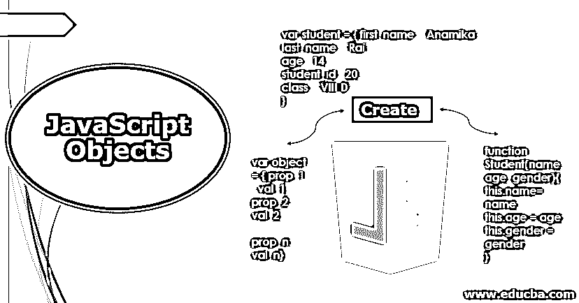

# JavaScript 对象

> 原文：<https://www.educba.com/javascript-objects/>




## 什么是 JavaScript 对象？

对象是每一种面向对象语言的基本构件。作为一种面向对象的语言，JavaScript 也不例外。由于 javascript 能够为网页提供动态行为，因此被广泛采用，人们应该了解 javascript 以及如何使用它的对象。javascript 中的对象是作为“键-值”对放在一起的一组不同的数据类型或对象。对象的“关键”部分就是对象属性。

例如，假设我们有一个对象“学生”，其属性为:名、姓、年龄、学生 id、班级等。

<small>网页开发、编程语言、软件测试&其他</small>

这个学生对象的 javascript 对象表示如下:

**代码:**

```
var student = { first_name : 'Anamika',
last_name : 'Rai',
age : 14,
student_id : 20,
class : 'VIII D'
}
```

请注意，属性 first_name、last_name 和 class 包含字符串数据类型的值，而 age 和 student_id 属于数字数据类型。

### 如何用 JavaScript 创建一个对象？

为了创建对象，javascript 提供了一些选项，用户可以根据自己的需要创建对象。

#### 1.利用对象初始化器语法

对象初始化器语法是属性名(键)及其各自值的列表，用花括号({…})括起来。在上面的例子中，我们已经使用对象初始化语法创建了对象“student”。

语法如下:

```
var object = { prop_1 : val_1,
prop_2 : val_2,
… … …
prop_n: val_n}
```

这里的属性或者是原始数据类型(字符串、数字、布尔、null 和 [undefined 是 javascript](https://www.educba.com/primitive-data-types-in-javascript/) 中的原始数据类型)或者是另一个对象。

**举例:**

**代码:**

```
var student = { first_name : 'Anamika',
last_name : 'Rai',
age : 14,
student_id : 20,
class : 'VIII D'
parents : {father : 'Mrinal Rai', mother : 'Payal Rai'}
}
```

注意，这里的“parents”属性是 object 类型的。它包括两个子属性，即父亲和母亲，分别为 r。

#### 2.利用构造函数

在这种情况下，首先，定义一个具有各自属性的构造函数，然后使用“new”关键字创建它的对象。然后给这个新创建的对象赋值。

**举例:**

让我们考虑一个构造函数，比如说，学生:

**代码:**

```
function Student(name, age, gender){
this.name= name;
this.age = age;
this.gender = gender;
}
```

请注意，按照命名约定，构造函数名称应该以大写字母开头。

现在，让我们使用“new”关键字创建对象。

**代码:**

```
var myStudent = new Student('Anita Rai', 14, 'female');
```

另外，请注意，这里我们只将值传递给构造函数。构造函数使用“this”关键字将这些值分配给各自的属性。使用“this”关键字引用当前对象。

#### 3.利用对象的实例

或者，可以利用对象实例/对象构造函数来创建和初始化它，如下所示:

**代码:**

```
var student = new Object();
student.name = "Anita Rai";
student.age = 14;
student.gender = "female";
```

#### 4.在对象类中使用 Create()方法

还可以使用 object 类提供的 create()方法来创建对象。create 方法接受一个对象原型作为参数。因此，人们可以避免编写构造函数。

**举例:**

**代码:**

```
var student = { name : "Anamika Rai", age : 14, gender : "female" }
```

这里“学生”是我们的原型对象。现在，使用这个，让我们创建另一个对象:

**代码:**

```
var student_1 = object.create(student);
```

这里，student_1 对象是使用 student 原型创建的。如果需要更改这个新创建的对象的任何值，可以按如下方式进行:

**代码:**

```
Student_1.name = "Ananya Gupta";
```

现在，除了属性“name”之外，student_1 对象具有与 student 对象相似的属性值。

### 如何在 JavaScript 中访问对象？

既然对象已经创建，接下来需要知道的是我们如何访问它？javascript 提供了两种访问对象的方法:

#### 1.使用对象实例

这里，对象实例用于访问其属性。

**语法:**

```
object.property
```

**举例:**

假设我们有一个学生定义的对象

**代码:**

```
var student = { name : "Anamika Rai", age : 14, gender : "female" }
```

现在要访问对象及其属性，让我们将它打印到控制台:

**代码:**

```
console.log ("Student" + student.name + "is" + student.age + "years old.");
// output: Student Anamika Rai is 14 years old.
```

#### 2.使用方括号

object 属性放在对象本身后面的方括号中。

**语法:**

```
object['property']
```

**举例:**

使用方括号访问上面的学生对象

**代码:**

```
console.log ("Student" + student['name'] + "is" + student['age '] + "years old.");
// output: Student Anamika Rai is 14 years old.
```

### JavaScript 对象方法

几种最常用的 javascript 方法如下:

*   **create():** 正如我们在上面已经看到的，这个方法用于从原型对象创建 javascript 对象。
*   **is():** 这个方法接受第二个对象作为参数，判断两个对象是否相等，并返回一个布尔值。也就是说，如果两个对象相等，则返回“真”，否则返回“假”。
*   **keys():**keys()方法接受 javascript 对象作为参数，并返回其属性数组。
*   **values():** 类似地，values 方法接受一个 javascript 对象作为参数，并返回其值的数组。
*   **entries():** 这个方法也接受一个 javascript 对象作为参数，并返回一个包含另一个键值对数组的数组。例子:让我们再次考虑我们的“学生”对象。

**代码:**

```
console.log(Object.entries(student));
//output: Array [Array ["name", "Anamika Rai"], Array ["age", 14], Array ["gender", "female"]]
```

### 结论

本文给出了 javascript 对象的概念以及创建它们的各种方法。它还讨论了这些对象拥有的属性以及如何以不同的方式访问它们。最后，我们需要了解处理 javascript 对象最常用的方法。

### 推荐文章

这是 JavaScript 对象的指南。这里我们讨论如何用 JavaScript 创建一个对象，以及如何用 JavaScript 访问对象。您也可以看看以下文章，了解更多信息–

1.  [JavaScript 中的构造函数](https://www.educba.com/constructor-in-javascript/)
2.  [在 JavaScript 中覆盖](https://www.educba.com/overriding-in-javascript/)
3.  [JavaScript 的特性](https://www.educba.com/features-of-javascript/)
4.  【JavaScript 如何工作


