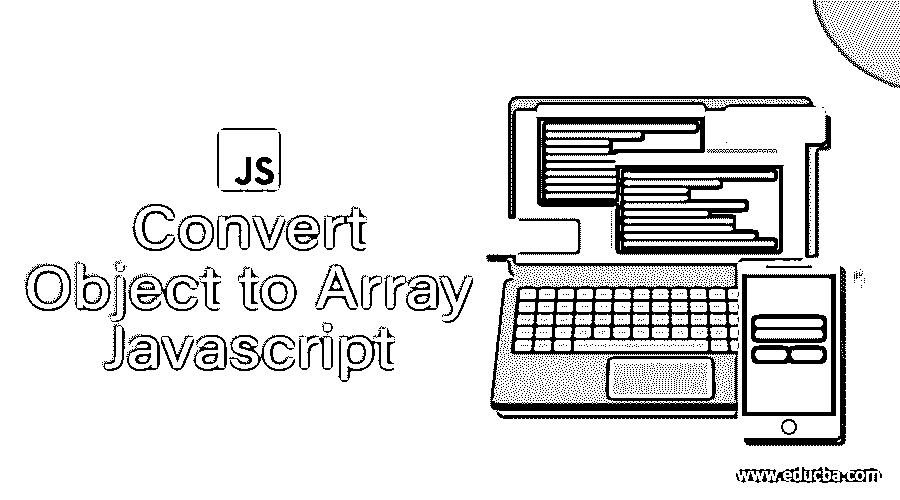
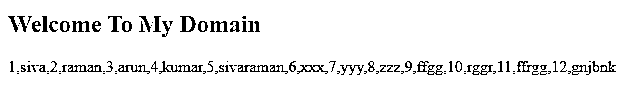
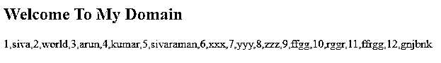
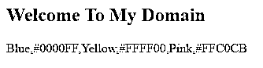

# 将对象转换为数组 Javascript

> 原文：<https://www.educba.com/convert-object-to-array-javascript/>




## 将对象转换为数组 Javascript 的定义

在 javascript 中，我们可以使用 new 关键字创建对象，并且可以使用 var 关键字以数组格式声明值，根据用户需求将值声明为一维或多维数组。我们可以在脚本中使用数组和对象，因为这会占用内存空间并降低性能。我们可以在 javascript 中将对象转换成数组；我们将遵循像 Object.keys()、Object.values()和 Object.entries()这样的默认方法；使用这些方法，我们将把 javascript 实例或对象转换成数组格式。

**语法:**

<small>网页开发、编程语言、软件测试&其他</small>

我们已经知道，在 javascript 中，每一个内置方法和数据类型的变量都有自己的语法。让我们看看 javascript 中的对象数组语法代码，如下所示。

```
<html>
<head>
<script>
var variablename={key:"values"};
var v=Object.create(variablename);//It is one of the way for creating object in javascript
document.write(Object.values(variablename));
-----some javascript logics—
</script>
</head>
<body>
</body>
</html>
```

在上面的代码中，我们使用了 Object.values(值)；我们在方法中传递值，基于我们将打印值的要求，或者使用该值，我们在脚本中获取键。

### Javascript 中如何把对象转换成数组？

使用 javascript 代码，我们可以向服务器发送 n 个请求，同时，我们可以从服务器接收脚本代码中请求的数据的响应；我们将编写创建对象的逻辑，返回值也将采用数组格式，请求和接收数据的转换都将采用其他格式，如字符串转换。该方法是 stringify()方法，其函数也用于更改字符串处理方法的行为，值是字符串数组，计算出的对象数量将作为对象值的属性包含在 JSON 字符串中。如果假设服务器响应为空值或未提供任何值作为响应，可能是一些其他格式，则对象的属性也包含在 JSON 格式中，并接收可以拆分为空格的服务器数据，它也用于字符串和数字。如果 JSON 和返回字符串格式意味着用户可以轻松阅读和理解数据，则插入空白区域中的实例并接收输出。

javascript 对象将使用新的关键字 object literal 初始化和声明，并定义对象构造函数，然后我们使用构造的类型创建对象。我们只提到 Object.create(variablename ),一旦我们创建了值或数据，它将成为原始或引用类型数据的无序格式。每当我们想要将实例转换为数组指定的数据时，我们可以在脚本中为数组指定的数据创建对象。我们只是将 Object.values(var)方法用于转换目的。但最有可能的是，每当我们启动脚本的 new 或 object 创建时，它会自动分配内存，无论是变量声明还是基于数组的对象创建，内存都是为实例分配的。使用 sizeof(obj)这些方法，我们将以字节格式返回近似的对象大小。

在 javascript 中，当一个对象被创建时，内存被自动创建，如果在脚本的任何部分都没有在该对象中使用内存，内存就会被释放，所以它会自动进入垃圾收集。如果我们想在脚本中创建数组实例/对象，我们使用一个名为 Array.from()的静态方法，它将字符串作为一个字符分开。它以数组格式存储；如果我们使用整数格式，如果 Object.values()只返回数组，那么它也是分开的。然而，无论元素是谁，都将是枚举类型的可枚举属性值，在 values()方法中已遵循该方法中存储的数据，然后剩余的步骤是相同的，就像对象的属性顺序看起来是相同的，就像通过循环属性值给出的一样，对象将被手动声明。

### Javascript 中将对象转换为数组的示例

以下是在 Javascript 中将对象转换为数组的不同示例:

#### 示例#1

**代码:**

```
<!DOCTYPE html>
<html>
<body>
<h2>Welcome To My Domain</h2>
<p id=*"demo"*></p>
<script>
var a = {
1: "siva",
2: "raman",
3: "arun",
4: "kumar",
5: "sivaraman",
6: "xxx",
7: "yyy",
8: "zzz",
9: "ffgg",
10: "rggr",
11: "ffrgg",
12: "gnjbnk"
};
var output = Object.keys(a)
.map(function(i) {
return [+i, a[i]];
});
document.write(output);
</script>
</body>
</html>
```

**输出:**




#### 实施例 2

**代码:**

```
<!DOCTYPE html>
<html>
<body>
<h2>Welcome To My Domain</h2>
<p id=*"*demo*"*></p>
<script>
var object = {"1": "siva", "2": "world", 3: "arun",
4: "kumar",
5: "sivaraman",
6: "xxx",
7: "yyy",
8: "zzz",
9: "ffgg",
10: "rggr",
11: "ffrgg",
12: "gnjbnk"
};
var array = function(object)
{
var arr=[];
for(var k in object)
{
arr.push([k,object[k]])
}
return arr;
}
document.write(array(object));
</script>
</body>
</html>
```

**输出:**




#### 实施例 3

**代码:**

```
<!DOCTYPE html>
<html>
<body>
<h2>Welcome To My Domain</h2>
<p id=*"demo"*></p>
<script>
function first(obj)
{
var k = second(obj);
var l = k.length;
var p = Array(l);
for (var i = 0; i < l; i++)
{
p[i] = [k[i], obj[k[i]]];
}
return p;
}
function second(obj)
{
if (!third(obj)) return [];
if (Object.keys) return Object.keys(obj);
var k1 = [];
for (var k2 in obj) if (_.has(obj, k2)) k1.push(k2);
return k1;
}
function third(obj)
{
var t = typeof obj;
return t === 'function' || t === 'object' && !!obj;
}
document.write(first({Blue: "#0000FF", Yellow: "#FFFF00", Pink: "#FFC0CB"}));
</script>
</body>
</html>
```

**输出:**




在上面的三个例子中，我们在不同的场景中使用了 Object.keys()。大多数时候，我们并行使用这些方法。我们使用 Object.values 和 Object.entries()在 key 的帮助下，我们可以很容易地识别值，所以如果我们在脚本中使用 keys 方法，就可以很容易地获取脚本中的值。

### 结论

在 javascript 的 Object to Array 中，我们使用默认方法来处理实例，然后将它存储并传输到一个数组中，所以当我们使用大量对象时，这个时间与它传输到数组的时间平行，因为与其他脚本语言相比，它的速度更快。

### 推荐文章

这是一个将对象转换为数组的 Javascript 指南。在这里，我们讨论在 Javascript 中将对象转换为数组的工作，以及不同的例子和代码实现。您也可以看看以下文章，了解更多信息–

1.  [JavaScript object.is()](https://www.educba.com/javascript-object-is/)
2.  [JavaScript 绝对值](https://www.educba.com/javascript-absolute-value/)
3.  [JavaScript 转换成 JSON](https://www.educba.com/javascript-convert-to-json/)
4.  [JavaScript 倒计时](https://www.educba.com/javascript-countdown/)


