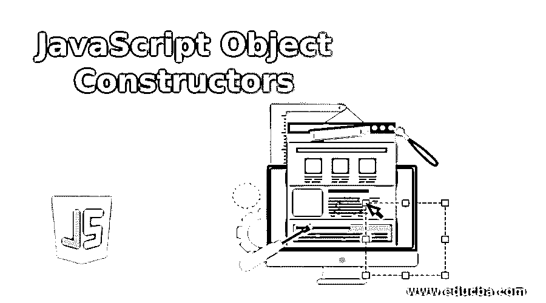

# JavaScript 对象构造函数

> 原文：<https://www.educba.com/javascript-object-constructors/>




## JavaScript 对象构造函数简介

键:值对形式的无序相关数据的集合在 JavaScript 中被称为对象，这里键可以是变量或函数，并相应地由名称属性和方法调用。对象不同于 JavaScript 的原始数据类型，如数字、布尔、字符串、符号等。它根据数据类型只存储单个值。而对象可以包含原始数据类型和对象的任意组合，称为引用数据类型。

**语法:**

<small>网页开发、编程语言、软件测试&其他</small>

```
function <function name> ( <attributes> ){
this.<name of the attribute> = <name of the attribute>;
………..
……….
}
var <object name> = new <function name> ( <values for attributes> )
```

这里，“this”和“new”是 JavaScript 对象构造函数的必需关键字。

### JavaScript 对象构造函数的例子

让我们通过一个简单的例子来理解 JavaScript 对象的样子:

```
function Company (name, age, id, project) {
this.name = name;
this.age = age;
this.id = id;
this.project = project;
}
```

在上面的例子中，函数名称 Company 具有属性名称、年龄、id、项目

构造函数以大写首字母命名。

这些构造函数类似于常规函数，不同的是我们用 new 关键字来使用它们。有两种不同的构造函数，Array 和 Object，它们是内置构造函数和自定义构造函数，为对象定义属性和方法。这些构造函数在创建多个具有相同属性和方法的相似对象时非常有用

要创建一个对象类型，我们需要使用对象构造函数，这里 Company 就是一个对象构造函数的例子。关键字“new”用于调用构造函数来创建相同类型的对象。

**例如:**

```
var customer = new Company ("Mayank", "30", "12031", "MetLife");
```

这里，customer 是通过使用“new”关键字调用对象构造函数创建的对象。它创建了一个公司将自己分配给可变客户的实例。构造函数 Company 接受传递给它的参数并将其附加到“this”对象，因此当使用“new”关键字调用构造函数时，构造函数的“this”被设置为“new”返回的倾向于的对象

```
var customer = {
name: Mayank
age: 30
id: 12031
project: MetLife
}
```

由于客户对象是构造器对象公司的实例，它确保接收正确类型的数据。我们还可以给构造函数分配方法，这些方法可以被对象构造函数创建的所有对象访问。使用构造函数，将在基本结构中创建对象，并且在不创建通用对象的情况下将减少错误。让我们看看对象构造函数是如何初始化的:

传递用“new”关键字和参数创建的对象，另一个是用花括号“{}”创建的对象

```
var object_name = new Object();
```

或者

```
var object_name = new Object ("arg1", "arg2", "arg3");
```

让我们看看属性是如何分配给对象的，

**使用点运算符(。):**

```
object_name.properties = value;
```

并使用第三个括号，即([ ])

```
object_name [ 'properties' ] = value;
```

将学生视为对象构造器，

```
function Student (s1, s2, s3) {
this.s1 = s1;
this.s2 = s2;
this.s3 = s3;
}
Student.prototype.getSum = function () {
var total = this.s1+this.s2+this.s3
return total;
};
var sum = new Student(25,50,45);
console.log(sum.getSum());
```

**输出:**


这里，s1、s2、s3 是学生在一个类中的标记，getSum 是用于计算总数的函数，用“new”关键字创建对象，函数 getSum 是对对象类的访问。

我们可以将任何新的属性或方法直接添加到对象构造函数中，以确保定义的对象属性将具有默认值。

### 内置 JavaScript 构造函数

我们有一些内置的 javascript 构造函数，

#### 字符串对象

通常，字符串是使用变量来声明和初始化的，但也可以使用“new”关键字创建为对象

```
var name = "James";
```

或者

```
var name = new String("James");
```

#### 数字对象

数字也可以用变量来声明和初始化，但也可以用“new”关键字创建为对象

```
var id = 45;
```

或者

```
var id = new Number(45);
```

#### 布尔对象

布尔值也可以用变量来声明和初始化，但也可以用“new”关键字创建为对象

```
var state = false;
```

或者

```
var id = new Boolean(false);
```

### 自定义构造函数

构造函数也可以用来创建多个具有相同属性和方法的对象，请看下面的例子。

```
function Record (name, date){
this.name = name;
this.date = '[' + date + ']';
}
var record1 = new Record("Physics","22/12/2012");
var record2 = new Record("Chemistry","24/12/2013");
console.log (record1.name, record1.date);
console.log (record2.name, record2.date);
```

因为记录构造函数需要两个参数，

**输出:**


使用构造函数模式测试，我们可以检查对象是否是使用' new '关键字调用的，使用' new。“target”属性。这种方法用于使语法更加灵活，但是如果没有“new”关键字，有时很难识别用户正在创建一个新对象。

```
function Student(name) {
if (! new.target) {
return new Student(name);
}
this.name = name;
}
let jack = Student("Jack"); //redirects call to new User jack
console.log(jack.name);
```

**输出:**


构造函数没有 return 语句，结果被写入' this '。但如果 return 语句出现并被对象调用，“this”将返回对象。如果对象是原语，则可以忽略返回。大多数内置构造函数(如“Object”、“Regex”和“Array”)都是范围安全的。作用域安全的构造函数被设计为无论使用“new”还是不使用“new”关键字调用对象都返回结果。

通过这篇文章，我们可以得出结论，构造函数是常规函数，但与关键字“new”一起使用，这意味着在声明参数或自变量之前创建一个空的“this ”,并返回最后填充的数据。查看了一些例子，并内置了 JavaScript 构造函数。还学习了 objects constructor 如何使用相同的属性和方法创建多个对象，以及如何使用“new”关键字或不使用“new”关键字调用构造函数，这些关键字被命名为作用域安全的构造函数。

### 推荐文章

这是 JavaScript 对象构造器的指南。在这里，我们还将讨论简介和内置的 javascript 构造函数，以及不同的示例和代码实现。您也可以看看以下文章，了解更多信息–

1.  [JavaScript 中的继承](https://www.educba.com/inheritance-in-javascript/)
2.  [JavaScript 中的布尔运算符](https://www.educba.com/boolean-operators-in-javascript/)
3.  [在 JavaScript 中嵌套 if](https://www.educba.com/nested-if-in-javascript/)
4.  [JavaScript 睡眠功能](https://www.educba.com/javascript-sleep-function/)


