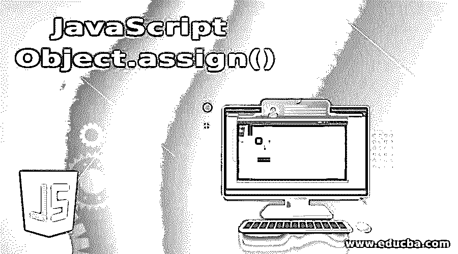
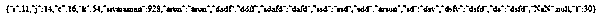
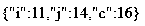
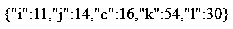

# JavaScript Object.assign()

> 原文：<https://www.educba.com/javascript-object-assign/>




## JavaScript Object.assign()简介

在 javascript 中 Object.assign()是默认方法之一，主要用于复制变量值。它的属性从单个或多个用户对象(即源对象)到目标对象，使用一些 POJO 方法(如 getter 和 setter)来存储和检索脚本中的值。它支持所有数据类型值的赋值，它可以保存变量引用及其属性，它不会从源对象中抛出未定义或任何空值，它返回目标对象值及其属性。

**语法:**

<small>网页开发、编程语言、软件测试&其他</small>

在 javascript 客户端验证代码中，浏览器本身的条件可以是有效的，不必为每个客户端请求检查服务器端的条件。其中，它可以使用一些默认方法及其语法来验证代码冗余，并降低应用程序的复杂性。

```
<html>
<body>
<script>
var v1="";
var v2=Object.assign({},v1);
document.write(v2);
---some javascript logics---
</script>
</body>
</html>
```

以上代码是脚本中 Object.assign()方法的基本语法，可用于克隆对象，有时也可用于合并具有相同属性的不同序列的对象。

### JavaScript object.assign()方法如何工作？

Javascript Object.assign()方法主要用于将变量值及其属性从一个或多个源对象复制到目的对象。每当客户端通过应用程序端后端被请求时，它就创建实例，当到达用户界面时，用户需要的结果将显示在浏览器中。我们可以初始化并分配更多的对象到目标实例位置，它可以保存每个变量值的引用及其属性，它支持所有的数据类型值，任何格式，如字符串，数字等。如果变量包含数字，意味着它也从源位置复制和克隆到目标位置，有时它在变量值和属性中包含零和非零数字，充当默认方法，如 Object.assign()。我们也验证单个变量中的值和 n 个变量值本身，如果假设变量包含键值对，它可能是整数、字符串和特殊字符或符号等。即使可以将数学值复制/克隆到目标对象，这些值也可以从源位置复制或合并到目标位置。

我们使用 Object.assign()方法复制对象的可枚举类型，就像在 enum 中创建变量一样，它从源到目标创建类型及其属性。我们在脚本中使用 getter 和 setter 方法，也就是说我们在源端对象中使用 getter，我们想在目标对象中使用 setter 来设置值。在 javascript 中借助构造函数，它将创建对象。使用构造函数也用于调用 Object.assign()方法，在任何需要的地方都可以使用它并创建实例。有时，它还会通过使用其他对象来覆盖值和属性，这些对象也使用了相同的属性，稍后将在脚本中使用参数以相同的顺序调用这些属性。发生在中的错误和异常有时发生在属性和值上的类似 TypeError 的错误是不可写的，即它只接受只读模式，我们无法在脚本中编辑属性值。如果假设我们要将源实例复制到目标实例，知道所有值(包括源对象到目标的引用和属性)在发生类型错误或某些错误时意味着复制的操作没有完全工作，因此在出现错误和异常之前，操作应该完成。Object.assign()方法不会在源实例和目标实例中抛出空值或未定义的值。

### 实现 JavaScript Object.assign()的示例

下面是 JavaScript Object.assign()的例子:

#### 示例#1

**代码:**

```
<!DOCTYPEhtml>
<html>
<body>
<script>
var v1 = { i: 11, j: 14, c: 16,i: 11, j: 14, c: 16 ,i: 11, j: 14, c: 16 ,i: 11, j: 14, c: 16 };
var v2 = { i: 50, k: 54,i: 11, j: 14, c: 16 ,i: 11, j: 14, c: 16 ,i: 11, j: 14, c: 16,'sivaraman':'srn','arun':'arun','dadf':'ddff','sdafd':'dafd','ssd':'ssd','sdd':'arsun','sd':'dsv','dsfv':'dsfd','ds':'dsfd','sivaraman':098,'sivaraman':0978,'sivaraman':0985,'sivaraman':0938,'sivaraman':0928,NaN:0/0, };
var v3 = { l: 30,i: 11, j: 14, c: 16,i: 11, j: 14, c: 16,'sivaraman':'srn','arun':'arun','dadf':'ddff','sdafd':'dafd','ssd':'ssd','sdd':'arsun','sd':'dsv','dsfv':'dsfd','ds':'dsfd','sivaraman':098,'sivaraman':0978,'sivaraman':0985,'sivaraman':0938,'sivaraman':0928,NaN:0/0, };
var result = Object.assign({}, v1, v2, v3);
document.write(JSON.stringify(result));
</script>
</body>
</html>
```

**输出:**




#### 实施例 2

**代码:**

```
<!DOCTYPEhtml>
<html>
<body>
<script>
functiondemo() {
'use strict';
let v1 = {i: 11, j: 14, c: 16,i: 11, j: 14, c: 16 ,i: 11, j: 14, c: 16 ,i: 11, j: 14, c: 16 };
let v2 = Object.assign({}, v1);
document.write(JSON.stringify(v2));
obj1.i = 1;
document.write(JSON.stringify(v1));
document.write(JSON.stringify(v2));
obj2.i = 2;
document.write(JSON.stringify(v1));
document.write(JSON.stringify(v2));
obj2.j.c = 3;
document.write(JSON.stringify(v1));
document.write(JSON.stringify(v2));
v1 = { i: 11, j: 14, c: 16,i: 11, j: 14, c: 16 ,i: 11, j: 14, c: 16 ,i: 11, j: 14, c: 16 };
let v3 = JSON.parse(JSON.stringify(v1));
v1.a = 4;
v1.b.c = 4;
document.write(JSON.stringify(v3));
}
demo();
</script>
</body>
</html>
```

**输出:**




#### 实施例 3

**代码:**

```
<!DOCTYPEhtml>
<html>
<body>
<script>
functiondemo() {
'use ';
var v1 = { i: 11, j: 14, c: 16,i: 11 };
var v2 = { i: 50, k: 54,i: 11, j: 14 };
var v3 = { l: 30,i: 11, j: 14, c: 16 };
var result = Object.assign({}, v1, v2, v3);
document.write(JSON.stringify(result));
}
demo();
</script>
</body>
</html>
```

**输出:**




### JavaScript Object.assign()的优点

**1。**object . assign()方法的好处它允许从多个源对象复制到单个目标对象。

**2。**我们可以使用具有复制、克隆目的的方法，将相同的源数据(如值及其属性)复制到目标位置，而不会丢失。

**3。可以复制字符串、数字、特殊字符等，可以支持所有类型的浏览器。**

### 结论

每当我们在编程中使用对象时，它就被称为一组不同的内置方法，帮助修改和定制用户需要的 web 应用程序。我们复制和克隆了具有不同序列的对象，这些对象将用于应用程序的不同区域。

### 推荐文章

这是 JavaScript Object.assign()的指南。在这里，我们讨论 JavaScript Object.assign()的介绍以及它是如何工作的，并给出了示例和代码实现。您也可以浏览我们推荐的其他文章，了解更多信息——

1.  [JavaScript 字符串格式](https://www.educba.com/javascript-string-format/)
2.  [JavaScript 匿名函数](https://www.educba.com/javascript-anonymous-function/)
3.  [Javascript 嵌套函数](https://www.educba.com/javascript-nested-functions/)
4.  [JavaScript 日期函数](https://www.educba.com/javascript-date-function/)


