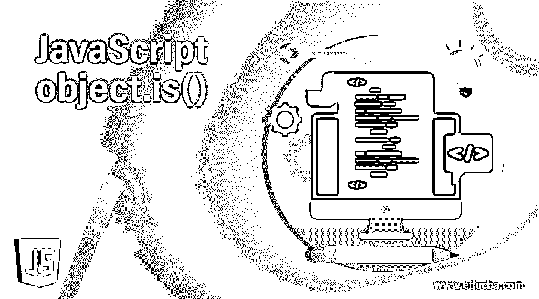
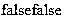
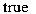

# JavaScript object.is()

> 原文：<https://www.educba.com/javascript-object-is/>




## JavaScript object.is()简介

在 javascript Object.is()中是默认方法之一，主要用于确定用户是否验证两个值的比较，可以是字符串、整数、浮点、小数等，无论比较什么数据类型的值，都可以看到两个变量引用及其属性。假设两个变量都是未定义的，或者有时两个变量值都是数字格式，有时都被称为“NaN”格式，或者可能是零格式，或者可能是这样的情况，两个变量都不是 NaN，并且都具有相同的值。

**语法:**

<small>网页开发、编程语言、软件测试&其他</small>

在 javascript 客户端验证代码中，浏览器本身的条件可以是有效的，不必为每个客户端请求检查服务器端的条件。其中，它可以使用一些默认方法及其语法来验证代码冗余，并降低应用程序的复杂性。

```
<html>
<body>
<script>
var v1="";
var v2="";
document.write(Object.is(v1, v2));
---some javascript logics---
</script>
</body>
</html>
```

以上代码是对象的基本语法。是脚本中的一个()方法，可用于验证目的，可能用不同的序列检查条件。

### JavaScript object.is()方法是如何工作的？

javascript Object.is()方法主要用于确定是否比较两个数据类型值，并在浏览器中显示结果。当比较这两个值时，可以看到左侧变量的引用及其属性。这两个数据类型值可以是任何格式，如字符串、整数等。如果变量包含数字意味着它被验证，有时它在这些默认方法 Object.is()中的变量值中包含零和非零数字，我们也验证单个变量本身中的值，如果假设变量包含键值对，它可能是整数、字符串和特殊字符或符号等。比较这些值，并在脚本中执行数学运算。

我假设我们没有使用 Object.is()方法，我们使用了“===”三个等号运算符，在 javascript 中也称为严格比较运算符。当我们比较 Object.js 和严格比较运算符时，它只在特定的情况下运行，同样会获取 NaN 和+0/-0 之类的值，即它在变量值中使用正负符号之类的运算符。因为 Object.is()方法。当我们比较这些值时，它会将结果显示为未定义，null 或两种类型的值为真或假，就像布尔条件一样，如果两个值都是字符串格式，并且我们已经计算了字符串长度，它也是相同的，字符也是相同的，顺序也是相同的，这也是一个重要的条件，另一个重要的条件是两个变量都是字符串格式，有相同的对象，这意味着两个对象有相同的引用。

### 实现 JavaScript object.is()的示例

下面是一些例子:

#### 示例#1

**代码:**

```
<!DOCTYPE html>
<html>
<body>
<script>
if (!Object.is) {
Object.is = function(i, j) {
if (i === j) {
return i !== 0 || 1 / i === 1 / j;
} else {
return i !== i && j !== j;
}
};
}
var first = { p: 1,q:3,r:4 };
var second = {  a: 5,b:6,c:4 };
document.write(Object.is(first, second));
document.write(Object.is(first, second));
</script>
</body>
</html>
```

**输出:**




#### 实施例 2

**代码:**

```
<!DOCTYPE html>
<html>
<body>
<script>
if (!Object.is) {
Object.is = function(i, j) {
if (i === j) {
return i !== 0 || 1 / i === 1 / j;
} else {
return i !== i && j !== j;
}
};
}
document.write(Object.is('sivaraman', 'srn'));
document.write(Object.is('arun', 'arun'));
document.write(Object.is('dadf', 'ddff'));
document.write(Object.is('sdafd', 'dafd'));
document.write(Object.is('ssd', 'ssd'));
document.write(Object.is('sdd', 'arsun'));
document.write(Object.is('sd', 'dsv'));
document.write(Object.is('dsfv', 'dsfd'));
document.write(Object.is('ds', 'dsfd'));
document.write(Object.is([], []));
document.write(Object.is('sivaraman', 098));
document.write(Object.is('sivaraman', 0978));
document.write(Object.is('sivaraman', 0985));
document.write(Object.is('sivaraman', 0938));
document.write(Object.is(NaN, 0/0));
document.write(Object.is('sivaraman', 0928));
document.write(Object.is(NaN, 0/0));
document.write(Object.is(NaN, 0/0));
document.write(Object.is(NaN, 0/0));
</script>
</body>
</html>
```

**输出:**


#### 实施例 3

**代码:**

```
<!DOCTYPE html>
<html>
<body>
<script>
if (!Object.is) {
Object.is = function(i, j) {
if (i === j) {
return i !== 0 || 1 / i === 1 / j;
} else {
return i !== i && j !== j;
}
};
}
var first = { p: 1,q:3,r:4,'sivaraman':'srn','arun':'arun','dadf':'ddff','sdafd':'dafd','ssd':'ssd','sdd':'arsun','sd':'dsv','dsfv':'dsfd','ds':'dsfd','sivaraman':098,'sivaraman':0978,'sivaraman':0985,'sivaraman':0938,'sivaraman':0928,NaN:0/0,'[]':'[]','-0':'0','sivaraman':0985,'sivaraman':0938,'sivaraman':0928,'sivaraman':0985,'sivaraman':0938,'sivaraman':0928,'sivaraman':0985,'sivaraman':0938,'sivaraman':0928,'sivaraman':0985,'sivaraman':0938,'sivaraman':0928,'sivaraman':0985,'sivaraman':0938,'sivaraman':0928,'sivaraman':0985,'sivaraman':0938,'sivaraman':0928,'sivaraman':0985,'sivaraman':0938,'sivaraman':0928,'sivaraman':0985,'sivaraman':0938,'sivaraman':0928,'sivaraman':0985,'sivaraman':0938,'sivaraman':0928,'sivaraman':0985,'sivaraman':0938,'sivaraman':0928,'sivaraman':0985,'sivaraman':0938,'sivaraman':0928,'sivaraman':0985,'sivaraman':0938,'sivaraman':0928,'sivaraman':0985,'sivaraman':0938,'sivaraman':0928,'sivaraman':0985,'sivaraman':0938,'sivaraman':0928,'sivaraman':0985,'sivaraman':0938,'sivaraman':0928,'sivaraman':0985,'sivaraman':0938,'sivaraman':0928,'sivaraman':0985,'sivaraman':0938,'sivaraman':0928,'sivaraman':0985,'sivaraman':0938,'sivaraman':0928,'sivaraman':0985,'sivaraman':0938,'sivaraman':0928,'sivaraman':0985,'sivaraman':0938,'sivaraman':0928,'sivaraman':0985,'sivaraman':0938,'sivaraman':0928,'sivaraman':0985,'sivaraman':0938,'sivaraman':0928,'sivaraman':0985,'sivaraman':0938,'sivaraman':0928,'sivaraman':0985,'sivaraman':0938,'sivaraman':0928,'arun':'arun','dadf':'ddff','sdafd':'sdafd','arun':'arun','dadf':'ddff','sdafd':'sdafd','arun':'arun','dadf':'ddff','sdafd':'sdafd','arun':'arun','dadf':'ddff','sdafd':'sdafd' };
document.write(Object.is(first, first));
</script>
</body>
</html>
```

**输出:**




**解释:**上面的三个例子我们在三个不同的场景中使用了 Object.is()方法，但基本上我们已经验证了字符串值、数字，然后是特殊字符，如运算符等。基于用户的输入，它将验证变量的值和引用，然后将结果显示为布尔类型，如 true 或 false。它满足脚本中的所有条件，同时支持字符串、数字和其他特殊字符。

### JavaScript object.is()的优点

根据要求，我们开发了 web 应用程序，我们还为客户的预期和安全目的提供了一些验证。同时，脚本的每个默认方法都有自己的优点，缺点主要是优点是最好的，因为当我们采用缺点时，代码行的频率，内存消耗会更多。

*   Object .的好处是()方法允许我们将代码部署到可重用的模块中。
*   对象也可以在脚本中创建每个可重用模块的实例。
*   “===”运算符和 Object.is()的作用相同，当我们在条件语句中使用===运算符时，它会检查并返回相同的值，如果我们使用 Object.is()方法，它也会检查条件，如脚本中给定的变量值及其引用。
*   每当我们使用 Object.is()方法时，都会计算引用。它验证所有字符，如字符串、数字、符号和运算符等。
*   它可以比较单个数据类型变量值以及多个变量值，但结果将与布尔条件相同，即使未定义的值也被检查。

### 结论

当我们在编程中使用对象时，它有一套不同的方法，有助于修改安全目的。我们已经检查了创建和分配的对象，同样的对象将在对象的键和值的帮助下进行迭代，并冻结或密封一个对象。

### 推荐文章

这是 JavaScript object.is()的指南。这里我们讨论一个 JavaScript object.is()的介绍，语法，它是如何与编程实例一起工作的。您也可以浏览我们的其他相关文章，了解更多信息——

1.  [JavaScript 比较字符串](https://www.educba.com/javascript-compare-strings/)
2.  [JavaScript 中的字符串](https://www.educba.com/string-in-javascript/)
3.  [JavaScript 中的指针](https://www.educba.com/pointers-in-javascript/)
4.  [备忘单 JavaScript](https://www.educba.com/cheat-sheet-javascript/)


