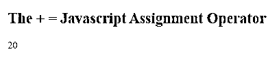
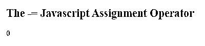
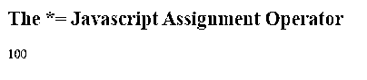
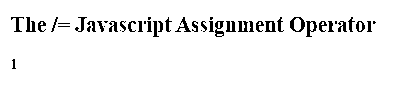
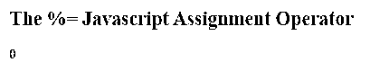
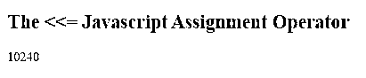
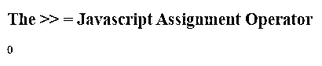
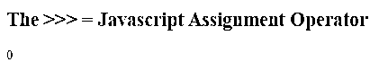
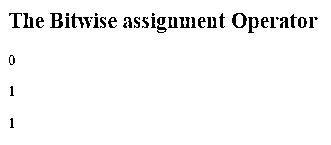

# JavaScript 赋值运算符

> 原文：<https://www.educba.com/javascript-assignment-operators/>


## JavaScript 赋值运算符简介

在本文中，我们将学习 Javascript 赋值操作符。

JavaScript 是一种用于网站的基于前端的开发语言。它拥有修改和改变 HTML [以及 CSS 样式](https://www.educba.com/css-table-styling/)的能力。此外， [JavaScript 函数还可以评估](https://www.educba.com/javascript-function-declaration/)，修改和验证可变数据。Javascript 提供了各种数据类型和操作符来构建网站或 web 应用程序。[几乎所有编程语言都提供了赋值操作符](https://www.educba.com/assignment-operators-in-c-plus-plus/)，比如 JavaScript、 [Python、Ruby](https://www.educba.com/python-vs-ruby/) 、Php 和 Python。赋值运算符有两个部分，左操作数和右操作数。它们用于根据右操作数的值给左操作数赋值。左操作数通常是一个变量。基本赋值运算符是等号(=)，用于将右边操作数的值赋给左边的操作数。例如，如果我们看赋值 a = b，它把变量 b 的值赋给变量 a。

<small>网页开发、编程语言、软件测试&其他</small>

### 常用赋值运算符

除了最常用的赋值操作符“=”，Javascript 还有其他几种适合不同需求的赋值操作符，如下所示:

| **速记操作员** | **实际表情** |
| a +=b | a = a + b |
| a -= b | a = a–b |
| a *= b | a = a*b |
| a /=b | a = a/b |
| a %= b | a = a%b |
| a<<=b | a = a< |
| a>>=b | a = a>>b |
| a>>>=b | a = a>>>b |
| a&= b | a = a&b |
| a^=湾 | a = a^b |
| a &#124;=b | a = a&#124;b |

### 理解 JavaScript 赋值运算符

现在让我们详细了解一下这些赋值操作符:

#### 1.a +=b

这个速记运算符与 a = a + b 相同。它将右侧变量的值相加，然后将它们赋给左侧变量。

**代码:**

```
<!DOCTYPE html>
<html>
<body>
<h2> The + = Javascript Assignment Operator</h2>
<p id="example"></p>
<script>
var b = 10;
var a = 10;
a += b;
document.getElementById("example").innerHTML = a;
</script>
</body>
</html>
```

**输出:**




#### 2.a –= b

这个简写运算符与 a = a–b 相同。它所做的是减去右侧变量的值，然后将它们赋给左侧变量。

**代码:**

```
<!DOCTYPE html>
<html>
<body>
<h2>The -= Javascript Assignment Operator</h2>
<p id="example"></p>
<script>
var b = 10;
var a = 10;
a -= b;
document.getElementById("example").innerHTML = a;
</script>
</body>
</html>
```

**输出:**




#### 3.a * = b

这个速记运算符与 a = a * b 相同。它将右侧变量的值相乘，然后将它们赋给左侧变量。

**代码:**

```
<!DOCTYPE html>
<html>
<body>
<h2>The *= Javascript Assignment Operator</h2>
<p id="example"></p>
<script>
var b = 10;
var a = 10;
a *= b;
document.getElementById("example").innerHTML = a;
</script>
</body>
</html>
```

**输出:**




#### 4.a / = b

这个速记运算符与 a = a / b 相同，它将右侧变量的值相除，并将其赋给左侧变量。

**代码:**

```
<!DOCTYPE html>
<html>
<body>
<h2>The /= Javascript Assignment Operator</h2>
<p id="example"></p>
<script>
var b = 10;
var a = 10;
a /= b;
document.getElementById("example").innerHTML = a;
</script>
</body>
</html>
```

**输出:**




#### 5.a % = b

这个速记运算符与 a = a % b 相同，它计算右侧变量的值的模，并将它们赋给左侧变量。

**代码:**

```
<!DOCTYPE html>
<html>
<body>
<h2>The %= Javascript Assignment Operator</h2>
<p id="example"></p>
<script>
var b = 10;
var a = 10;
a %= b;
document.getElementById("example").innerHTML = a;
</script>
</body>
</html>
```

**输出:**




#### 6.a <<= b

这个速记运算符与 a = a << b 相同。它进行左移，并将右侧变量的值和赋给左侧变量。

**代码:**

```
<!DOCTYPE html>
<html>
<body>
<h2> The <<= Javascript Assignment Operator </h2>
<p id="example"></p>
<script>
var b = 10;
var a = 10;
a <<= b;
document.getElementById("example").innerHTML = a;
</script>
</body>
</html>
```

**输出:**




#### 7.a >>= b

这个速记运算符与 a = a >> b 相同。它执行右移位，并将右侧变量的值和赋给右侧变量。

**代码:**

```
<!DOCTYPE html>
<html>
<body>
<h2> The >> = Javascript Assignment Operator </h2>
<p id="example"></p>
<script>
var b = 10;
var a = 10;
a >>= b;
document.getElementById("example").innerHTML = a;
</script>
</body>
</html>
```

**输出:**




#### 8.a >>>= b

这个简写操作符与 a = a >>> b 相同。它执行一个填零的右移位，并将右侧变量的值和赋给右侧变量。

**代码:**

```
<!DOCTYPE html>
<html>
<body>
<h2> The >>> = Javascript Assignment Operator </h2>
<p id="example"></p>
<script>
var b = 10;
var a = 10;
a >>>= b;
document.getElementById("example").innerHTML = a;
</script>
</body>
</html>
```

**输出:**




#### 9.a &= b，a ^= b，a |= b

这 3 个运算符是按位运算符，是按位 and 运算、按位 XOR 运算和按位 OR 运算的简写表达式。

**代码:**

```
<!DOCTYPE html>
<html>
<body>
<h2>The Bitwise assignment Operator</h2>
<p id="demo"></p>
<p id="demo1"></p>
<p id="demo2"></p>
<script>
var x = true;
var y = false;
x &= y
document.getElementById("demo").innerHTML = x;
var x1 = true;
var y1 = false;
x1 ^= y1
document.getElementById("demo1").innerHTML = x1;
var x2 = true;
var y2 = false;
x2 |= y2
document.getElementById("demo2").innerHTML = x2;
</script>
</body>
</html>
```

**输出:**




### 结论

从上面的例子中，我们可以得出结论，Java script 像其他编程语言一样提供了各种赋值运算符，包括 Python、Ruby、Php 和 Python，这些运算符既可以作为速记表达式求值，也可以作为普通表达式求值。使用 short has 表达式的优点是，它允许我们只用几行代码就能执行复杂的操作。

### 推荐文章

这是 JavaScript 赋值操作符的指南。在这里，我们讨论最常用的赋值操作符，并通过适当的代码和输出详细理解这些操作符。您也可以浏览我们的其他相关文章，了解更多信息——

1.  [JavaScript 中的算术](https://www.educba.com/arithmetic-operators-in-javascript/)
2.  [JavaScript 静态方法](https://www.educba.com/javascript-static-method/)
3.  [JavaScript 中的斐波那契数列](https://www.educba.com/fibonacci-series-in-javascript/)
4.  [JavaScript 表单验证](https://www.educba.com/javascript-form-validation/)


