# JavaScript 中的比较运算符

> 原文：<https://www.educba.com/comparison-operators-in-javascript/>

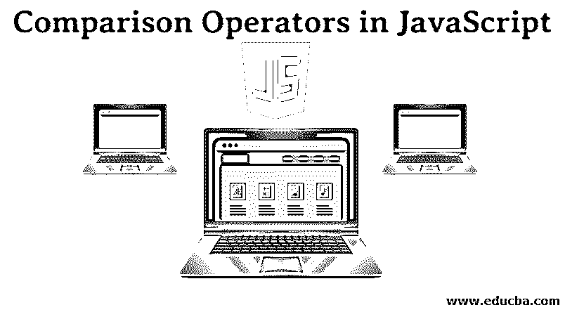

## JavaScript 中的比较运算符是什么？

JavaScript 中的比较运算符用于通过确定变量值之间的相等或不同来做出某些决策或执行某些业务逻辑。对于任何使用 JavaScript 开发的网站，这些操作符都是最常用的。现在让我们看一下多个这样的操作符，并分析它们的编码输出。

### JavaScript 比较运算符

让我们详细看看一些最广泛使用的 JavaScript 比较运算符。

<small>网页开发、编程语言、软件测试&其他</small>

#### 1) ' == '运算符

*   这个运算符被称为“等于”，用于将一个变量的值与其他变量的值进行比较，或者直接与其他值进行比较；这个等式的确定还取决于变量的性质，例如，它是整数还是浮点数等等。
*   如果比较的两个操作数不属于同一类型，则相等运算符执行类型转换。
*   JavaScript 对象的比较也可以用这个来完成；在这种情况下，它比较内部引用，也就是说，如果操作数引用内存中的同一个对象，result 将等于 true。
*   语法:" x == y "
*   某些条件为真或假，应遵守-' 1 ' = = 1//评估为真。

这是因为比较运算符不做类型检查；它们只是做值比较，所以这里发生了从字符串到整数的内部类型转换，然后值变为真。

*   0 == null //计算结果为 false
*   0 ==未定义//计算结果为假
*   null = = undefined//计算结果为 false
*   现在让我们看几个相同的示例代码；代码片段输出只能在浏览器的控制台进行交叉检查。

**例 1:**

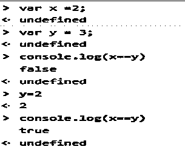

**例 2:**

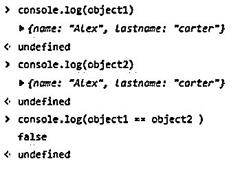

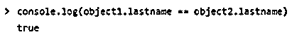

**例 3:**

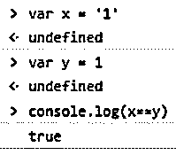

因此，上面的例子表明，在进行对象比较时，如果引用不相同，那么将导致错误的结果。

#### 2) ' === '运算符

*   到目前为止，我们已经看到了 equals to 运算符，现在我们将加入“equals to and equals type”运算符，其中也可以检查类型。
*   类型检查和相等性有时是必不可少的，因为业务逻辑有时需要这样做。
*   语法–X = = = Y
*   让我们直接看到一些片段，并相应地进行解释。

**举例:**

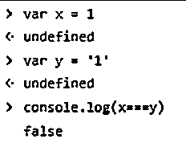

因此在这里对类型求值。

#### 3) ' != '运算符

*   该运算符称为“不等于”运算符；如果被求值的两个操作数不相等，则返回值为真。
*   语法–X！= Y

**举例:**

#### 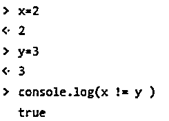

#### 4) ' !== '运算符

*   该运算符用于检查不等于和不等于类型，即值和类型不匹配；如果两个条件中的任何一个也不为真，则计算结果为真。
*   语法–X！== Y
*   针对多种情况的输出已经在下面的代码片段中提到。

**举例:**

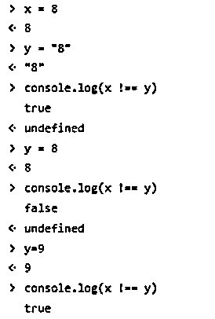

#### 5)大于'>.'

*   在实现业务逻辑时，可以检查是否有任何表达式生成了大于其他表达式的值；如果是，那么该值将评估为真，否则为假。'
*   语法–X > Y
*   现在让我们看一个用例，并分析输出。

**举例:**

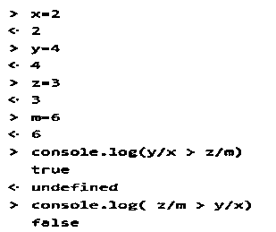

#### 6)小于运算符“< .”

*   如果在任何业务逻辑中，表达式将小于运算符左侧的操作数值小于右侧的值，则该逻辑返回 true 结果。
*   语法–X < Y
*   让我们看看下面提到的几个例子片段；注意，边界条件没有包含等于条件。

**举例:**

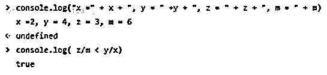

#### 7)大于等于“> = .”

*   该运算符包括边界条件和大于条件。基于所需的业务逻辑，可以合并这个条件。
*   语法–X > = Y

**举例:**

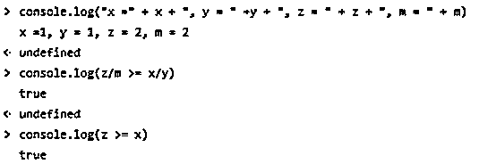

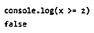

#### 8)小于或等于“< = .”

*   该运算符包括边界条件和小于条件。基于所需的业务逻辑，可以合并这个条件。
*   语法–X < = Y

**举例:**

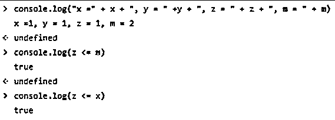

### 结论

*   因此，我们看到了不同的用例，在这些用例中进行了比较，并且看到了不同的输出；根据测试操作数数据或评估表达式，某些条件为真或为假。
*   类型检查也是一个重要的问题。
*   当根据操作数进行检查时，空值和未定义的值是在实现业务逻辑时会出现的特殊情况。
*   因此，应适当处理空检查，以免出现意外情况。
*   与此同时，某些先进的框架已经出现在画面中；那些仅仅是基于 JavaScript 的，在现代已经被用于适当的网络开发相关的项目；这样的框架有 Angular，React，Ember 等。所有这些都是基于 JavaScript 概念的，因此用例以及调试策略都是相同的。
*   此外，还有像 Jasmine 这样的用于调试的框架，或者也可以从浏览器的控制台进行调试。

### 推荐文章

这是 JavaScript 中比较运算符的指南。这里我们讨论 JavaScript 中不同的比较操作符，并给出一个例子。您也可以浏览我们推荐的其他文章，了解更多信息——

1.  [JavaScript 工具](https://www.educba.com/javascript-tools/)
2.  [Javascript 框架](https://www.educba.com/best-javascript-frameworks/)
3.  [Java 中的类型转换](https://www.educba.com/type-conversion-in-java/)
4.  [Java 中的转换](https://www.educba.com/conversion-in-java/)

