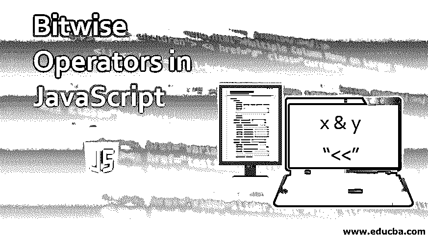

# JavaScript 中的按位运算符

> 原文：<https://www.educba.com/bitwise-operators-in-javascript/>

## JavaScript 中的按位运算符简介

JavaScript 中的位运算符通过以二进制数(基数 2)表示形式(特别是 32 位数字形式)对操作数进行运算，而不是以十进制数(基数 10)、八进制数(基数 8)或十六进制数(基数 16)表示法对操作数进行运算。例如，1010 是十进制数十的二进制表示。JavaScript 中的按位运算是对二进制表示的运算符的操作数执行的，但输出总是以标准数值形式返回。

JavaScript 中的按位运算符将其操作数转换为 32 位有符号整数形式的二进制补码形式。因此，每当操作符处理一个整数时，派生的值就是该整数的二进制补码形式。整数的二进制补码是该数的一进制补码(即该数的按位非)加 1。

<small>网页开发、编程语言、软件测试&其他</small>

例如，下面是数字 7 的 32 位表示

00000000000000000000000000000111

下面是 1’的补充，即～7

11111111111111111111111111111000

下面是等于-7 的二进制补码形式

11111111111111111111111111111001

| **按位运算符** | **用途** | **意为** |
| 按位 AND | x & y | 如果两个相应的位都是 1，则在每个位位置返回 1，否则返回 0。 |
| 按位或 | x &#124; y | 如果任何相应的位为 1，将在每个位位置返回 1，否则为 0。 |
| 按位异或 | x ^ y | 如果两个对应的位都是 1 或 0，则在每个位的位置都将返回 0，否则，只要这两个位不同，就返回 1。 |
| 按位非 | ~ x | 将操作数 x 的位从 1 翻转到 0，反之亦然。 |
| 左移 | x << y | 将二进制数 x 上的位向左移动 y 位，同时将 0 从右边推到原位。 |
| 符号传播右移 | x >> y | 将二进制数 x 上的位向右移动 y 位，同时将最左边的位向左复制以完成 32 位。 |
| 零填充右移 | x >>> y | 会将二进制数 x 上的位向右移动 y 位，同时从左侧将 0 推到原位。 |

### JavaScript 中的按位逻辑运算符

按位逻辑运算符由大多数语言中使用的所有逻辑运算符组成，但它们在某种程度上是不同的，因为按位逻辑运算符是逐位运算的。以下是 JavaScript 中使用的按位逻辑运算符:

#### 1.按位 AND

这是一个二进制运算符，用符号“&”表示，它对其参数的连续对应位对执行“与”运算。“&”运算符只有在两位都为 1 时才返回 1，否则将返回 0。因此，我们也可以将“与”运算与乘法运算相关联，因为两者会给出相同的答案。

| **X** | **Y** | **X & Y** |
| **0** | **0** | **0** |
| **0** | **1** | **0** |
| **1** | **0** | **0** |
| **1** | **1** | **1** |

**例子**

10(以 10 为基数)= 0000000000000000000000000001010
13(以 10 为基数)= 000000000000000000000001101

————————————————————————————

10 和 13 0000000000000000000000000000001000 = 8(基数为 10)

#### 2.按位或

这是一个由竖线“|”符号表示的二元运算符，它对其参数的连续对应位对执行 or 运算。如果任一位为 1 或两位都为 1，则“|”运算符将返回 1，否则将返回 0。按位“或”|”不同于逻辑“或”||”，因为它是逐位工作的。

| **X** | **Y** | **X &#124; Y** |
| **0** | **0** | **0** |
| **0** | **1** | **1** |
| **1** | **0** | **1** |
| **1** | **1** | **1** |

**例子**

10(以 10 为基数)= 0000000000000000000000000001010
13(以 10 为基数)= 000000000000000000000001101

————————————————————————————

10 | 13 0000000000000000000000000000001111 = 15(基数为 10)

#### 3.按位异或

这是一个由脱字符号“^”表示的二元运算符，它对其自变量的连续对应位对执行 XOR 运算。如果两位都相同(即都是 1 或都是 0),“^”运算符将返回 0，否则将返回 1。

| **X** | **Y** | **X ^ Y** |
| **0** | **0** | **0** |
| **0** | **1** | **1** |
| **1** | **0** | **1** |
| **1** | **1** | **0** |

**例子**

10(以 10 为基数)= 0000000000000000000000000001010
13(以 10 为基数)= 000000000000000000000001101

————————————————————————————

10 ^ 13 000000000000000000000000000000111 = 7(基数为 10)

#### 4.按位非

这是一个一元运算符，用代字号“~”表示，它对其参数的相应位执行 NOT 运算。“~”运算符将反转操作数的位，即从 0 转换为 1 或从 1 转换为 0。

| **X** | **~X** |
| **0** | **1** |
| **1** | **0** |

**例子**

10(以 10 为基数)= 000000000000000000000000000001010

————————————————————————————

~10   11111111111111111111111111110101

### JavaScript 中的按位移位运算符

在中，按位移位操作也接受两个参数，其中第一个参数是要进行移位操作的二进制数，第二个参数指定第一个参数必须移位的位数。正在使用的运算符指定了二进制数中移位操作的方向。

#### 1.按位左移

这是一个二元运算符，用符号“<

**例:**8<T3】3 得 64

8(以 10 为基数)= 000000000000000000000000000001000

————————————————————————————

8 < < 3000000000000000000000000010000000 = 64(基数为 10)

#### 2.按位右移

这是由符号“> > >”表示的二元运算符。该运算符将第一个参数最右边的位向右移动第二个参数乘以的值。对于每次执行的移位操作，从左边移位的位在最左边部分被替换为 0。

**例:** 8 > > > 3 得 1

8(以 10 为基数)= 000000000000000000000000000001000

————————————————————————————

8 > >> 300000000000000000000000000000001 = 1(基数为 10)

-8(基数为 10)= 1111111111111111111111111111111000

————————————————————————————

-8 > > > 3 000111111111111111111111111111 = 536870911(十进制)

#### 3.按位符号传播右移

这是一个二元运算符，用符号“> >”表示。该运算符将第一个参数最右边的位向右移动第二个参数乘以的值。对于执行的每个移位操作，从左侧移位的位被最左侧部分中的最左侧位(即符号位)替换。

**例:** 8 > > > 3 得 1

8(以 10 为基数)= 000000000000000000000000000001000

————————————————————————————

8 > > 3 000000000000000000000000000001 = 1(基数为 10)

-8(基数为 10)= 1111111111111111111111111111111000

————————————————————————————

-8 > > 3 1111111111111111111111111111 =-1(基数 10)

### 结论

自变量被转换成 32 位二进制数，并以位的形式表示(即 0 和 1)。参数中超过 32 位的数字的 msb(最高有效位)将被丢弃。当在移位操作期间，如果左移，则 msb 处的额外位被丢弃，而在右移期间，在最右边部分增长的额外位被丢弃时，同样的规则适用。

之前:1100110101000111010010001000001110010010010001

————————————————————————————

之后:1110100100010000001110010010001

每个对应的位彼此成对，即第一位与其他自变量的第一位成对，第二位与第二位成对，依此类推。

运算符应用于每一位(对于二元运算符，应该是一对位)，因此在 JavaScript 中称为按位运算符。

按位运算符的实际应用是位标志、套接字/端口通信、压缩、加密、有限状态机、图形等。

### 推荐文章

这是 JavaScript 中按位运算符的指南。在这里，我们讨论 JavaScript 中的按位运算符的介绍、类型，如逻辑和移位运算符及其运算。你也可以看看下面的文章来了解更多-

1.  [c#中的按位运算符](https://www.educba.com/bitwise-operators-in-c-sharp/)
2.  [c++中的按位运算符](https://www.educba.com/bitwise-operators-in-c-plus-plus/)
3.  [JavaScript 中的逻辑运算符](https://www.educba.com/logical-operators-in-javascript/)
4.  [PHP 中的按位运算符](https://www.educba.com/bitwise-operators-in-php/)

