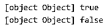
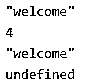

# JavaScript 中的一元运算符

> 原文：<https://www.educba.com/unary-operators-in-javascript/>


## JavaScript 中的一元运算符简介

JavaScript 一元运算符是特殊的运算符，它考虑单个操作数，并对该单个操作数执行所有类型的运算。这些类型的运算符包括一元加号、一元减号、前缀增量、后缀增量、前缀减量和后缀减量。根据要求和输出，这些运算符放在操作数之前或之后。与 JavaScript 相比，一元运算符更受青睐，因为它们在函数调用方面效率更高。一元运算符不能被重写，这使得它的功能灵活多样。

### JavaScript 一元运算符的类型

与包括加法、减法、乘法和除法作为运算一部分的普通运算符不同，使用这些类型的通用运算符。但是在一元运算符的情况下，应用了一些约束和规则，基于这些约束和规则进行运算，并且包括用于所有操作的单个操作数。

<small>网页开发、编程语言、软件测试&其他</small>

因此，JavaScript 一元运算符的类型描述如下:

#### 1.一元加号(+)

该运算符位于操作数之前，将该运算符转换为具有所需数字的最终输出。它将包含数字、布尔值和任何类型的 null 的字符串转换为最终数字。它包括整数、浮点数、十六进制数等。在 JavaScript 方面，可以说一元加号基本上是试图将任何表达式转换成数字。

**Note:** Unary operator will return value only if the object it has contains the valueOf key and that function, in turn, return any of the values as mentioned above.

**代码:**

```
function M_Unary_Typ(p) {
this.number = p;
}
M_Unary_Typ.prototype.valueOf = function() {
return this.number;
};
const obj_1 = new M_Unary_Typ(9);
console.log(obj_1 + 3);
```

**输出:**


#### 2.一元否定(-)

它的工作方式也与一元加类似，唯一的区别是它包括前面有操作数的操作数，然后用相同的函数转换一元加操作数，使值被求反。简而言之，在一元否定的基础上执行一元否定和一元加，使得被否定的值具有与非数字相同的功能。这个程序演示了一元否定运算，一旦应用了键值，就会给出负值。

**代码:**

```
function M_negtion_func(s) {
this.nm = s;
}
M_negtion_func.prototype.valueOf = function() {
return this.nm;
};
const obj1 = new M_negtion_func(true);
const obj2 = new M_negtion_func(15);
console.log(obj1 + 3 -20);
console.log(obj2 + 3 -20);
```

**输出:**


#### 3.逻辑 Not(！)

逻辑“非”操作符出现在操作数之前，先将操作数转换为布尔等价形式，然后再转换为布尔等价形式并对值求反。这个程序演示了逻辑 Not(！)一元运算符，返回逻辑 not 的输出。

**代码:**

```
function M_negtion_func(z) {
this.nm = z;
}
M_negtion_func.prototype.valueOf = function() {
return this.nm;
};
const obj1 = new M_negtion_func(!false);
const obj2 = new M_negtion_func(!"-3");
console.log(obj1, !false );
console.log(obj2, !"-3");
```

**输出:**




#### 4.增量(++)

增量也是一种一元操作数，它利用运算符和操作数，运算符将操作数加 1，然后将结果作为其值返回。此外，该运算符可以分为两种类型，即后缀和前缀。在 postfix 中，操作符跟在操作数后面，因此在执行任何递增之前返回值。在 prefix 中，运算符位于操作数之前，因此在给值加上前缀后返回值。

**代码:**

```
let q = 15;
++q;
console.log(q);
```

**输出:**


#### 5.减量(–)

减量运算符在执行减量运算时，从其操作数之一中减去值，并在执行后缀之前返回值。在返回一个值之前执行前缀，然后递减使它变得不同。这个程序演示了递减一元运算符，它递减所考虑变量的前缀值。

**代码:**

```
var k = 5
k = --k
console.log(k);
```

**输出:**


#### 6.按位非(~)

按位“非”是一种执行二进制“非”运算的方法，通过反转操作数中的所有位，然后返回一个数字及其值。这个程序演示了按位 not(~)，它反转所有的位，然后返回输出中显示的值。

**代码:**

```
var i = ~8
var j = ~9
console.log(i);
console.log(j);
```

**输出:**


#### 7.…类型

type of 是一元操作数，它返回一个字符串，指示操作数的数据类型是一个使用操作数前面的运算符的字符串。这个程序演示了 Date()函数的类型，它使用一元运算符在控制台中返回日期。

**代码:**

```
typeof Date()
console.log(Date());
```

**输出:**


#### 8.删除

Delete 也是 JavaScript 中的一元运算符之一，它使用运算符和操作数，其中 delete 运算符也位于操作数之前，然后它删除数组的特定索引，以及对象的任何特定属性。它不会妨碍变量，函数，或者对象的状态，只是删除了一些属性或者定义的对象。这个程序演示了删除一元运算符，其输出值如下所示。

**代码:**

```
var welcm = 2;
delete welcm;
console.log(welcm);
```

**输出:**


#### 9.空的

void 是一个操作符，它位于一个操作之前，在该操作中，它丢弃任何表达式的值，然后计算该表达式是否返回某个具有未定义返回类型的值，这意味着返回类型为空，并且不包含任何特定值以供将来引用。这个程序演示了 void 一元运算符，其输出如输出中所示。

**代码:**

```
void 0
var wl = function () {
console.log('welcome')
return 4;
}
var re_slt = wl()
console.log(re_slt);
var void_rstlt = void (wl())
console.log(void_rstlt);
```

**输出:**




### 结论

一元运算符是同时使用运算符和操作数的特殊运算符，但操作数的使用是单一的，这意味着一个单一操作数处理所有运算和运算符，但对其执行的运算并不使其灵活和通用，而是使运算和逻辑操作更加简化。

### 推荐文章

这是 JavaScript 中一元运算符的指南。这里我们讨论 JavaScript 中一元运算符的介绍，以及带有编程示例的类型。您也可以浏览我们的其他相关文章，了解更多信息——

1.  [Java 操作符](https://www.educba.com/java-operators/)
2.  [c++中的按位运算符](https://www.educba.com/bitwise-operators-in-c-plus-plus/)
3.  [Java 中的逻辑运算符](https://www.educba.com/logical-operators-in-java/)
4.  [c++中的赋值运算符](https://www.educba.com/assignment-operators-in-c-plus-plus/)


