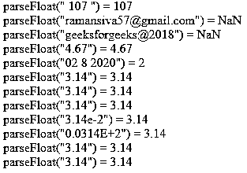

# JavaScript 浮动

> 原文：<https://www.educba.com/javascript-floating/>


## JavaScript 浮动简介

浮点被定义为具有十进制数的数。它是动态类型的，大多数情况下，数字被转换为字符串和浮点型定点数字之间的隐式格式，这些数字也是 IEEE 格式，64 位格式值强制变量值为浮点数。它在脚本中使用了一些全局类型的预定义方法，像 parseFloat()就是预定义方法之一。它被用于传递脚本中变量的浮点值。

### 语法和参数

javascript floating 是应用程序中表示数字的一种类型，用于在网页中使用数学运算。它在运作中有自己的特点和行为。

<small>网页开发、编程语言、软件测试&其他</small>

```
<html>
<body>
<script>
var v=12345f;
var v1=123-4f5;
document.getElementById("").innerHTML=v + v1;
--some jaavscript logics---
</script>
</body>
</html>
```

以上代码是脚本中数学运算的基本语法。我们可以使用一些默认的方法来减少脚本中的代码行，因为它有助于找到解析字符串，并将数字作为浮点格式返回。

### JavaScript 中浮动是怎么做到的？

Javascript 有时我们不得不选择称为数值转换的特性。它有助于使用运算符和操作数，如加号+,或者我们可以使用函数或默认方法，如 Number()是脚本代码中的严格格式。如果一个值与格式数字不完全匹配，那么使用名为 parseFloat 的默认方法将会失败。从技术上讲，代码中的逻辑应该抛出一些异常，比如唯一的异常，它是固定在字符串数据类型开头或结尾的一个空格。有时在应用中会被忽略，但在某些基于需求的应用中，我们经常使用默认格式的值，如单位、像素等。这些单位在称为 CSS 的表示层中使用，如“203px”或“15pt”。

一般来说，parseInt()和 parseFloat()方法在第二个参数中作为一个可选参数使用。因为它指定了数字系统的基数，涵盖了脚本中所有类型的数字。所以它需要并接受 parseFloat 方法，它也可以解析六进制数，二进制数，八进制数的每个数字类型的字符串，它满足所有要求。所以我们可以解析 parseInt 和 parseFloat 数字是“只读”选项，它不能编辑数字，尽管它必须是字符串类型，直到它们不能覆盖所有的段。如果出现错误，它将处理收集数字的情况，并以不同的顺序返回。方法 parseInt 返回整数，而 parseFloat 将返回浮点数，这是 javascript 两个函数的基本区别。

JavaScript 为像 Math object 这样的类提供了内置方法，Math object 包含了数学函数和常数的小型 apilibraries。我们可以使用这些函数和缺省常数，而且它适用于算术和逻辑运算。不仅仅是这些函数，它还有一些其他的默认函数和常数，它有默认的数学对象，使用这些特殊的实例，它应用了三角学和其他特性。

### JavaScript 浮动的例子

下面是一些例子:

#### 示例#1

**代码:**

```
<!DOCTYPEhtml>
<html>
<body>
<script>
x = parseFloat(" 107 ")
document.write('parseFloat(" 107 ") = ' +x +"<br>");
y = parseFloat("ramansiva57@gmail.com")
document.write('parseFloat("ramansiva57@gmail.com") = '
+y +"<br>");
c = parseFloat("geeksforgeeks@2018")
document.write('parseFloat("geeksforgeeks@2018") = '
+c +"<br>");
d = parseFloat("4.67")
document.write('parseFloat("4.67") = '
+d +"<br>");
e = parseFloat("02 8 2020")
document.write('parseFloat("02 8 2020") = '
+e +"<br>");
</script>
</body>
</html>
```

**输出:**


#### 实施例 2

**代码:**

```
<!DOCTYPEhtml>
<html>
<body>
<script>
x = parseFloat(" 107 ")
document.write('parseFloat(" 107 ") = ' +x +"<br>");
y = parseFloat("ramansiva57@gmail.com")
document.write('parseFloat("ramansiva57@gmail.com") = '
+y +"<br>");
c = parseFloat("geeksforgeeks@2018")
document.write('parseFloat("geeksforgeeks@2018") = '
+c +"<br>");
d = parseFloat("4.67")
document.write('parseFloat("4.67") = '
+d +"<br>");
e = parseFloat("02 8 2020")
document.write('parseFloat("02 8 2020") = '
+e +"<br>");
f=parseFloat(3.14);
document.write('parseFloat("3.14") = '
+f +"<br>");
g=parseFloat('3.14');
document.write('parseFloat("3.14") = '
+g +"<br>");
h=parseFloat('  3.14  ');
document.write('parseFloat("3.14") = '
+h +"<br>");
i=parseFloat('314e-2');
document.write('parseFloat("3.14e-2") = '
+i +"<br>");
j=parseFloat('0.0314E+2');
document.write('parseFloat("0.0314E+2") = '
+j +"<br>");
k=parseFloat('3.14some non-digit numbers ad characters are also apploicables');
document.write('parseFloat("3.14") = '
+k +"<br>");
l=parseFloat({ toString: function() { return"3.14" } });
document.write('parseFloat("3.14") = '
+l +"<br>");
</script>
</body>
</html>
```

**输出:**




#### 实施例 3

**代码:**

```
<!DOCTYPEhtml>
<html>
<head>
<style>
div.second {
background-color:green;
font-family: "Times New Roman", Times, serif;
}
div.third {
background-color:red;
font-family: Arial, Helvetica, sans-serif;
}
div.four {
background-color:pink;
font: 80% sans-serif;
}
div.five {
background-color:yellow;
font: 13px/11px sans-serif;
}
div.six {
background-color:orange;
font-weight: 500;
font: 1rem monospace;
white-space: nowrap;
}
</style>
</head>
<body bgcolor="blue">
<div class="second">Welcome</div>
<div class="third">To My</div>
<div class="four">Domain</div>
<div class="five">Gud Day</div>
<div class="six">Userss</div>
<script>
x = parseFloat(" 107 ")
document.write('parseFloat(" 107 ") = ' +x +"<br>");
y = parseFloat("ramansiva57@gmail.com")
document.write('parseFloat("ramansiva57@gmail.com") = '
+y +"<br>");
c = parseFloat("geeksforgeeks@2018")
document.write('parseFloat("geeksforgeeks@2018") = '
+c +"<br>");
d = parseFloat("4.67")
document.write('parseFloat("4.67") = '
+d +"<br>");
e = parseFloat("02 8 2020")
document.write('parseFloat("02 8 2020") = '
+e +"<br>");
f=parseFloat(3.14);
document.write('parseFloat("3.14") = '
+f +"<br>");
g=parseFloat('3.14');
document.write('parseFloat("3.14") = '
+g +"<br>");
h=parseFloat('  3.14  ');
document.write('parseFloat("3.14") = '
+h +"<br>");
i=parseFloat('314e-2');
document.write('parseFloat("3.14e-2") = '
+i +"<br>");
j=parseFloat('0.0314E+2');
document.write('parseFloat("0.0314E+2") = '
+j +"<br>");
</script>
</body>
</html>
```

**输出:**

**T2】**


 **### 结论

在脚本语言的不同场景中，我们在网页中使用了浮点值。每当我们使用浮点值的默认方法时，都应该在客户端和服务器端进行验证，很可能是在客户端进行验证。

### 推荐文章

这是一个 JavaScript 浮动指南。在这里，我们也讨论了 javascript 中的浮动是如何实现的？以及不同的示例及其代码实现。您也可以看看以下文章，了解更多信息–

1.  [JavaScript 窗口对象](https://www.educba.com/javascript-window-object/)
2.  [JavaScript encodeURI()](https://www.educba.com/javascript-encodeuri/)
3.  [卸载 JavaScript](https://www.educba.com/unshift-javascript/)
4.  [JavaScript encodeURI()](https://www.educba.com/javascript-encodeuri/)


**