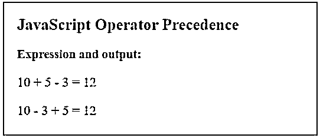
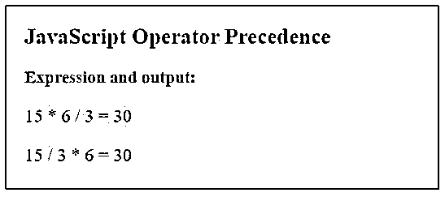
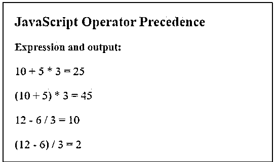
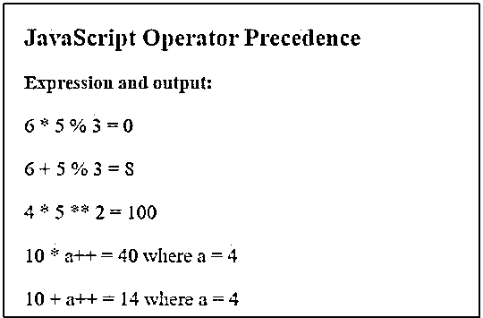

# JS 运算符优先级

> 原文：<https://www.educba.com/js-operator-precedence/>


## JS 运算符优先级介绍

下面的文章提供了 JS 操作符优先级的概要。JavaScript(JS)中的运算符优先级定义了如何处理数学表达式，以及哪个运算符将优先于另一个。这类似于普通数学表达式，其中乘法比加法或减法更受青睐。JavaScript 中的普通表达式有时会变得更加复杂，确定运算符优先级的顺序至关重要，在这种情况下，JavaScript 运算符优先级预先定义了该顺序，JavaScript 将根据该运算符优先级计算表达式。这种运算符优先级有助于 JavaScript 轻松计算和解析具有多种类型运算符和不同顺序的复杂表达式。

### JavaScript 中运算符优先级是如何工作的？

考虑一个简单数学运算的例子，

<small>网页开发、编程语言、软件测试&其他</small>

其中 x = 10+4 * 5；

因为在普通数学中，乘法比加法优先，所以乘法将首先执行。

因此，var x = 10 + 4 * 5

变成，x = 10 + 20 = 30

由于运算符有预定义的优先级或顺序，在代数中它们将首先执行，这同样适用于 JavaScript。每个操作员都有一个预先定义的操作顺序。具有更多偏好的操作符将首先被评估，并且该操作的结果将成为剩余操作符的操作数，并且同样的操作将继续，直到我们得到结果。

### JS 运算符优先级的示例

下面是提到的例子:

#### 示例 1–加法和减法

**代码**:

```
<!DOCTYPE html>
<html>
<head>
<title>
JavaScript Operator Precedence
</title>
<style>
.results {
border : green 1px solid;
background-color :aliceblue;
text-align : left;
padding-left : 20px;
height : 200px;
width : 95%;
}
.resultText {
font-size : 20px;
font-style : normal;
color : blue;
}
</style>
</head>
<body>
<div class = "results">
<h2> JavaScript Operator Precedence </h2>
<h3> Expression and output: </h3>
<div class = "resultText">
<p id = "result1"></p>
<p id = "result2"></p>
</div>
</div>
<script type = "text/javascript">
var x = 10 + 5 - 3;
document.getElementById("result1").innerHTML = "10 + 5 - 3 = " + x;
var y = 10 - 3 + 5;
document.getElementById("result2").innerHTML = "10 - 3 + 5 = " + y;
</script>
</body>
</html>
```

**输出**:




这里，两个操作符具有相同的优先级，因此两种情况下的输出是相同的。

#### 示例 2–乘法和除法运算

**代码:**

```
<!DOCTYPE html>
<html>
<head>
<title>
JavaScript Operator Precedence
</title>
<style>
.results {
border : green 1px solid;
background-color :aliceblue;
text-align : left;
padding-left : 20px;
height : 200px;
width : 95%;
}
.resultText {
font-size : 20px;
font-style : normal;
color : blue;
}
</style>
</head>
<body>
<div class = "results">
<h2> JavaScript Operator Precedence </h2>
<h3> Expression and output: </h3>
<div class = "resultText">
<p id = "result1"></p>
<p id = "result2"></p>
</div>
</div>
<script type = "text/javascript">
var x = 15 * 6 / 3;
document.getElementById("result1").innerHTML = "15 * 6 / 3 = " + x;
var y = 15 / 3 * 6;
document.getElementById("result2").innerHTML = "15 / 3 * 6 = " + y;
</script>
</body>
</html>
```

**输出:**




在这种情况下，两个运算符也具有相同的优先级。

#### 示例 3–括号()

**代码:**

```
<!DOCTYPE html>
<html>
<head>
<title>
JavaScript Operator Precedence
</title>
<style>
.results {
border : green 1px solid;
background-color :aliceblue;
text-align : left;
padding-left : 20px;
height : 280px;
width : 95%;
}
.resultText {
font-size : 20px;
font-style : normal;
color : blue;
}
</style>
</head>
<body>
<div class = "results">
<h2> JavaScript Operator Precedence </h2>
<h3> Expression and output: </h3>
<div class = "resultText">
<p id = "result1"></p>
<p id = "result2"></p>
<p id = "result3"></p>
<p id = "result4"></p>
</div>
</div>
<script type = "text/javascript">
var x = 10 + 5 * 3;
document.getElementById("result1").innerHTML = "10 + 5 * 3 = " + x;
var y = (10 + 5) * 3;
document.getElementById("result2").innerHTML = "(10 + 5) * 3 = " + y;
var x = 12 - 6 / 3;
document.getElementById("result3").innerHTML = "12 - 6 / 3 = " + x;
var x = (12 - 6) / 3;
document.getElementById("result4").innerHTML = "(12 - 6) / 3 = " + x;
</script>
</body>
</html>
```

**输出:**




这里可以看出，括号比其他运算符更具有偏好性。

#### 示例 4–其他运算符

**代码:**

```
<!DOCTYPE html>
<html>
<head>
<title>
JavaScript Operator Precedence
</title>
<style>
.results {
border : green 1px solid;
background-color :aliceblue;
text-align : left;
padding-left : 20px;
height : 310px;
width : 95%;
}
.resultText {
font-size : 20px;
font-style : normal;
color : blue;
}
</style>
</head>
<body>
<div class = "results">
<h2> JavaScript Operator Precedence </h2>
<h3> Expression and output: </h3>
<div class = "resultText">
<p id = "result1"></p>
<p id = "result2"></p>
<p id = "result3"></p>
<p id = "result4"></p>
<p id = "result5"></p>
</div>
</div>
<script type = "text/javascript">
var x = 6 * 5 % 3;
document.getElementById("result1").innerHTML = "6 * 5 % 3 = " + x;
var y = 6 + 5 % 3;
document.getElementById("result2").innerHTML = "6 + 5 % 3 = " + y;
var x = 4 * 5 ** 2 ;
document.getElementById("result3").innerHTML = "4 * 5 ** 2 = " + x;
var a = 4;
var y = 10 * a++;
document.getElementById("result4").innerHTML = "10 * a++ = " + y + " where a = 4";
var a = 4;
var z = 10 + a++;
document.getElementById("result5").innerHTML = "10 + a++ = " + z + " where a = 4";
</script>
</body>
</html>
```

**输出:**




这里，我们试验了多个操作符。

下面是对输出的观察:

*   与乘法/除法相比，模数(%)运算符优先级较低。
*   与加法/减法相比，模数(%)运算符具有更高的优先级。
*   取幂(**)运算符的优先级高于其他运算。
*   增量运算符优先级比乘法/除法低，比加法/减法高。

以类似的方式，我们可以通过形成不同的组合来试验各种运算符。

### 结论

运算符优先级预先定义了多种类型运算符的执行顺序。每个运算符都有一个预定义的优先级，优先级最高的运算符将首先执行，然后从高到低依次执行。

### 推荐文章

这是 JS 运算符优先级的指南。为了更好地理解，我们在这里讨论 JS 操作符优先级的介绍和相应的例子。您也可以看看以下文章，了解更多信息–

1.  [Javascript 数组到字符串](https://www.educba.com/javascript-array-to-string/)
2.  [JavaScript 字符串格式](https://www.educba.com/javascript-string-format/)
3.  [C 语言中运算符的优先级](https://www.educba.com/operators-precedence-in-c/)
4.  [c++中的运算符优先级](https://www.educba.com/operator-precedence-in-c-plus-plus/)


