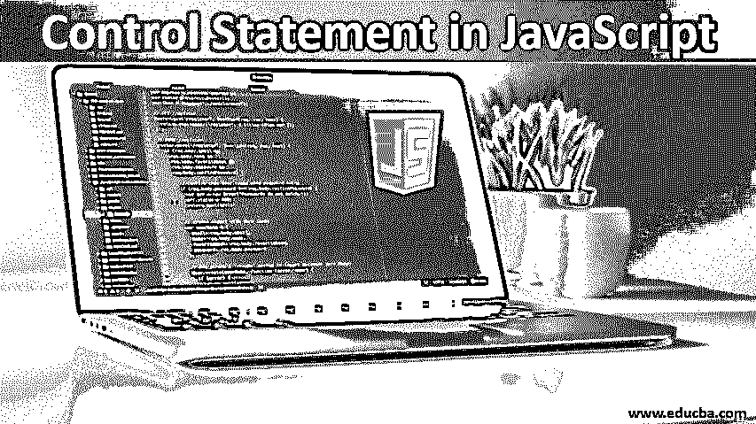
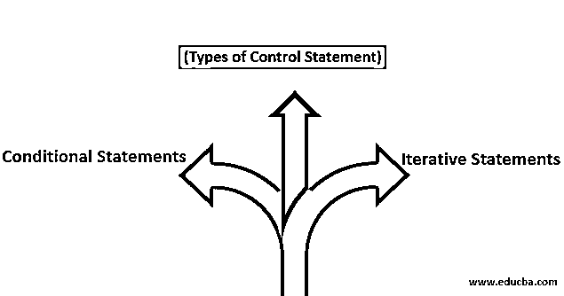

# JavaScript 中的控制语句

> 原文：<https://www.educba.com/control-statement-in-javascript/>




## JavaScript 中的控制语句简介

在本文中，我们将了解 JavaScript 中的控制语句，如何使用这些语句以及它们的语法。但是在我们进入控制语句部分之前，让我们先理清对 JavaScript 编程语言的理解。

[JavaScript，俗称 JS](https://www.educba.com/javascript-objects/) ，是一种高级、轻量级、面向对象的编程语言。JS 有解释编程语言，这意味着当执行时，JS 代码不符合，但它由翻译器翻译。这个翻译器翻译 JS 代码，并将结果加载到浏览器的网页中。JS 引擎是一个完成翻译工作的简单的计算机程序，它是一个标准的解释器。JS Engine 有效地利用了实时编译的优势，以获得更好的性能。

<small>网页开发、编程语言、软件测试&其他</small>

任何程序中的普通语句都旨在执行一个命令或说，做某事。控制语句是一种相同的语句，但是有权力决定其他语句中的哪一个应该在什么时候执行。一个很基本的例子，对于懂编程的人来说，IF-ELSE 是控制语句之一。这些控制语句的能力是基于一个完成求值工作的表达式。

### JavaScript 中控制语句的类型

基本上，每种编程语言都有如下两种类型的控制语句:




*   **条件语句:**根据传递的表达式，条件语句做出决定，结果要么是，要么不是。
*   **迭代语句(Loop):** 直到且除非满足给定的表达式或条件，这些语句重复自己。

### 例子

让我们通过例子来理解这些陈述:

#### 1.条件语句

这是决定程序执行流程的地方。条件语句根据结果决定下一步。条件语句产生 True 或 False。无论条件通过与否，如果为真，则程序进入下一步，如果条件为假，则程序进入下一步。与循环语句不同，这些语句只执行一次。

以下是不同类型的条件语句:

##### 如果

当您想要检查特定条件时。使用 IF 条件，如果满足提供的条件，则执行内部代码块。

**语法:**

```
if (condition) {
//code block to be executed if condition is satisfied
}
```

##### 如果-否则

IF 的扩展版本。当你想检查一个特定的条件和两个

**语法:**

```
if (condition)
{
// code to be executed of condition is true
}
else {
// code to be executed of condition is false
}
```

如您所见，当 IF-ELSE 中的条件满足时，将执行第一个代码块，如果条件不满足，将执行第二个代码块。

##### 转换

switch 语句类似于 IF，当您需要根据传递的表达式的结果执行多个代码块中的一个代码时，它非常有用。Switch 语句带有一个表达式，该表达式与以下事例的值进行比较，一旦找到匹配项，就会执行与该事例相关的代码。

**语法:**

```
switch (expression) {
case a:
//code block to be executed
Break;
case b:
//code block to be executed
Break;
case n:
//code block to be executed
Break;
default:
//default code to be executed if none of the above case is executed
}
```

上面的代码在最开始包含了一个表达式，它将与包含的案例进行检查和比较。如果传递的表达式与案例 a 匹配，则执行案例中的代码块。这同样适用于情况 b 和 n，当传递的表达式与提到的情况都不匹配时，它的代码进入默认情况并执行默认情况下的代码。

现在，我们已经理解了条件语句，让我们学习第二种类型，即迭代语句。

#### 2.迭代语句

循环，[对于任何编程语言](https://www.educba.com/what-is-a-programming-language/)来说，都是一个强大的工具，用来重复执行一组指令，同时满足所传递的表达式。一个非常基本的例子可以是，将“Hello World”打印 10 次。现在，连续 10 次使用“Hello world”编写相同的打印语句将非常耗时，并且会影响执行时间。这就是循环派上用场的地方。有三个迭代语句:WHILE、 [DO-WHILE 和](https://www.educba.com/do-while-loop-in-java/) FOR。让我们用语法来理解每一个。

##### 在…期间

控制流语句之一，当条件满足时执行代码块。但与 IF 不同，while 会不断重复，直到满足条件。if 和 while 的区别可以是，IF 执行代码“IF”条件得到满足，而 while 不断重复自己，直到条件得到满足。

**语法:**

```
while (condition)
{
//code block to be executed when condition is satisfied
}
```

##### 做一会儿

类似于 while 循环，在循环结束时保持一个条件。也称为退出控制循环，DO-WHILE 执行代码，然后检查条件。

**语法:**

```
while
{
//code block to be executed when condition is satisfied
} (condition)
```

如果最后的条件满足，循环将重复。

##### 为

for 循环将多次执行一个代码块。与其他循环相比，FOR 更短，更容易调试，因为它在一行中包含了初始化、条件和增量或减量。

**语法:**

```
for (initialize; condition; increment/decrement)
{
//code block to be executed
}
```

使用 initialize，它开始循环，这里使用了一个声明的变量。然后在条件部分检查循环的退出条件。当这个条件返回 true 时，执行里面的代码块。如果条件返回 false 或失败，则进入递增/递减部分，变量被赋予一个更新值。值会一直更新，直到满足条件。

### 结论

JavaScript 有两种类型的控制语句。有条件的和迭代的(循环)以及它们的特定用途。我们学习了条件语句，如 IF、IF-ELSE 和 SWITCH，以及它们各自的语法。对于迭代语句，我们学习了 WHILE、DO-WHILE 和 for 以及语法。通过并检查条件，直到满足为止。

### 推荐文章

这是 JavaScript 中控制语句的指南。这里我们讨论 javascript 中控制语句的介绍和类型，包括条件语句和迭代语句。您也可以浏览我们推荐的其他文章，了解更多信息——

1.  [JavaScript 中的回文](https://www.educba.com/palindrome-in-javascript/)
2.  [JavaScript 中的 For 循环](https://www.educba.com/for-loop-in-javascript/)
3.  [Java 中的控制语句](https://www.educba.com/control-statement-in-java/)
4.  [JavaScript 确认](https://www.educba.com/javascript-confirm/)


