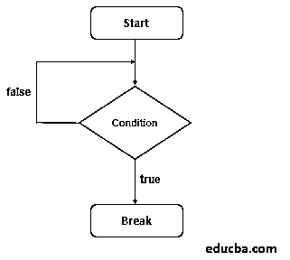
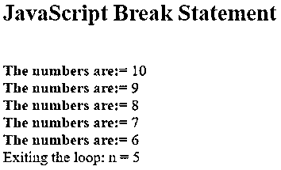
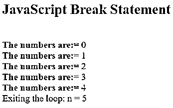
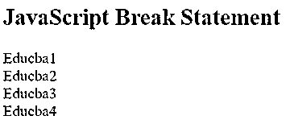
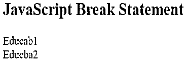
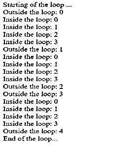
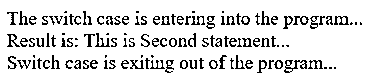

# JavaScript 中的 Break 语句

> 原文：<https://www.educba.com/break-statement-in-javascript/>


## JavaScript 中 Break 语句的介绍

Break 语句用于改变程序的功能。在测试结果不准确之前，循环被用来执行几次这样的语句序列。在某些情况下，如果不执行大部分句子，我们可以退出语句。在这些情况下，我们可以在 javascript 中使用 break 语句。break 语句是在 switch 语句中使用的[，它是从 switch 块中分离出来的。在提到的标签中，break 语句必须是嵌套的。每个 block 语句都可以是标记语句；循环语句不需要在它之前。](https://www.educba.com/python-switch-statement/)

如果 JavaScript 编译器在执行 for 循环、while 循环和 do-while 循环时发现其中的 break 语句，则循环将阻止执行这些语句并立即退出循环。

<small>网页开发、编程语言、软件测试&其他</small>

****语法:****

```
break;
```

**代码:**

```
var n = 0;
while (n < 5) {
if (n === 3) {
break;
}
n = n + 1;
}
console.log(n);
```

**输出:**

Three

**Note:** The break statement is also [used with switch statements.](https://www.educba.com/switch-statement-in-c-sharp/)

### 流程图

JavaScript 中 Break 语句的流程图:

break 语句的流程图如下图所示:




### JavaScript 中 Break 语句是如何工作的？

当我们在循环中使用 break 语句时，break 语句分割循环，并在循环后继续初始化代码。您还可以使用标签连接的 break 语句来退出 JavaScript 的代码块。简单地说，只要匹配成功，如果满足 break 语句[，工作就完成了。因此，switch 语句应该继续分析表达式。](https://www.educba.com/break-statement-in-python/)

我们必须确保正在执行的语句是第一个匹配，当您希望各种组合导致代码块时，这将被 break 语句阻止。switch 块中的最后一个实例不需要断开。无论哪种方式，块在那里打破。

### JavaScript 中 Break 语句的示例

下面是提到的例子:

#### 示例#1

for 循环中的 Break 语句。

**代码:**

```
<!DOCTYPE html>
<html>
<head>
<title> JavaScript Break Statement</title>
</head>
<body>
<h2> JavaScript Break Statement </h2>
<script>
var n;
for (n = 10; n > 0; n--)
{
if(n == 5)
{
document.write("<br\>Exiting the loop: n = " + n);
break;
}
document.write("<br\><b>The numbers are:</b>= " + n);
}
</script>
</body>
</html>
```

****解说** :**

*   将上述代码保存为 html 格式。
*   在 web 浏览器中运行代码。

****输出:****




#### 实施例 2

while 循环中的 Break 语句。

**代码:**

```
<!DOCTYPE html>
<html>
<head>
<title> JavaScript Break Statement</title>
</head>
<body>
<h2> JavaScript Break Statement </h2>
<script>
var n = 0;
while (n <= 10)
{
document.write("<br \ > <b>The numbers are:</b>= " + n);
n++;
if(n == 5)
{
break;
}
}
document.write("<br \> Exiting the loop: n = " + n);
</script>
</body>
</html>
```

****输出:****




#### 实施例 3

div 标记内的 Break 语句。

**代码:**

```
<!DOCTYPE html>
<html>
<head>
<title>
JavaScript Break statement
</title>
</head>
<body style="text-align:left;">
<div>
<h2>JavaScript Break Statement</h2>
</div>
<p id="brk_stmt_id"></p>
<script>
var myvalue = "";
var n;
for (n = 1; n < 10; n++) {
if (n === 5) {
break;
}
myvalue += "Educba" + n + "<br>";
}
document.getElementById("brk_stmt_id").innerHTML = myvalue;
</script>
</body>
</html>
```

****输出:****




#### 实施例 4

使用 break 标签语句。

**代码:**

```
<!DOCTYPE html>
<html>
<head>
<title>
JavaScript Break Statement
</title>
</head>
<body>
<div>
<h2>JavaScript Break Statement</h2>
</div>
<p id="brk_stmt_id"></p>
<script>
var res = ["Educab1", "Educba2", "Educba3", "Educba4", "Educba5"];
var value = "";
breaklabel: {
value += res[0] + "<br>" + res[1] + "<br>";
break breaklabel;
value += res[2] + "<br>"+ res[3] + "<br>" + res[4];
}
document.getElementById("brk_stmt_id").innerHTML = value;
</script>
</body>
</html>
```

****输出:****




#### 实施例 5

内循环中的 Break 语句。

**代码:**

```
<html>
<head>
<title>
JavaScript Break Statement
</title>
</head>
<body>
<script type = "text/javascript">
document.write("Starting of the loop ...<br/> ");
outerloop:        // indicates name of the label
for (var m = 0; m < 5; m++) {
document.write("Outside the loop: " + m + "<br />");
innerloop:
for (var n = 0; n < 5; n++) {
if (n > 3 ) break ;
if (m == 2) break innerloop;
if (m == 4) break outerloop;
document.write("Inside the loop: " + n + " <br/>");
}
}
document.write("End of the loop...<br /> ");
</script>
</body>
</html>
```

****输出:****




#### 实施例 6

开关情况下的 Break 语句。

**代码:**

```
<!DOCTYPE html>
<html>
<head>
<title>
JavaScript Break Statement
</title>
</head>
<body>
<script type = "text/javascript">
var value = 'two';
document.write("The switch case is entering into the program...<br />");
switch (value) {
case 'one': document.write("Result is: This is First statement...<br />");
break;
case 'two': document.write("Result is: This is Second statement...<br />");
break;
case 'three': document.write("Result is: This is Third statement...<br />");
break;
case 'four': document.write("Result is: This is Fourth statement...<br />");
break;
case 'five': document.write("Result is: This is Five statement...<br />");
break;
default:  document.write("Result is: This is last statement...<br />")
}
document.write("Switch case is exiting out of the program...");
</script>
</body>
</html>
```

****输出:****




### 结论

对于打通包括 JavaScript For 循环、JavaScript While 循环、 [JavaScript Do While 循环](https://www.educba.com/do-while-loop-in-javascript/)在内的任何循环都非常有帮助。如果 JavaScript 编译器在实现这些循环时检测到自己内部的 break 语句，循环将停止执行这些语句并立即退出循环。简单地说，只要找到匹配，如果遇到 break 语句，就执行工作。因此，switch 语句必须开始检查表达式。我们还将 switch case [用于 break](https://www.educba.com/break-in-c-sharp/) 语句，其中 switch 语句分析将表达式的值与 case 子句相匹配的表达式，并执行与该 case 相关的语句以及 cases 中的语句。

### 推荐文章

这是 JavaScript 中 Break 语句的指南。在这里，我们讨论 JavaScript 中 break 语句的工作示例和不同示例，以及代码和输出。你也可以看看下面的文章来了解更多-

1.  [JavaScript 中的 Switch 语句](https://www.educba.com/switch-statement-in-javascript/)
2.  [JavaScript 中的模式](https://www.educba.com/patterns-in-javascript/)
3.  [JavaScript 中的 While 循环](https://www.educba.com/while-loop-in-javascript/)
4.  [JavaScript 中的比较运算符](https://www.educba.com/comparison-operators-in-javascript/)


