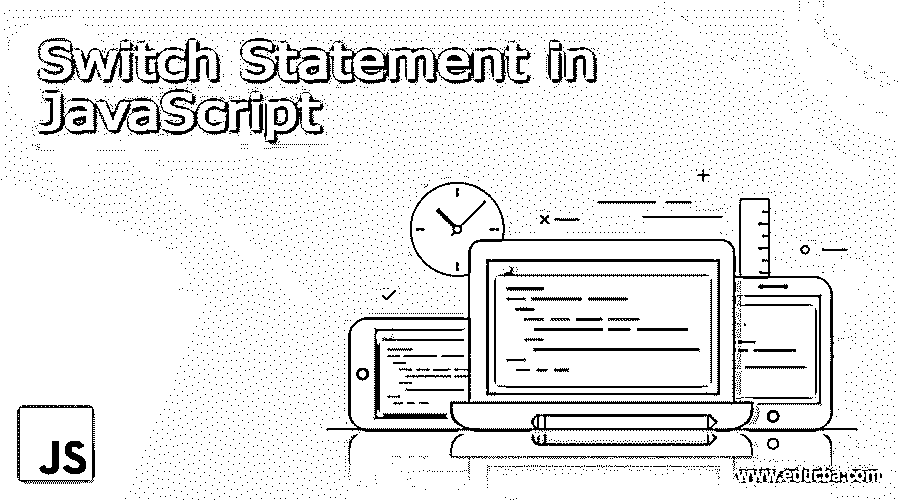

# JavaScript 中的 Switch 语句

> 原文：<https://www.educba.com/switch-statement-in-javascript/>




## JavaScript 中的 Switch 语句简介

switch 语句是在 [JavaScript 编程语言](https://www.educba.com/what-is-javascript/)中可用的多个条件语句之一，当满足切换条件并且输入值匹配切换条件中的一个或多个情况时，代码开始执行。这个条件在每种情况后都有一个‘break ’,反过来控制程序的执行流程。它还应该有一个“默认”块，以便在给定的输入与 switch 语句中提供的 case 选项不匹配时，执行能够顺利进行。

### JavaScript 中的 Switch 语句是什么？

JavaScript 中有几种条件方法，如 if-else 方法、if-else-if 方法、while 方法、do-while 方法以及其他几种方法。在 JavaScript 的不同方法中，switch 语句方法就是其中之一。如果条件满足，我们使用这个方法来运行一组特定的指令或代码。switch 语句通常包含几个 case 块以及一个可选的默认 case。根据条件，如果案例满足，可以执行一个或多个案例。如果没有 switch 语句块变为 true，则默认 case 会自动执行(如果它被添加到代码中)。

<small>网页开发、编程语言、软件测试&其他</small>

### JavaScript Switch 语句的语法

switch 语句中 JavaScript 的基本语法如下:

```
switch(an expression which needs to be checked) {
case x:
// block of code or instructions
break;
case y:
// block of code or instructions
break;
default:
// block of code or instructions for default condition
}
```

现在，让我们试着理解这个语句块实际上是如何运行的。

*   **需要检查的表达式***–*在这个语句中，我们检查需要求值的表达式。基于表达式的执行，满足条件的开关将被执行。
*   **不同情况***–*在执行表达式时，满足表达式的情况被执行。
*   **默认情况***–*如果任何一个切换情况没有得到满足，则执行默认情况。

### 流程图

下面给出了 switch 语句的流程图:


### JavaScript 中 Switch 语句是如何工作的？

switch 语句通常包含三个子部分，它们是:

*   要评估的表达式。
*   为表达式执行的事例。
*   如果没有案例得到满足，则需要执行的默认案例。

这些分部的基本职责是

*   **需要检查的表达式***–*在这个语句中，我们检查需要求值的表达式。基于表达式的执行，满足条件的开关将被执行。
*   **不同情况***–*在执行表达式时，满足表达式的情况被执行。
*   **默认情况***–*如果任何一个切换情况没有得到满足，则执行默认情况。

### 例子

下面是提到的例子:

#### 示例#1

现在，让我们举一个例子，从用户的输入框中获取一个数字；如果数字小于 10，则显示用户输入的数字；否则将显示输入的数字大于 10 的消息。

只需复制下面的代码，并将其粘贴到 HTML 文件来运行它。

**代码:**

```
<!DOCTYPE html>
<html>
<body>
<h2>JavaScript switch statement</h2>
<label>Enter the number in textbox</label>
<input type="number" id="inputBox"/>
<input type="button" onClick="checkVal()" value="Check value">
<label id="labelVal"></label>
<script>
var text = '', labelVal = "";
function checkVal(){
text = document.getElementById("inputBox").value;
labelVal = '';
text = Number(text)
switch(text) {
case 1:
labelVal = "You entered 1";
break;
case 2:
labelVal = "You entered 2";
break;
case 3:
labelVal = "You entered 3";
break;
case 4:
labelVal = "You entered 4";
break;
case 5:
labelVal = "You entered 5";
break;
case 6:
label Val = "You entered 6";
break;
case 7:
labelVal = "You entered 7";
break;
case 8:
label Val = "You entered 8";
break;
case 9:
labelVal = "You entered 9";
break;
default:
labelVal = "Enter value less than 10";
}
document.getElementById("labelVal").innerText = labelVal;
}
</script>
</body>
</html>
```

现在让我们看看输入了值的示例:

**输入值:** 6

**输出值:**您输入了 6

#### 实施例 2

现在让我们看看如何在 JavaScript 中执行多个 switch 语句。

如果条件满足，则执行多个案例。

现在，让我们看看如何执行多个案例。复制下面的代码并粘贴到一个 HTML 文件中来执行它。

**代码:**

```
<!DOCTYPE html>
<html>
<body
<h2>JavaScript switch statement</h2>
<label>Enter the number in textbox</label>
<input type="number" id="inputBox"/>
<input type="button" onClick="checkVal()" value="Check value">
<label id="labelVal"></label>
<script>
var text = '', labelVal = "";
function checkVal(){
text = document.getElementById("inputBox").value;
labelVal = '';
text = Number(text)
switch(text) {
case 1:
labelVal = labelVal + " You entered 1";
case 2:
labelVal = labelVal + " You entered 2";
case 3:
labelVal = labelVal+ " You entered 3";
break;
case 4:
label Val = labelVal+ " You entered 4";
case 5:
label Val = labelVal+ " You entered 5";
case 6:
label Val = labelVal+ " You entered 6";
break;
default:
label Val = "Enter value less than 10";
}
document.getElementById("label Val").innerText = label Val;
}
</script>
</body>
</html>
```

输入值:1

输出值:你输入 1，你输入 2，你输入 3。

### 结论

JavaScript 是一种编程语言，其中有许多概念需要学习。switch 语句就是其中之一。这些[条件语句](https://www.educba.com/conditional-statements-in-javascript/)基本执行代码，根据表达式求值检查表达式是否满足条件；它返回值。条件语句广泛用于任何编程语言中的各种逻辑编程表达式。

### 推荐文章

这是 JavaScript 中 Switch 语句的指南。这里我们讨论 JavaScript 中 switch 语句的概念、语法、工作原理和例子。您也可以浏览我们推荐的其他文章，了解更多信息——

1.  [JavaScript 字符串函数](https://www.educba.com/javascript-string-functions/)
2.  [JavaScript 数学函数](https://www.educba.com/javascript-math-functions/)
3.  [JavaScript 重新排列](https://www.educba.com/javascript-onresize/)
4.  [JavaScript 字符串到布尔值](https://www.educba.com/javascript-string-to-boolean/)


