# JavaScript elseIf

> 原文：<https://www.educba.com/javascript-elseif/>

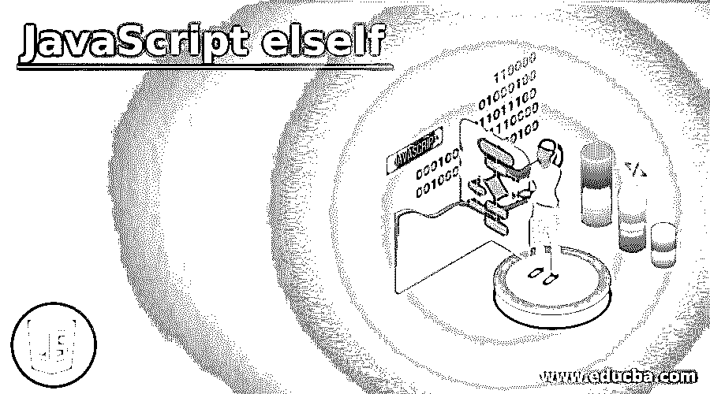


## JavaScript elseIf 简介

JavaScript elseIf 是一种用于编程决策的条件语句，用于根据某些特定条件控制代码行的执行流程。如果条件满足，语句返回 true，执行一个操作；否则，如果条件不满足，执行另一个操作。JavaScript elseIf 语句用于根据程序行的变化使执行流分支。

基本上，if 用于指定条件为真时要执行的代码块。如果条件为假，则需要使用 else 来执行特定的代码块。在这里，我们使用 else if 来指定要测试的新条件，前提是先前的条件为 false。

<small>网页开发、编程语言、软件测试&其他</small>

我们有各种条件语句来执行不同的决策，

*   **if:** 指定条件为真时要执行的代码块
*   **else:** 指定条件为假时要执行的代码块
*   **否则如果:**如果第一个条件失败，则指定要测试的新条件
*   **switch:** 指定要执行的替代代码块

**语法:**

```
if ( condition1 ) {
//first block of code, will be executed if condition is true
} else if ( condition2 ) {
//code block executed if condition1 fails and condition2 is true
} else {
//code block to be executed if condition1 and condition2 is false
}
```

### JavaScript elseIf 示例

我们将看到一些例子，通过这些例子你将清楚地了解 else if 的用法:

#### 示例#1

**代码:**

```
<!DOCTYPE html>
<html>
<body>
<h2>Using JavaScript else If condition</h2>
<h3>Enter a number and Get your gift Here!!</h3>
<input id="input" type="text">
<button onclick="sampleElseIf()">Click Here</button>
<p id="demo"></p>
<script>
function sampleElseIf() {
var numbers = document.getElementById("input").value;
var giftText;
// If number given is 2
if (numbers === "2") {
giftText = "You have won gold coin!!";
// If number given is 3 or 5, anyone
} else if (numbers === "3" || numbers === "5") {
giftText = "You have won 4 rupees!!";
}
else if (numbers === "7" || numbers === "100") {
giftText = "You have won 10 rupees!!";
// If the number is anything else
} else {
giftText = "You lost!!";
}
document.getElementById("demo").innerHTML = giftText;
}
</script>
</body>
</html>
```

**输出:**

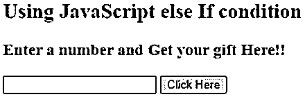


所以你需要输入任意一个随机数，基于这个条件，文本就会显示出来。

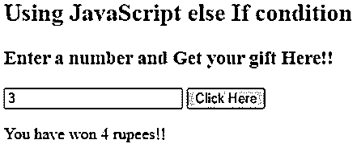


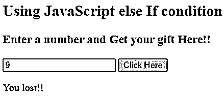


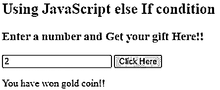


基于 if 条件和 else if 条件，您可以看到上面的结果。

#### 实施例 2

**代码:**

```
<!DOCTYPE html>
<html>
<body>
<h2>Using JavaScript else If condition</h2>
<p id="demo"></p>
<script>
var employee = "Karthick";
if( employee == "Jack" ) {
document.write("<b>Jack is the new employee</b>");
} else if( employee == "Karthick" ) {
document.write("<b>Karthick is the oldest employee</b>");
} else if( employee == "Saideep" ) {
document.write("<b>Saideep is a lateral employee</b>");
} else {
document.write("<b>He/ She is not an employee</b>");
}
</script>
</body>
</html>
```

**输出:**

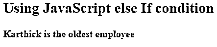


将 employee 值更改为“Juhi ”,可以看到 else 条件已经通过。

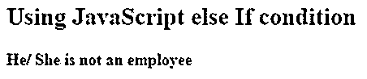


#### 实施例 3

**代码:**

```
<!DOCTYPE html>
<html>
<body>
<h2>Using JavaScript else If condition</h2>
<p id="demo"></p>
<script>
var x=290;
if(x == 100){
document.write("Value of x is 100");
}
else if(x == 195){
document.write("Value of x is 195");
}
else if(x == 290){
document.write("value of x is 290");
}
else{
document.write("Value of x is not defined properly");
}
</script>
</body>
</html>
```

**输出:**


我把值改为 100，这是输出，

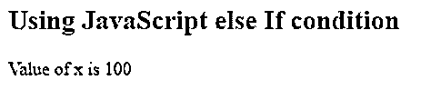


#### 实施例 4

**代码:**

```
<!DOCTYPE html>
<html>
<body>
<h2>Using JavaScript else IF condition</h2>
<h3>Click Here to get Greeting based on the Time</h3>
<button onclick="dateGreeting()">Try it</button>
<p id="demo"></p>
<script>
function dateGreeting() {
var sampleGreeting;
var setTime = new Date().getHours();
if (setTime< 8 || setTime == 10) {
sampleGreeting = "Hey people! Good Morning";
} else if (setTime< 20) {
sampleGreeting = "Hey People! Good Afternoon";
} else if (setTime>= 16) {
sampleGreeting = "Hey People! Good Evening";
} else {
sampleGreeting = "You have entered into an Alien Zone!"
}
document.getElementById("demo").innerHTML = sampleGreeting;
}
</script>
</body>
</html>
```

**输出:**

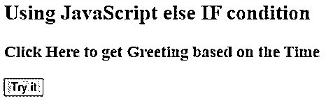


点击按钮后

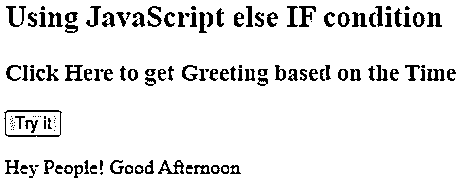


**Note:** Executed at the time of 24:05, hence its Good Afternoon!!

#### 实施例 5

**代码:**

```
<!DOCTYPE html>
<html>
<body>
<h2>Using JavaScript else If condition</h2>
<p id="demo"></p>
<script>
var x = 11;
if (x == 11) {
if (x < 15)
document.write("i is smaller than 15");
if (i< 12)
document.write("i is smaller than 12 too");
else if (x >= 11)
document.write("i is greater than 15");
}
else {
document.write("you have given a wrong number");
}
</script>
</body>
</html>
```

**输出:**

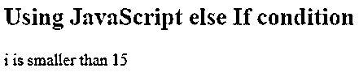


你可以用任何其他数字来核对。

### 结论

这样我们就可以结束我们的主题“JavaScript elseIf”。我们已经看到了这个简单的主题，上面列举了几个例子。我希望你已经理解了那些例子。用上面的例子好好尝试一下，本身就足以理解条件语句及其用法了。您甚至可以在编辑器中使用调试模式，它会显示所取的值。

### 推荐文章

这是一个 JavaScript elseIf 指南。这里我们讨论 javascript elseif 的介绍和语法，以及不同的例子和它的代码实现。您也可以看看以下文章，了解更多信息–

1.  [JavaScript 动画](https://www.educba.com/javascript-animation/)
2.  [JavaScript 转换成 JSON](https://www.educba.com/javascript-convert-to-json/)
3.  [JavaScript 数组包含](https://www.educba.com/javascript-array-contain/)
4.  [JavaScript onkeyup](https://www.educba.com/javascript-onkeyup/)


