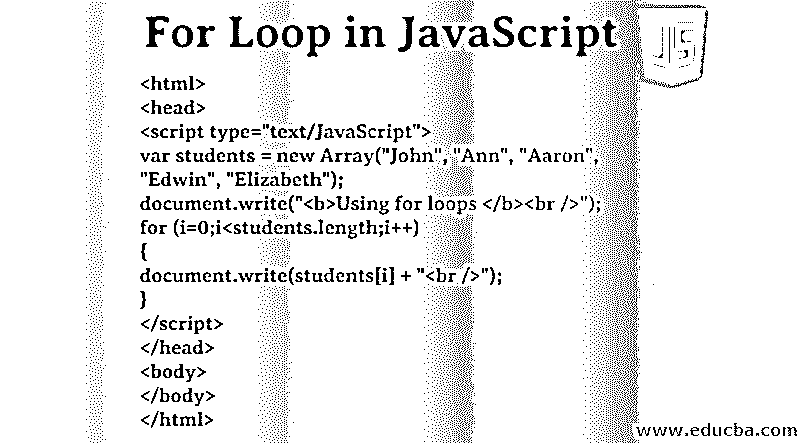
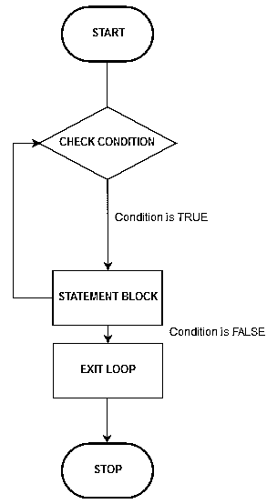
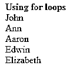
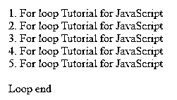
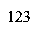
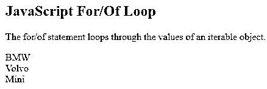

# JavaScript 中的 For 循环

> 原文：<https://www.educba.com/for-loop-in-javascript/>




## JavaScript 中 For 循环的介绍

[JavaScript 中的 For 循环是同时迭代一系列数据的最佳方法](https://www.educba.com/what-is-javascript/)。For 循环是一个入口控制的循环，在进入程序体之前检查测试条件。当我们知道进入循环之前的迭代次数时，使用 For 循环。循环通常用于重复一系列步骤一定的次数，因此它们通常涉及计数器变量、条件测试、改变计数器变量的方法。在许多情况下，For 循环可以用更少的代码行实现与 while 循环相同的功能。

### JavaScript 中 For 循环的类型

下面给出了 javascript 中 for 循环的类型:

<small>网页开发、编程语言、软件测试&其他</small>

*   **For:** 用于循环 n 次代码，直到条件为假。
*   **For/in:** 用于遍历对象属性。
*   **For/of** :用于循环遍历一个可迭代对象数组。

**For 循环语法:**

```
for (Initialization condition; test condition; Increment/Decrement)
{
Body of loop
}
```

**For/in 循环语法:**

```
for (var in object)
{
Body of loop
}
```

**For/of 循环语法:**

```
for (variable of iterable)
{
Body of loop
}
```

### JavaScript 中 For 循环的工作流

*   **初始化条件:**该条件表示 for 循环的开始。变量可以在循环中初始化，也可以单独声明。
*   **测试条件:** For 循环是一个入口控制循环，在程序执行前检查条件。它还测试循环的退出条件。
*   **语句执行:**只有当测试条件为真时，才会执行循环体。
*   **递增/递减:**对于每个循环，循环执行后，控制转到 Increment 语句。这里它增加或减少控制变量。
*   **循环终止:**条件一变为假，循环就终止。

**Note:** We can skip the initialization condition inside the For loop if we want, but ( ; ) Semicolon should not be removed. If it is removed, then the program will throw an error. The variable can be declared outside the loop.

**举例:**

**代码:**

```
int add=10;
for(;add<30;add++)
```

### JavaScript 中 For 循环是如何工作的？

当循环执行时，检查初始条件。这是循环开始的初始值。下一步，条件测试提供的条件是真还是假；这决定了循环是否应该继续。如果条件为真，则变量修改循环，并执行循环语句。语句执行后，循环重新开始，直到条件为假。

### For 循环流程图

下面是 JavaScript 中 For 循环的流程图:

**

** 

循环首先执行，for 循环检查测试条件，无论它是否为真。如果条件为真，它将转到执行它的语句块。如果条件为假，那么循环将退出，程序将停止。

### JavaScript 中 For 循环的示例

以下是不同的例子:

#### 示例 1:使用 For 循环

下面的程序使用 JavaScript 来打印学生姓名列表。

**代码:**

```
<html>
<head>
<script type="text/JavaScript">
var students = new Array("John", "Ann", "Aaron", "Edwin", "Elizabeth");
document.write("<b>Using for loops </b><br />");
for (i=0;i<students.length;i++)
{
document.write(students[i] + "<br />");
}
</script>
</head>
<body>
</body>
</html> 
```

**输出:**




#### 示例 2:使用 For 循环

**代码:**

```
<html>
<body>
<script>
for (var iterator1 = 0; iterator1 < 5; iterator1++) //initialization, condition, increment
{
document.write(iterator1 + 1 + ". " + "For loop Tutorial for JavaScript</br>");
}
document.write("</br>Loop end");
</script>
</body>
</html><>
```

**输出:**




**Note:** For loop ends after 5 iterations.

#### 示例 3:使用 For/in 循环

for/in 循环用于遍历对象的属性。

**代码:**

```
<html>
<body>
<script type="text/JavaScript">
var string1 = "";
var object1 = {a: 1, b: 2, c: 3};
for (var property1 in object1)
{
string1 += object1[property1];
}
document.write(string1);
</script>
</body>
</html>
```

**输出:**

**

** 

#### 示例#4:使用 For/of 循环

**代码:**

```
<html>
<body>
<h2>JavaScript For/Of Loop</h2>
<p>The for/of statement loops through the values of an iterable object.</p>
<script>
var cars = ['BMW', 'Volvo', 'Mini'];
var x;
for (x of cars) {
document.write(x + "<br >");
}
</script>
</body>
</html>
```

**输出:**




### 结论

起初，for 循环可能看起来有点混乱，但是一旦你弄清楚了 for 语句的不同部分，它们就不难了。请记住，每个 for 循环都以关键字 for 开头，后面是一组包含三个部分的括号，一对花括号。For 循环有助于程序员高效、轻松地编写程序。省去了写多行代码耗费更多时间的问题。对于一个程序员来说，有效且多产地写一个程序。原谅还有一个额外的好处，因为它减少了程序的长度。

### 推荐文章

这是 JavaScript 中 For 循环的指南。在这里，我们讨论 JavaScript 中 for 循环的介绍及其类型以及流程图。您也可以浏览我们推荐的其他文章，了解更多信息——

1.  [Python 中的 For 循环](https://www.educba.com/for-loop-in-python/)
2.  [Java 中的 For 循环](https://www.educba.com/for-loop-in-java/)
3.  [Java 中的迭代器](https://www.educba.com/iterator-in-java/)
4.  [Matlab 中的 For 循环](https://www.educba.com/for-loop-in-matlab/)


