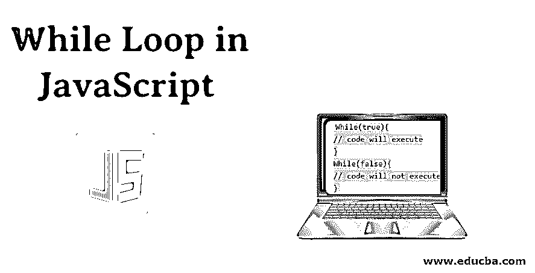
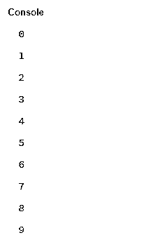
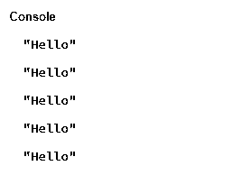
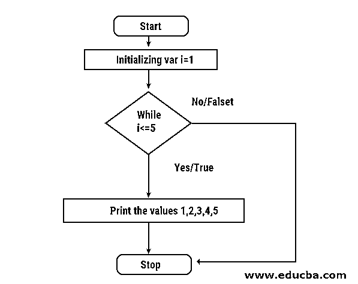
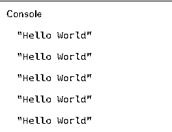
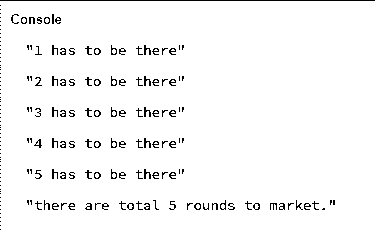
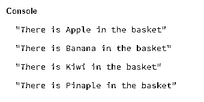
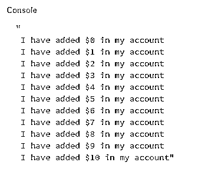

# JavaScript 中 While 循环

> 原文：<https://www.educba.com/while-loop-in-javascript/>




## Javascript 中的 While 循环介绍

今天我们集中讨论 while 循环。循环只不过是一遍又一遍地重复任务。假设我们必须打印一些数字，例如 1 到 10。在这种情况下，如果我们认为我们必须为每个 no .编写 10 次 print 语句，代码将会更多，而且非常耗时。最重要的是，它是重复的。在用任何语言编码时，我们都必须考虑 DRY 策略。那意思就是不要重复自己(干)。在这个主题中，我们将学习 JavaScript 中的 While 循环。

所以，在 while 循环中，循环出现了。如果你思考简单的英语，那么你会理解得更好。简单而言，意思是同时或到一个时期。这同样适用于[编程语言](https://www.educba.com/what-is-a-programming-language/)。当条件为真时，特定代码将执行。

<small>网页开发、编程语言、软件测试&其他</small>

当循环检查条件时，不管它是真还是假，如果条件为真，它只是运行代码直到断点。如果条件为假，则不继续。

**语法:**

```
While(condition){
// code to execute
}
```

在 while 循环中，我们在开始循环时检查条件，因此我们可以决定执行它。在 while 循环中，我们有一些语句块。只有在循环中指定的条件为真。

我们经常用真作为真假。如果你知道编程中的二进制概念，那么就更容易理解了。

True 和 false 是用于计算表达式的两个值。在检查条件和执行程序时，这将是有帮助的。

看看下面的正确和错误的语法:

```
While(true){
// code will execute
}
While(false){
// code will not execute
}
```

**例子**

```
while(true){
console.log("Hello");
break;
}
```

**输出:**


在零的情况下，我们会直接从循环中出来。

**例子**

```
var i = 0;
while (i < 10) {
console.log(i);
i++;
}
```

**输出:**




### Javascript 中的 While 循环是如何工作的？

while 循环非常容易理解。我们知道循环在编程中被用来自动化不同的重复任务。但我们需要采取一些预防措施，在这一点上，我们不会增加它。为了更清楚地了解这一点，让我们来看看下面的例子。

**例子**

下面的代码是用增量运算符++编写的。

```
var i=1;
while (i<=5){
console.log("Hello");
i++;
}
```

**输出:**


现在，让我们看一些没有增量操作符的代码。请尝试下面的代码。

在 JavaScript 中，你必须声明变量并初始化它。跳过这个过程可能会在编译器中导致运行时错误。

```
var i=1;
while (i<=5){
console.log("Hello");
i++;
}
```

**输出:**




请运行上面的代码，你会看到代码无限运行。

没有停止打印的名字你好。为了确保我们得到特定数量的单词作为输出，我们必须在 while 循环中使用递增或递减操作符。

### 流程图

一般来说，循环分为 3 个部分。

1.  初始化:给变量赋值
2.  条件:检查它是真还是假的条件
3.  递增或递减:这些操作符在自动递增循环或递减循环时很有用。

在接下来的例子中，我们将仔细研究循环的所有这些状态。

任何程序的重要部分是它的逻辑。仔细看下面的流程图；在程序开始时，我们需要初始化变量。

初始化就是给要使用的变量赋值。在初始化时，我们可以很好地应用 while 循环。在 while 循环中，我们检查条件。例如，I <=5。如果条件为真，循环将开始。如果条件为假，那么我们将直接退出循环。一般来说，当我们在讨论如何走出循环时，我们需要增量(++)和减量(–)操作符。




### 例子

让我们想一个关于减量操作符的例子。到目前为止，我们已经看到了[带有递增运算符(++)的 while 循环](https://www.educba.com/while-loop-in-shell-scripting/)。现在，我们将观察减量(–)运算符。顾名思义，减量运算符根据给定的要求减少变量的值。当条件为假时，循环将停止。

**举例:**

```
var i=5;
while (i>=1){
console.log("Hello World");
i--;
}
```

**输出:**




如果您运行上面的程序，您将会发现与使用 increment 操作符所看到的相同的输出。

**举例:**

```
fruits = 1;
while (fruits <= 5) {
console.log(fruits + " has to be there");
fruits++;
}
console.log("there are total " + (fruits - 1) + " rounds to market.");
```

**输出:**




**例子:** While 循环用数组

```
var fruits = ["Apple","Banana","Kiwi","Pinaple"];
total = 0;
while (total < fruits.length) {
console.log("There is " + fruits[total]+ " in the basket");
total++;
}
```

**输出:**




**例子**

```
var balance = 0;
var greet = "";
while (balance <= 10) {
greet = greet + "\n I have added $" + balance+ " in my account";
balance ++;
}
console.log(greet);
```

**输出:**




在上面所有的例子中，我们已经看到了如何使用 while 循环。当条件为真时，循环是可能的。改变条件。尝试判断正确和错误的陈述。观察输出。

While 循环总是检查条件。如果条件为真，则执行它。

它使我们免于一次又一次地做重复性的工作。所以多试几次，把手弄脏。

### 结论

循环在编程中起着重要的作用，因为它们有助于减少重复的任务，并通过自动完成这些任务。如果我们有正确的逻辑，那么循环为程序员节省了大量时间。

### 推荐文章

这是 JavaScript 中 While 循环的指南。在这里，我们通过例子、流程图和输出来讨论 While 循环在 Javascript 中是如何工作的。您也可以看看以下文章，了解更多信息–

1.  [Java 中的 While 循环](https://www.educba.com/while-loop-in-java/)
2.  [R 中的循环](https://www.educba.com/loops-in-r/)
3.  [JavaScript 中的数组](https://www.educba.com/arrays-in-javascript/)
4.  [C 中的循环](https://www.educba.com/loops-in-c/)


