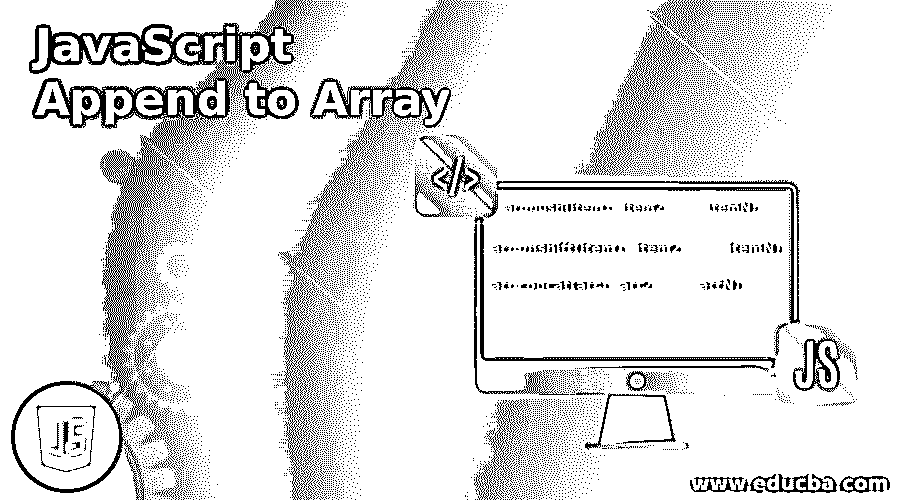
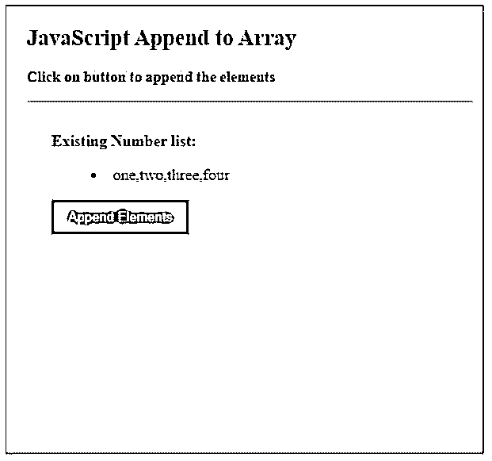
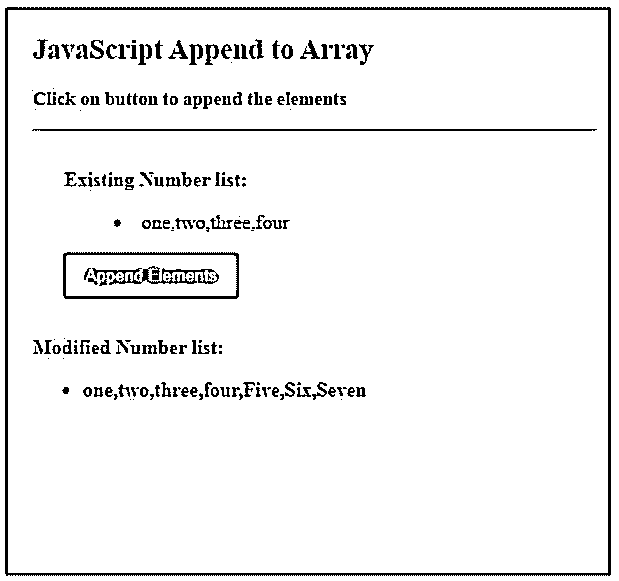
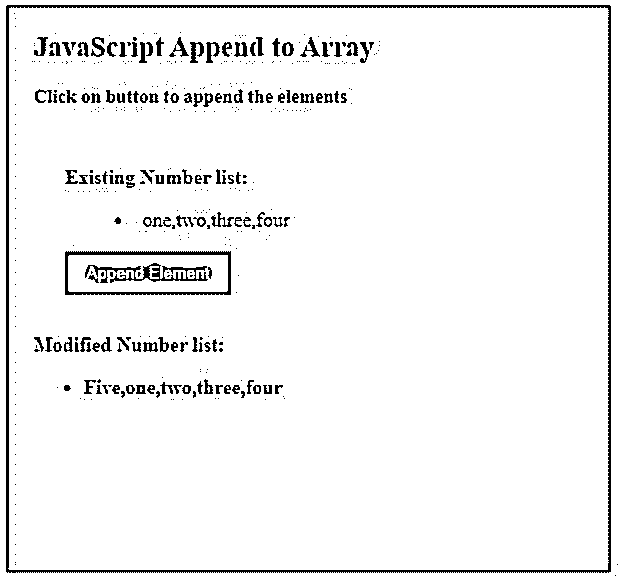
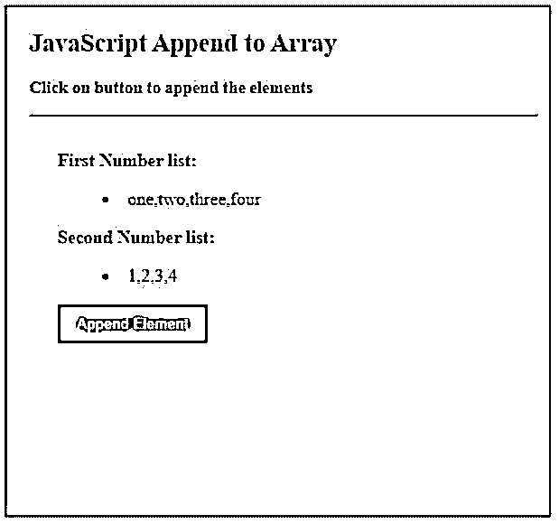
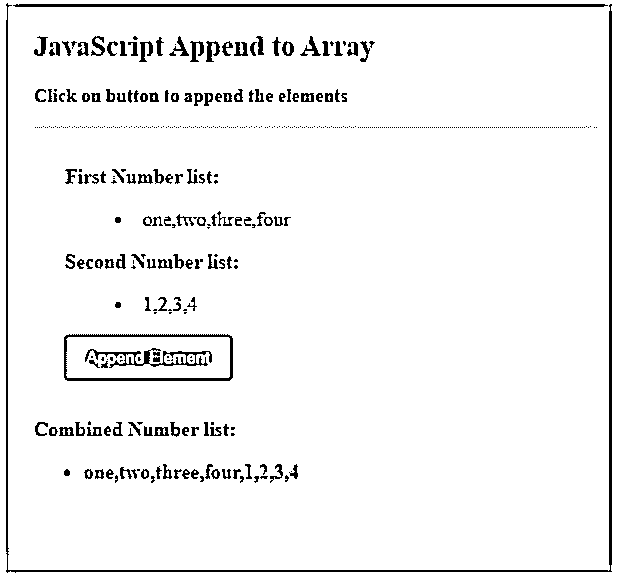

# JavaScript 追加到数组

> 原文：<https://www.educba.com/javascript-append-to-array/>




## JavaScript 追加到数组简介

JavaScript 中的 Append to Array 操作是将新的数组元素添加到 JavaScript 中定义的现有数组的末尾或开头。这个操作是在已经定义好的现有数组上进行的，它可能包含一些元素，也可能不包含任何元素，用户希望向其中添加新的值或数组元素。JavaScript 在数组对象上提供了多种方法来执行这样的操作，因为这些对象继承了作为父对象的原型对象。所有数组对象都继承自 Array.prototype。我们可以使用原型中的方法直接追加或修改数组对象。

**语法:**

<small>网页开发、编程语言、软件测试&其他</small>

```
arr.push(item1, item2, .... , itemN);
```

该方法将指定的元素追加到数组的末尾。可以使用 push()方法追加一个或多个元素。

```
arr.unshift(item1, item2, .... , itemN);
```

此方法将指定的元素追加到数组的开头。使用 unshift()操作可以追加多个元素。

```
arr.concat(arr1, arr2, .... , arrN);
```

此方法将连接用原始数组指定的数组，并返回新形成的组合数组。

### JavaScript Append to Array 是如何工作的？

下面给出了工作原理:

#### 1.推送()

**代码:**

```
<!DOCTYPE html>
<html>
<head>
<meta charset = "UTF-8">
<title>
JavaScript Append to Array
</title>
<style>
.body-data {
border : #81D4FA 2px solid;
background-color : #03a9f400;
text-align : left;
padding-left : 20px;
height : 450px;
width : 95%;
}
.list {
margin:5px auto;
max-width: 700px;
padding: 25px 15px 15px 25px;
}
.list li {
margin: 8px 0 0 0;
list-style: inside;
}
.list p, .resultText {
margin: 0 0 3px 0;
padding: 0px;
display: block;
font-weight: bold;
}
.resultText {
display: none;
}
.heading {
font-weight: bold;
border-bottom: 2px solid #ddd;
font-size: 15px;
width: 98%;
}
.list button[ type = submit] {
background: #2196F3;
padding: 10px 17px 10px 17px;
margin-right: 10px;
color: #fff;
border: none;
}
.list button[ type = submit]:hover {
background: #2173f3;
}
</style>
</head>
<body>
<div class = "body-data" >
<div class = "heading" >
<h2> JavaScript Append to Array </h2>
<p> Click on button to append the elements </p>
</div>
<div class = "list" >
<p> Existing Number list: </p>
<ul>
<li id = "existing" >  </li>
</ul>
<button type = "submit" value = "submit" onclick = "appendUsingPush()"> Append Elements </button>
</div>
<div class = "resultText">
<p> Modified Number list: </p>
<ul>
<li id = "modified" >  </li>
</ul>
</div>
</div>
<script type = "text/javascript">
var numbers = [ "one" , "two" , "three" , "four"];
document.getElementById("existing").innerHTML = numbers;
function appendUsingPush() {
numbers.push( "Five" );
numbers.push( "Six", "Seven" );
document.getElementsByClassName("resultText")[0].style.display = "block";
document.getElementById("modified").innerHTML = numbers;
}
</script>
</body>
</html>
```

**输出:**

**

** 




#### 2.未移位()

**代码:**

```
<!DOCTYPE html>
<html>
<head>
<meta charset = "UTF-8">
<title>
JavaScript Append to Array
</title>
<style>
.body-data {
border : #81D4FA 2px solid;
background-color : #03a9f400;
text-align : left;
padding-left : 20px;
height : 450px;
width : 95%;
}
.list {
margin:5px auto;
max-width: 700px;
padding: 25px 15px 15px 25px;
}
.list li {
margin: 8px 0 0 0;
list-style: inside;
}
.list p, .resultText {
margin: 0 0 3px 0;
padding: 0px;
display: block;
font-weight: bold;
}
.resultText {
display: none;
}
.heading {
font-weight: bold;
border-bottom: 2px solid #ddd;
font-size: 15px;
width: 98%;
}
.list button[ type = submit] {
background: #2196F3;
padding: 10px 17px 10px 17px;
margin-right: 10px;
color: #fff;
border: none;
}
.list button[ type = submit]:hover {
background: #2173f3;
}
</style>
</head>
<body>
<div class = "body-data" >
<div class = "heading" >
<h2> JavaScript Append to Array </h2>
<p> Click on button to append the elements </p>
</div>
<div class = "list" >
<p> Existing Number list: </p>
<ul>
<li id = "existing" >  </li>
</ul>
<button type = "submit" value = "submit" onclick = "appendUsingPush()"> Append Element </button>
</div>
<div class = "resultText">
<p> Modified Number list: </p>
<ul>
<li id = "modified" >  </li>
</ul>
</div>
</div>
<script type = "text/javascript">
var numbers = [ "one" , "two" , "three" , "four"];
document.getElementById("existing").innerHTML = numbers;
function appendUsingPush() {
numbers.unshift("Five" );
document.getElementsByClassName("resultText")[0].style.display = "block";
document.getElementById("modified").innerHTML = numbers;
}
</script>
</body>
</html>
```

**输出:**




#### 3.concat()

**代码:**

```
<!DOCTYPE html>
<html>
<head>
<meta charset = "UTF-8">
<title>
JavaScript Append to Array
</title>
<style>
.body-data {
border : #81D4FA 2px solid;
background-color : #03a9f400;
text-align : left;
padding-left : 20px;
height : 450px;
width : 95%;
}
.list {
margin:5px auto;
max-width: 700px;
padding: 25px 15px 15px 25px;
}
.list li {
margin: 8px 0 0 0;
list-style: inside;
}
.list p, .resultText {
margin: 0 0 3px 0;
padding: 0px;
display: block;
font-weight: bold;
}
.resultText {
display: none;
}
.heading {
font-weight: bold;
border-bottom: 2px solid #ddd;
font-size: 15px;
width: 98%;
}
.list button[ type = submit] {
background: #2196F3;
padding: 10px 17px 10px 17px;
margin-right: 10px;
color: #fff;
border: none;
}
.list button[ type = submit]:hover {
background: #2173f3;
}
</style>
</head>
<body>
<div class = "body-data" >
<div class = "heading" >
<h2> JavaScript Append to Array </h2>
<p> Click on button to append the elements </p>
</div>
<div class = "list" >
<p> First Number list: </p>
<ul>
<li id = "existing1" >  </li>
</ul>
<p> Second Number list: </p>
<ul>
<li id = "existing2" >  </li>
</ul>
<button type = "submit" value = "submit" onclick = "appendUsingPush()"> Append Element </button>
</div>
<div class = "resultText">
<p> Combined Number list: </p>
<ul>
<li id = "modified" >  </li>
</ul>
</div>
</div>
<script type = "text/javascript">
var numbers1 = [ "one" , "two" , "three" , "four"];
document.getElementById("existing1").innerHTML = numbers1;
var numbers2 = [ 1, 2, 3, 4];
document.getElementById("existing2").innerHTML = numbers2;
function appendUsingPush() {
document.getElementsByClassName("resultText")[0].style.display = "block";
var combined = numbers1.concat( numbers2 );
document.getElementById("modified").innerHTML = combined;
}
</script>
</body>
</html>
```

**输出:**







### 结论

JavaScript append 是一种向现有数组元素添加新元素的操作。JavaScript 提供了以不同方式执行追加操作的多种方法。Prototype push 方法在末尾追加元素，unshift 方法在开头追加元素，concat 方法用于组合多个数组。

### 推荐文章

这是一个 JavaScript 追加到数组的指南。在这里我们讨论介绍和 JavaScript append 是如何工作的？您也可以看看以下文章，了解更多信息–

1.  [JavaScript 按值传递](https://www.educba.com/javascript-pass-by-value/)
2.  [JavaScript 数组包含](https://www.educba.com/javascript-array-contain/)
3.  [JavaScript 转换成 JSON](https://www.educba.com/javascript-convert-to-json/)
4.  [JavaScript z-index](https://www.educba.com/javascript-z-index/)


