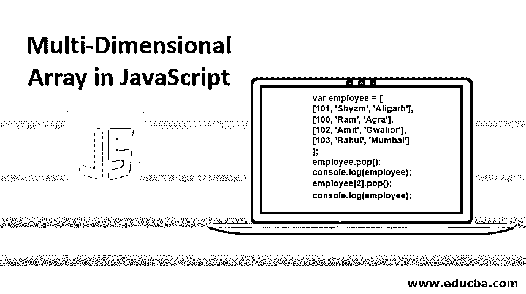
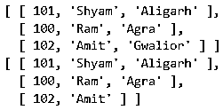
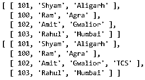
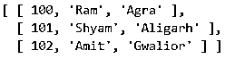
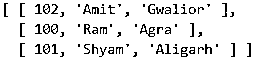
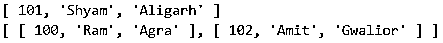
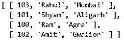

# JavaScript 中的多维数组

> 原文：<https://www.educba.com/multi-dimensional-array-in-javascript/>




## JavaScript 中的多维数组简介

JavaScript 本身不提供多维数组或它们的任何语法。然而，我们可以在 JavaScript 中通过创建数组的数组来创建多维数组，即数组将由其他数组作为元素组成。在 JavaScript 中定义多维数组最简单的方法是使用数组文字符号。下面的例子将创建一个二维数组人。

```
var Employee = [
[100, ‘Ram’, ‘Agra’],
[101, ‘Shyam’, ‘Aligarh’],
[102, ‘Amit’, ‘Gwalior’]
]
```

下图说明了雇员数组:

<small>网页开发、编程语言、软件测试&其他</small>

| One hundred | 随机存取存储器(random access memory 的缩写)ˌ随机访问内存(random-access memory 的缩写) | 阿格拉 |
|  101 | 希亚姆 | 阿里格尔 |
| One hundred and two | 阿米特 | 瓜廖尔 |

**访问多维数组的元素:**

为了访问 2D 数组的元素，我们以如下方式使用两个方括号:

```
Alert(Employee[1][2]); // Aligarh
```

在这里，第一个方括号将给出一个内部数组，作为外部数组的每行索引的结果，如下所示:

| One hundred | 随机存取存储器(random access memory 的缩写)ˌ随机访问内存(random-access memory 的缩写) | 阿格拉 |
|  101 | 希亚姆 | 阿里格尔 |
| One hundred and two | 阿米特 | 瓜廖尔 |

第二个方括号用于访问给定外部数组行索引上内部数组的特定元素。因此，雇员[1][0]将引用第二子数组中的第一个元素。

***NOTE: **Index in JavaScript starts with 0.*

```
Console.log(Employee[1][0]); // 101
```

### JavaScript 中多维数组的属性

以下是 JavaScript 中多维数组的属性:

**1。** **isArray( ):** 这个函数将帮助判断给定的数组是否为数组。这个函数的返回类型是 Boolean。

```
var d[][];
Array.isArray(d); // True
```

**2。** **typeof:** 该操作符用于查找被传递对象的类型。

```
var d[][];
typeof d; // Object
```

**3。** **长度:**该函数将返回所传递数组的长度。

```
var d[3, 6, 7];
d.length; // 3
```

### JavaScript 多维数组中的 8 大方法

下面是 JavaScript 中多维数组使用的方法:

#### 1.流行( )

此方法用于移除数组最后一个索引处的元素。这将最终导致数组长度减少 1。

**代码:**

```
var employee = [
[101, 'Shyam', 'Aligarh'],
[100, 'Ram', 'Agra'],
[102, 'Amit', 'Gwalior'],
[103, 'Rahul', 'Mumbai']
];
employee.pop();
console.log(employee);
employee[2].pop();
console.log(employee);
```

**输出:**




#### 2.推送( )

此方法用于在数组的最后一个索引处插入一个元素。这将最终导致数组长度增加 1。

**代码:**

```
var employee = [
[101, 'Shyam', 'Aligarh'],
[100, 'Ram', 'Agra'],
[102, 'Amit', 'Gwalior']
];
employee.push([103, 'Rahul', 'Mumbai']);
console.log(employee);
employee[2].pop('TCS');
console.log(employee);
```

**输出:**




#### 3.排序( )

该方法用于根据传递的数组类型，按字母顺序或数字顺序对数组元素进行排序。Sort 方法也将永久改变数组的顺序。

**代码:**

```
var employee = [
[101, 'Shyam', 'Aligarh'],
[100, 'Ram', 'Agra'],
[102, 'Amit', 'Gwalior']
];
employee.sort();
console.log(employee);
```

**输出:**




#### 4.反向( )

此方法用于反转数组元素。该方法的输出是使最后一个索引元素成为第一个，第一个索引元素成为最后一个。

**代码:**

```
var employee = [
[101, 'Shyam', 'Aligarh'],
[100, 'Ram', 'Agra'],
[102, 'Amit', 'Gwalior']
];
employee.reverse();
console.log(employee);
```

**输出:**




#### 5\. IndexOf( )

此方法用于查找数组中特定元素的第一个匹配项的索引。如果元素不存在，那么它将返回-1。

**代码:**

```
var employee = [
[101, 'Shyam', 'Aligarh'],
[100, 'Ram', 'Agra'],
[102, 'Amit', 'Gwalior']
];
var id = 'Ram';
function index(id, arr) {
for (var i=0; i<arr.length; i++) {
for (var j=0; j<arr[i].length; j++) {
if (arr[i][j] == id) { return i; }
}
}
return -1;
}
console.log(index(id, employee));
```

**输出:**


#### 6.Shift()

该方法用于将数组向左移动，即移除数组的第一个元素，并将其他元素向左移动。

**代码:**

```
var employee = [
[101, 'Shyam', 'Aligarh'],
[100, 'Ram', 'Agra'],
[102, 'Amit', 'Gwalior']
];
console.log(employee.shift());
console.log(employee);
```

**输出:**




#### 7.未移位( )

此方法用于将数组向右移位，即在 0 索引上添加一个新元素，并将所有其他元素向右移动。

**代码:**

```
var employee = [
[101, 'Shyam', 'Aligarh'],
[100, 'Ram', 'Agra'],
[102, 'Amit', 'Gwalior']
];
employee.unshift([103, 'Rahul', 'Mumbai']);
console.log(employee);
```

**输出:**




#### 8.拼接( )

此方法用于在数组中插入或移除任意数量的元素。

**代码:**

```
var employee = [
[101, 'Shyam', 'Aligarh'],
[100, 'Ram', 'Agra'],
[102, 'Amit', 'Gwalior']
];
employee.splice(0,1);// remove 1 element from 0 index
console.log(employee);
employee.splice(0,2);// remove 2 element from 0 index
console.log(employee);
employee.splice(0,0,[103, 'Rahul', 'Mumbai']);// add 1 element at 0,0
console.log(employee);
employee.splice(0,1,[100, 'Ram', 'Agra']);// add 1 element at 0,1
console.log(employee);
```

**输出:**


**Note:** Push( ), Pop( ), Shift( ), Unshift( ), Splice( ) etc. all these methods are used to manipulate the content of [the multidimensional arrays](https://www.educba.com/multidimensional-array-in-php/).

### 遍历多维数组的元素

要遍历多维数组的所有元素，我们需要使用嵌套 for 循环概念，如下所示:

**代码:**

```
// outer loop is for the outer array
for (var i=0; i<arr.length; i++){
// inner loop is for the inner arrays
for (var j=0; j<arr[i].length; i++){
// access each element of the 2D array
Console.log(arr[i][j]);
}
}
```

**NOTE: **The inner arrays of the multidimensional array can be of variable length which makes it different from other programming languages multidimensional array where the length or columns are fixed.

### 结论

JavaScript 中的多维数组提供了将不同类型的数据存储到单个数组中的功能，数组内部的每个元素都能够存储独立于数组其余部分的数据，这在 Java、C 和其他语言中是无法实现的。

### 推荐文章

这是一个 Javascript 多维数组的指南。这里我们讨论基本概念和它的属性，以及 Javascript 中多维数组使用的顶级方法。您也可以浏览我们推荐的其他文章，了解更多信息——

1.  [JavaScript 的特性](https://www.educba.com/features-of-javascript/)
2.  [c++中的多维数组](https://www.educba.com/multi-dimensional-arrays-in-c-plus-plus/)
3.  [C#多维数组](https://www.educba.com/c-sharp-multidimensional-arrays/)
4.  [JavaScript getelement byid()](https://www.educba.com/javascript-getelementbyid/)


