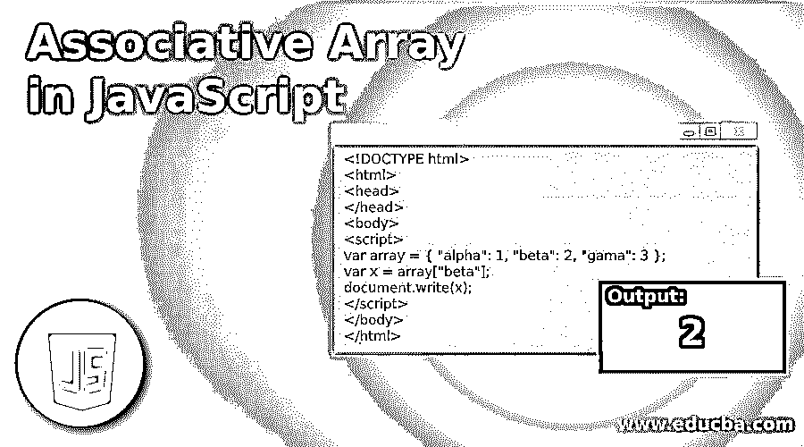
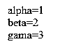
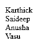
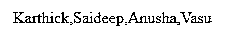
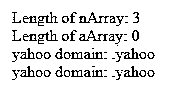
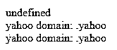
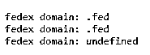
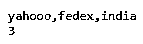

# JavaScript 中的关联数组

> 原文：<https://www.educba.com/associative-array-in-javascript/>




## Javascript 中的关联数组简介

关联数组是一组键值对和动态对象，用户可以根据需要修改它们。当用户为数据类型为数组的键赋值时，它会转换为一个对象，并丢失以前数据类型的属性和方法。它使用字符串而不是数字作为索引。这里，我们需要理解 javascript 不支持关联数组，但是 javascript 中的所有数组都是对象，Javascript 的对象语法有助于模仿关联数组。

**语法:**

<small>网页开发、编程语言、软件测试&其他</small>

```
<name of the array> = {key1:'value1', key2:'value2', key3:'valu3'…..}
```

**举例:**

```
employee = {101:'Karthick', 102:'Saideep', 103:'Anusha'}
```

上面的例子有助于创建一个包含 3 个键和 3 个值的数组 employee，键可以是标识符、数字或字符串。

### 关联数组的示例

这里我们可以看到为什么关联数组不能像普通数组一样在 javascript 中创建，相反，我们可以使用 javascript 对象创建它。

#### 示例#1

**代码:**

```
<!DOCTYPE html>
<html>
<head>
</head>
<body>
<script>
var array = { "alpha": 1, "beta": 2, "gama": 3 };
var x = array["beta"];
document.write(x);
</script>
</body>
</html>
```

**输出:**


#### 实施例 2

**代码:**

```
<!DOCTYPE html>
<html>
<head>
</head>
<body>
<script>
var x = new Object();
x["alpha"] = 1;
x["beta"] = 2;
x["gama"] = 3;
for(var i in x)
{
document.write(i + "=" +x[i] + '<br>');
}
</script>
</body>
</html>
```

**输出:**




#### 实施例 3

在关联数组中循环。

**代码:**

```
<!DOCTYPE html>
<html>
<head>
</head>
<body>
<script>
var array = {
"Karthick": "Deloitte",
"Saideep": "Infosys",
"Anusha": "Capgemini",
"Vasu": "Cognizant"
};
for (var key in array) {
if (array.hasOwnProperty(key)) {
document.write(key + "<br>");
}
}
</script>
</body>
</html>
```

**输出:**




除了循环关联数组，我们还可以使用 Object.keys()显示数组元素。

#### 实施例 4

**代码:**

```
<!DOCTYPE html>
<html>
<head>
</head>
<body>
<script>
var array = {
"Karthick": "Deloitte",
"Saideep": "Infosys",
"Anusha": "Capgemini",
"Vasu": "Cognizant
};
var keys = Object.keys(array);
document.write(keys);
</script>
</body>
</html>
```

**输出:**




我们不能像创建普通数组一样创建关联数组，用户需要使用一个空对象或空关联数组。

#### 实施例 5

**代码:**

```
<!DOCTYPE html>
<html>
<head>
</head>
<body>
<script>
//Normal array
var nArray= new Array();
nArray[0] = ".yahoo";
nArray[1] = ".fed";
nArray[2] = ".in";
document.write("Length of nArray: " + nArray.length);
document.write('</br>');
//Associative array
var aArray = new Array();
aArray['yahooo'] = ".yahoo";
aArray['fedex'] = ".fed";
aArray['india'] = ".in";
document.write("Length of aArray: " + aArray.length);
document.write('</br>');
document.writeln("yahoo domain: " + aArray['yahooo']);
document.write('</br>');
document.writeln("yahoo domain: " + aArray.yahooo);
</script>
</body>
</html>
```

**输出:**




#### 实施例 6

使用 javascript 对象创建关联数组。

**代码:**

```
<!DOCTYPE html>
<html>
<head>
</head>
<body>
<script>
var myObject = {};
myObject.yahooo = ".yahoo";
myObject.fedex= ".fed";
myObject.india= ".in";
document.writeln(myObject.length);  // undefined
document.write('</br>');
document.write("yahoo domain: " + myObject['yahooo']);
document.write('</br>');
document.write("yahoo domain: " + myObject.yahooo);
</script>
</body>
</html>
```

**输出:**




我们可以使用点属性符号来访问数组元素、删除对象值以及赋值。

为了删除关联数组的属性，我们有“delete”语句。

#### 实施例 7

**代码:**

```
<!DOCTYPE html>
<html lang="en">
<head>
<meta charset="UTF-8">
<title>JavaScript object deleting</title>
</head>
<body>
<pre>
<script type="text/javascript">
var myObject = {};
myObject.yahooo = ".yahoo";
myObject.fedex= ".fed";
myObject.india= ".in";
document.writeln("fedex domain: " + myObject['fedex']);
document.writeln("fedex domain: " + myObject.fedex);
delete myObject.fedex;
document.writeln("fedex domain: " + myObject.fedex);
</script>
</pre>
</body>
</html>
```

**输出:**




当我们处理物体时，我们可以求出它的长度。

#### 实施例 8

**代码:**

```
<!DOCTYPE html>
<html lang="en">
<head>
<meta charset="UTF-8">
<title>JavaScript object key length</title>
</head>
<body>
<pre>
<script type="text/javascript">
var myObject = {};
myObject.yahooo = ".yahoo";
myObject.fedex= ".fed";
myObject.india= ".in";
document.write( Object.keys(myObject) );
document.write('</br>');
document.writeln( Object.keys(myObject).length );
</script>
</pre>
</body>
</html>
```

**输出:**




关联数组是动态对象，当用户给数组类型的键赋值时，它会转换为对象，并丢失数组类型的所有属性和方法，转换后的数组也不再有长度属性。

通过这个关联数组，用户可以保存更多的数据，因为我们有一个字符串作为存储关联数据的数组元素的键。这个优势是因为使用对象来访问数组元素

### 结论

让我们用一个很好的注释来结束这篇文章，因为我们已经学习了 Javascript 中的关联数组，关联数组的创建和它是如何工作的，用户如何访问关联数组的数组元素，以及上面在这个上下文中解释的一些例子。此外，用户可以向关联数组对象添加属性。

### 推荐文章

这是一个 JavaScript 关联数组的指南。这里我们讨论介绍和例子。您也可以看看以下文章，了解更多信息–

1.  [JavaScript 光标](https://www.educba.com/javascript-cursor/)
2.  [JavaScript 数组过滤器](https://www.educba.com/javascript-array-filter/)
3.  [JavaScript 刷新页面](https://www.educba.com/javascript-refresh-page/)
4.  [JavaScript 展平数组](https://www.educba.com/javascript-flatten-array/)


