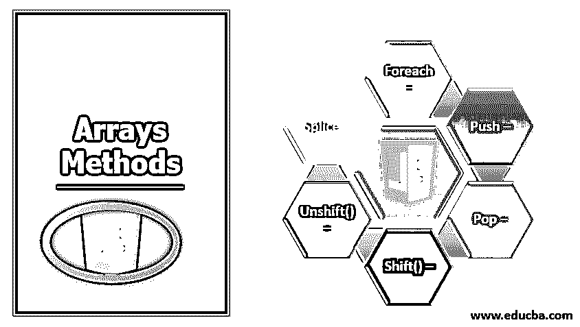
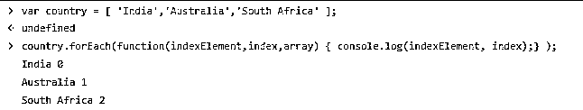
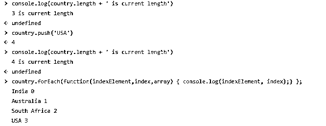
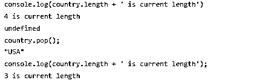
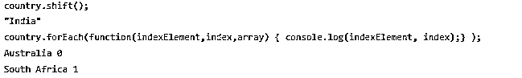
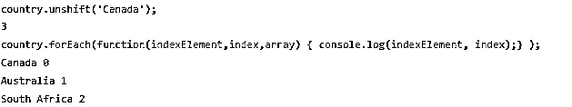
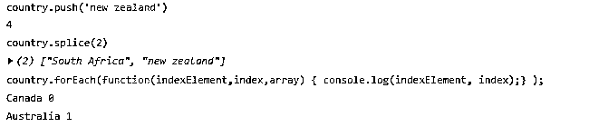
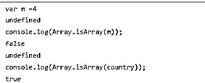

# JavaScript 中的数组方法

> 原文：<https://www.educba.com/arrays-methods-in-javascript/>




## JavaScript 中的数组方法简介

Javascript 提供数组来保存数据，如整数、字符串和用户定义的对象。用例场景类似于我们在其他语言中发现的数组概念。在这个主题中，我们将学习 JavaScript 中的数组方法。

[Javascript](https://www.educba.com/what-is-javascript/) 是给网页添加动态行为的前端语言；这些数组用于保存要在网页中呈现的数据，就像您有一个包含图书名称、作者姓名、出版日期和费用的图书列表一样，因此所有这些都可以放在一个对象中，同时生成的多个对象可以存储在这些数组中，这些数组可以传递给控制器进行处理，或者以同样的方式由控制器发送给视图进行呈现。

<small>网页开发、编程语言、软件测试&其他</small>

Javascript 中的数组声明是这样完成的

```
var arr = new Array();
```

或者

```
var arr=[];
```

或者

```
var arr = [1,2,3,4];
```

在这里，您可以看到我们给数组赋予了整数值，并将其标记为 var 类型，在 Javascript 中，所有元素都将仅存储为 var 类型，如果它们被视为整数或其他数据类型，那么在使用数组中的数据时，必须解析为该类型。

### Javascript 中的数组方法

对于数组数据的处理，我们有多种方法可用；它们将帮助我们在数据处理和操作过程中执行一些必需的操作。

#### 1.为每一个

这个方法用于循环数组数据，我们可以让每个单独的元素呈现在网页上它想要的占位符上。

```
var country = ['India','Australia','South Africa'];
```

我们将从索引 0 迭代到长度-1，其中长度是数组的大小，这里是 3。

现在让我们使用 forEach 方法迭代它们

**例子**

```
var country = ['India','Australia','South Africa'];
country.forEach(function(indexElement,index,array)
{
console.log(indexElement, index);
} );
```

**输出:**




#### 2.推

每当你有一个现有的数组，同时，你正在执行一些计算，该数组可能会收到一些数据值添加到它。在这种情况下，应使用推送功能。

让我们在上面定义的列表中添加一个国家，这次我们将重复一遍，改变后的长度也会显示出来。

请记住，推送将在数组中最后一个可用的索引处完成。

**例子**

```
// this line gives current length i.e. 3
console.log(country.length + ' is current length')
// here we push one more country
country.push('USA')
//print updated length
console.log(country.length + ' is current length')
// print each element and index
country.forEach(function(indexElement,index,array)
{
console.log(indexElement, index);
} );
```

**输出:**




#### 3.流行音乐

我们也可以要求从数组中删除数据元素；pop 用于删除数组末尾的元素，即数组的最后一个元素将被删除，依此类推。

让我们举个例子来看看同样的情况——

```
// this line gives current length i.e. 4
console.log(country.length + ' is current length')
// pop the last element, it doesn’t take any argument
Country.pop()
// this line gives current length i.e. 3, as the array lost one element
console.log(country.length + ' is current length')
```

**输出:**




#### 4.Shift()

你可能需要从数组的前面取出元素，所以你不能使用 pop，因为它会先删除你所有的数据，然后让你到达第一个元素；为此，我们有 shift()方法，这将直接从数组的开头删除一个元素。

让我们看看下面的例子——

这里我们将运行 forEach 循环来显示哪个元素被删除了。

```
// line below will remove India, which was the first element
country.shift() ;
//let’s print the elements now
country.forEach(function(indexElement,index,array)
{
console.log(indexElement, index);
} );
```

**输出:**




在上图中，你可以看到整个数组实际上被向左移动了；元素“澳大利亚”已经从索引 1 移动到索引 0。因此，这种操作会导致数组中所有元素的移位，并且当数据非常大时，这种操作的开销会非常大，因此应结合适当的分析来使用这种操作，并遵循正确的编码技术。

#### 5.未移位()

这里的要求是将数据添加到数组的前面，而不是添加到它的末尾，这种方法称为 unshift()，这也会增加一个开销，即在一次插入操作中将数组的所有现有元素向右移动一个索引。

当性能不变时，这也可能是一项成本高昂的操作。

让我们来看一个如何实现这种非移位的例子

请查看新添加的元素“加拿大”在快照中出现的索引。

```
//add Canada
country.unshift('Canada');
//print elements
country.forEach(function(indexElement,index,array)
{
console.log(indexElement, index);
} );
```

**输出:**




#### 6.接合

这个方法用于根据用户传递的一些索引来移除元素，我们还看到了 push 和 pop、shift 和 unshift，这些都处理最后一个和第一个索引，如果我们要对中间索引进行移除操作，那么我们需要 splice 方法，我们可以传递要从数组中移除的元素索引。

让我们举一个例子，我们给出了一个起始索引，从这个索引开始，所有的元素都必须从数组中删除。

我已经将新西兰添加到现有的数组中，并使其大小再次为 4。

```
//the following statement will target index 2 and 3 to be removed.
country.splice(2)
```

**输出:**




#### 7\. isArray()

此方法检查变量是否属于数组类型。

让我们从下面的快照开始




### 结论

在这里，我们看到了使用 javascript 进行数据操作的多种方法，这在开发游戏或网页时非常方便。

### 推荐文章

这是 JavaScript 中数组方法的指南。这里我们讨论多种方法，这些方法将帮助我们在数据处理和操作期间执行一些必需的操作。您也可以看看以下文章，了解更多信息–

1.  [JavaScript 中的构造函数](https://www.educba.com/constructor-in-javascript/)
2.  [JavaScript 中的数组](https://www.educba.com/arrays-in-javascript/)
3.  [JavaScript 是什么？](https://www.educba.com/what-is-javascript/)
4.  [在 JavaScript 中覆盖](https://www.educba.com/overriding-in-javascript/)


