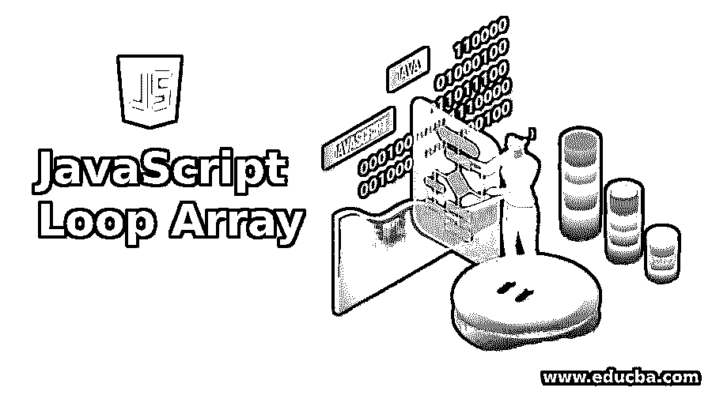
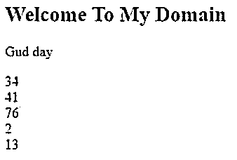
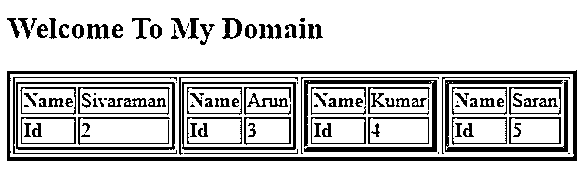
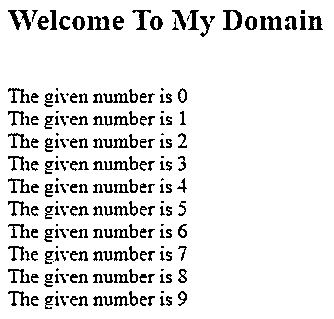

# JavaScript 循环数组

> 原文：<https://www.educba.com/javascript-loop-array/>




## JavaScript 循环数组简介

以下文章提供了 JavaScript 循环数组的概要。在 JavaScript 中，我们有不同的循环结构集，它的特性对于创建和验证网页以向服务器发送请求非常有帮助。特别是接收来自服务器的响应，它将显示在网页屏幕上。JavaScript 数组有不同的类型和方式，确定脚本中使用哪个数组序列更复杂。同时，for 循环是基本的 JavaScript 循环之一，就像 forEach 方法及其集合拥有 forEach 及其每个方法的库一样。当我们使用迭代方法在脚本中使用数组时，我们将检索数据。

**语法:**

<small>网页开发、编程语言、软件测试&其他</small>

在 JavaScript 中，我们根据需求在网页中使用不同的循环集。我们将在脚本中应用它，但是当我们在网页上验证某些东西时，它对“for，while”等非常有帮助。

```
<html>
<head>
<script>
var variable name="";
//use any loops for example for and while we used in this script
for(inti=initialize value;condition check;increment/decrement)
{
Some logics;
}
while(variablename  condition check)
{
--some logics---
}
</script>
</head>
<body>
</body>
</html>
```

上面的代码是 JavaScript 中循环的基本用法，当我们在脚本中使用 for 循环和 forEach 声明数组时，我们可以迭代它来检索值。

### JavaScript 循环数组是如何工作的？

JavaScript 循环总是迭代单个数组中的每一项，如果我们使用多维数组，我们可以使用 forEach，否则我们将使用多个普通的 for 循环来迭代元素。基本上，数组是从零开始的索引元素，这意味着第一个元素将从 0 索引开始，它将继续下去，但声明将结束。数组中的引用项总是特定于数字索引，它也是从 0 索引开始，以数组长度结束。我们在三种类型的表达式中使用 always 循环语句，比如初始化条件声明的值和递增/递减变量，这是最后一种类型的表达式。

这些类型的表达式在每个循环执行结束时执行，此外，如果我们想要迭代第二级属性或字段，它还用于增加索引。元素也可以与 for 循环中的条件嵌套，这也是保持跟踪脚本中具有单独索引变量类型的元素的主要优势。如果我们想停止 for 循环的执行，我们使用 break 语句或将索引设置为数组长度或值，这将使脚本语句不再有值。此外，如果我们希望省略 for 循环语句中的条件，请使用 break 关键字终止 for 循环条件，然后该值将不再为 true 条件集。基本 for 循环条件易于理解代码逻辑并满足要求，而且与其他类型的循环相比，它需要更多的内存消耗，因为它必须满足条件，否则循环将被终止，并且语法也很繁琐。

当我们使用嵌套 for 循环时，它将创建并初始化满足所有嵌套循环条件的变量，并且它必须增加或减少变量。如果我们使用 forEach 循环它首先使用 JavaScript 的 native array 对象实际上 forEach 循环在代码中使用了回调函数它必须遵循三种类型的参数称为元素值、 循环中遍历的元素索引和数组元素是数组变量值中的当前项我们在循环中使用变量初始化我们必须在 forEach 循环中使用数组变量中的初始化变量它只使用元素类型对于索引和数组它是不可接受的元素除了值迭代之外什么都不是所以我们应该在 forEach 循环中执行回调函数之后总是声明具有参数类型的元素 它还接受可选参数 has thisArg 关键字，我们将该关键字用于调用循环计数中的当前方法或值，作为变量声明，用于对作用域外的特定方法中的值进行计数。

### JavaScript 循环数组的例子

下面是提到的例子:

#### 示例#1

**代码:**

```
<!DOCTYPEhtml>
<html>
<body>
<h2>Welcome To My Domain</h2>
<p>Gud day</p>
<p id="demo"></p>
<script>
var t = "";
var n = [34, 41, 76, 2, 13];
n.forEach(sample);
document.getElementById("demo").innerHTML = t;
function sample(v, i, a) {
t = t + v + "<br>";
}
</script>
</body>
</html>
```

**输出:**




#### 实施例 2

**代码:**

```
<html>
<head>
<script language="javascript">
document.writeln("<h2>Welcome To My Domain</h2>");
var b = { "First" : [
{ "Name"  : "Sivaraman", "Id" : 2 },
{ "Name"  : "Arun", "Id" : 3 }],
"Second"  : [
{ "Name"  : "Kumar", "Id" : 4 },
{ "Name"  : "Saran", "Id" : 5 }]
}
var i = 0
document.writeln("<table border = '3'><tr>");
for(i = 0;i<b.First.length;i++) {
document.writeln("<td>");
document.writeln("<table border = '2' width = 37 >");
document.writeln("<tr><td><b>Name</b></td><td width = 27>" + b.First[i].Name+"</td></tr>");
document.writeln("<tr><td><b>Id</b></td><td width = 57>" + b.First[i].Id +"</td></tr>");
document.writeln("</table>");
document.writeln("</td>");
}
for(i = 0;i<b.Second.length;i++) {
document.writeln("<td>");
document.writeln("<table border = '4' width = 67 >");
document.writeln("<tr><td><b>Name</b></td><td width = 50>" + b.Second[i].Name+"</td></tr>");
document.writeln("<tr><td><b>Id</b></td><td width = 50>" + b.Second[i].Id+"</td></tr>");
document.writeln("</table>");
document.writeln("</td>");
}
document.writeln("</tr></table>");
</script>
</head>
<body>
</body>
</html>
```

**输出:**




#### 实施例 3

**代码:**

```
<!DOCTYPEhtml>
<html>
<body>
<h2>Welcome To My Domain</h2>
<p id="demo"></p>
<script>
var t = ""
var i = 0;
do {
t += "<br>The given number is " + i;
i++;
}
while (i < 10);
document.getElementById("demo").innerHTML = t;
</script>
</body>
</html>
```

**输出:**




以上三个例子我们用 JavaScript do、while、for 和 forEach 的不同方式使用了循环，我们用 do while 先执行一次循环，之后会检查条件。

### 结论

数组循环是代码的基本原则。基本上，循环总是执行变量，比如正常声明的变量或数组格式。JavaScript 有一种固有的方法来迭代数组，并使用库来配置。

### 推荐文章

这是一个 JavaScript 循环数组的指南。这里我们讨论 JavaScript 循环数组如何与编程示例一起工作，以便更好地理解。您也可以看看以下文章，了解更多信息–

1.  [JavaScript getElementsByTagName()](https://www.educba.com/javascript-getelementsbytagname/)
2.  JavaScript 中的[对象](https://www.educba.com/object-in-javascript/)
3.  [JavaScript 键盘事件](https://www.educba.com/javascript-keyboard-events/)
4.  [JavaScript join()](https://www.educba.com/javascript-join/)


